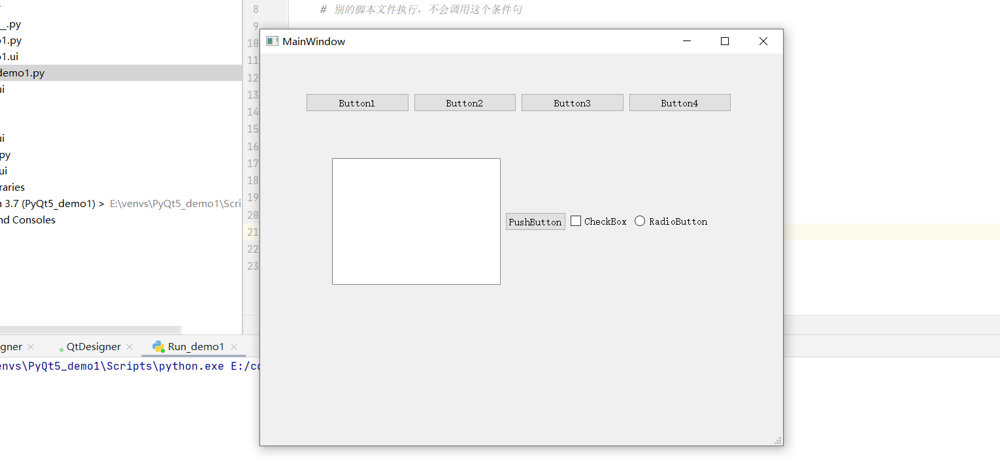
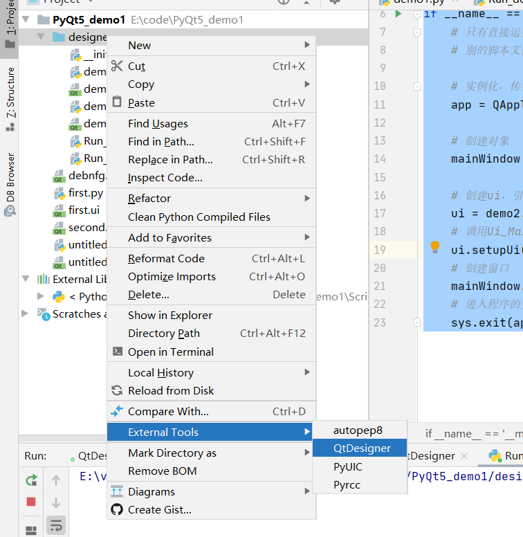
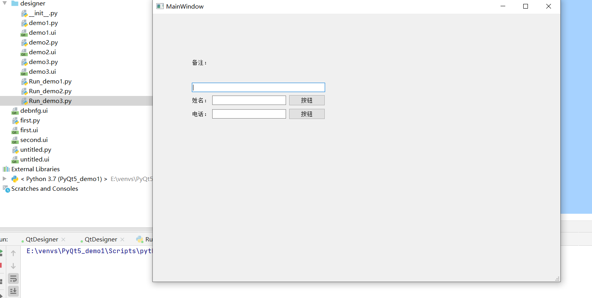
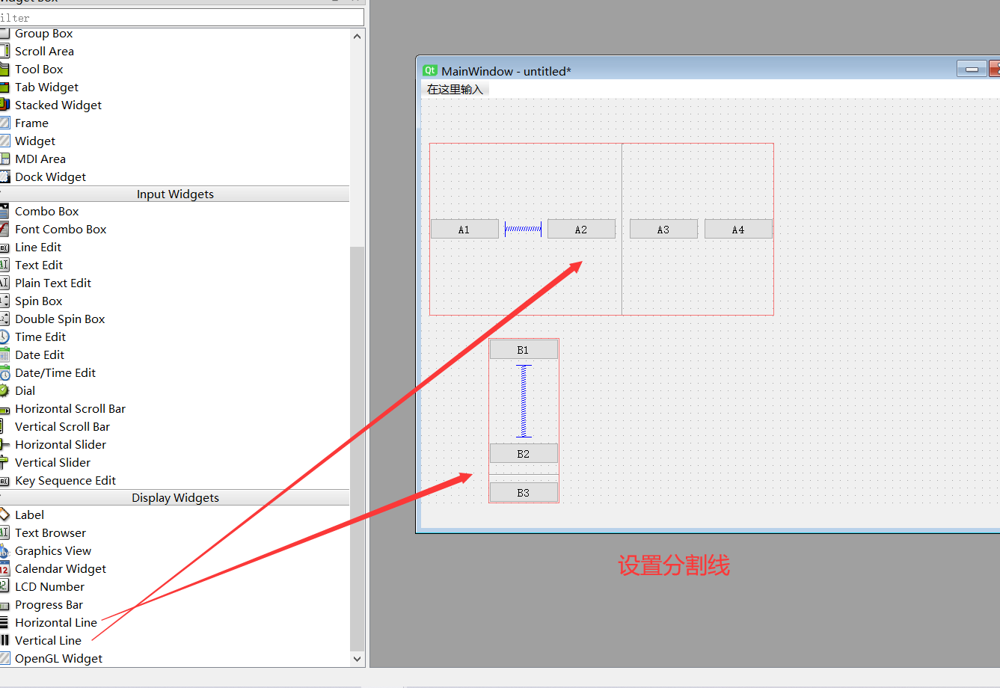
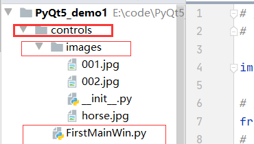
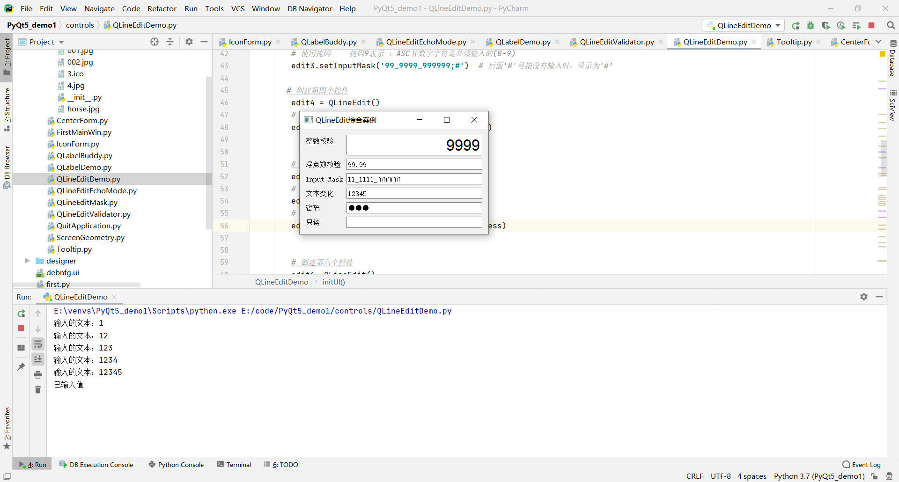
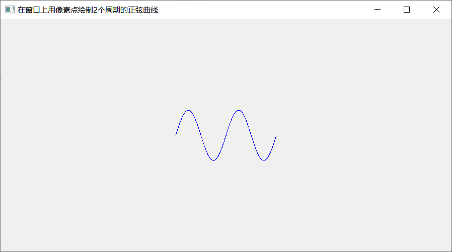
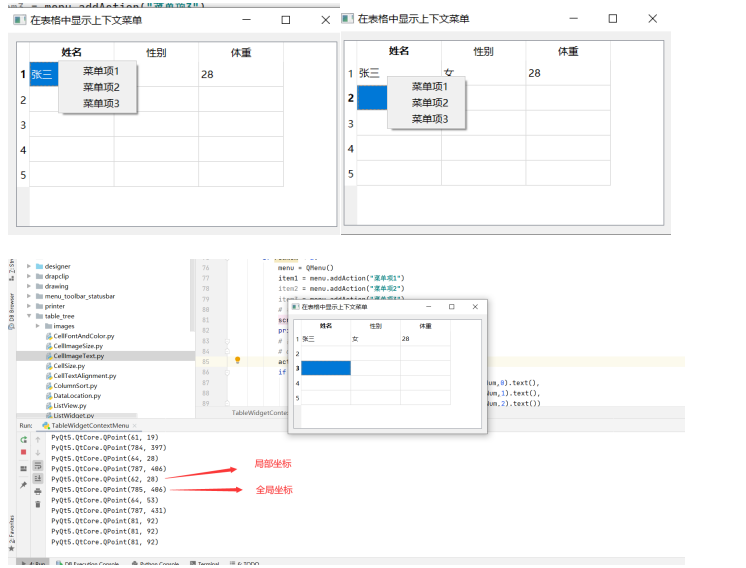

### PyQt5保姆级教程-- 从入门到精通

主要内容：


| 1    | Qt Designer                                                  |
| ---- | ------------------------------------------------------------ |
| 2    | PyQt5基本窗口控件(QMainWindow、Qwidget、Qlabel、QLineEdit、菜单、工具栏等) |
| 3    | PyQt5高级组件(QTableView、QListView、容器、线程等)           |
| 4    | PyQt5布局管理(QBoxLayout、QGirdLayout、QFormLayout、嵌套布局等) |
| 5    | PyQt5信号与槽(事件处理、数据传递等)                          |
| 6    | PyQt5图形与特效(定制窗口风格、绘图、QSS与UI美化、不规则窗口、设置样式等) |
| 7    | PyQt5扩展应用(制作PyQt5安装程序、数据处理、第三方绘图库在PyQt5中的应用、UI自动化测试等) |

搭建PyQt5开发环境

工具：

Python

PyQt5模块

PyCharm


在PyCharm里面安装PyQt5 

```
pip install PyQt5 -i https://pypi.douban.com/simple
```

在PyCharm里面安装Qt的工具包

```
pip install PyQt5-tools -i https://pypi.douban.com/simple
```

在安装tools时，报如下错误：

##### 1.pip install PyQt5-tools安装失败

```
WARNING: Ignoring invalid distribution -yqt5 (e:\venvs\pyqt5_demo1\lib\site-packages)
Installing collected packages: pyqt5, click, qt5-tools, pyqt5-plugins, pyqt5-tools
ERROR: Could not install packages due to an OSError: [WinError 5] 拒绝访问。: 'e:\\venvs\\pyqt5_demo1\\Lib\\site-packages\\PyQt5\\QtCore.pyd'
Check the permissions.

```

解决办法：

第一步：

将`pip install ...`加入`--user`为`pip install --user ...`即可 

```
pip install PyQt5-tools  -i https://pypi.douban.com/simple   --user
```

换个思路

重启电脑，继续输入第一条命令安装


原因分析，可能占用了进程。

##### 2.配置Qt  Designer


```
Working directory：$FileDir$
```

##### 3.配置PyUIC


```
Program：python的安装目录下的python.exe文件
Arguments：-m PyQt5.uic.pyuic  $FileName$ -o $FileNameWithoutExtension$.py
```

##### 4.配置Pyrcc


```
Program：python的安装目录下的Scripts文件夹的pyrcc5.exe文件
Arguments：$FileName$ -o $FileNameWithoutExtension$_rc.py
```

展示效果如下：


##### 5.ui转py的过程：

1.点击EXternal Tools里面的QTDesigner，会跳转到QT界面，


拖动组件，调整好界面，保存为first文件，它会默认生成first.ui文件


选中文件，鼠标右击，打开扩展，选择PyUIC,它会生成.py文件


将.ui文件转化为.py文件的命令行方法：

```python
python -m PyQt5.uic.pyuic demo.ui -o demo.py
```

##### 6.开发第一个基于PyQt5的桌面应用

必须使用两个类: QApplication和QWidget。都在PyQt5.QtWidgets。

第一个类表示应用程序，第二个类表示窗口


输入如下代码：

```python
# 开发第一个基于PyQt5的桌面应用

import sys

from PyQt5.QtWidgets import QApplication,QWidget


if __name__ == '__main__':
    # 创建QApplication类的实例
    app = QApplication(sys.argv)
    # 创建一个窗口
    w = QWidget()
    # 设置窗口尺寸   宽度300，高度150
    w.resize(400,200)
    # 移动窗口
    w.move(300,300)

    # 设置窗口的标题
    w.setWindowTitle('第一个基于PyQt5的桌面应用')

    # 显示窗口
    w.show()

    # 进入程序的主循环，并通过exit函数确保主循环安全结束(该释放资源的一定要释放)
    sys.exit(app.exec_())
```

效果如下：


也可以在命令行运行

```python
python 文件名.py
```

##### 7.基本操作


左侧是可以选择的组件，右侧可以设定属性值，设置完成之后，可以在窗体选择预览，选择查看c++和python代码。

##### 8.在QtDesigner中使用水平布局(Vertical Layout)


两种方式：

###### (1)先移组件，再布局。

放置五个按钮，让这五个按钮等宽的，水平的排列

（全部选中-->鼠标右键-->布局-->水平布局     预览）


预览：


###### (2)先布局，再移组件。


生成demo1.ui文件


转成demo2.py文件，转成py文件，才能在程序里面调。

生成的代码如下：

```html
# -*- coding: utf-8 -*-

# Form implementation generated from reading ui file 'demo1.ui'
#
# Created by: PyQt5 UI code generator 5.15.4
#
# WARNING: Any manual changes made to this file will be lost when pyuic5 is
# run again.  Do not edit this file unless you know what you are doing.


from PyQt5 import QtCore, QtGui, QtWidgets


class Ui_MainWindow(object):
    def setupUi(self, MainWindow):
        MainWindow.setObjectName("MainWindow")
        MainWindow.resize(800, 600)
        self.centralwidget = QtWidgets.QWidget(MainWindow)
        self.centralwidget.setObjectName("centralwidget")
        self.widget = QtWidgets.QWidget(self.centralwidget)
        self.widget.setGeometry(QtCore.QRect(70, 50, 651, 51))
        self.widget.setObjectName("widget")
        self.horizontalLayout = QtWidgets.QHBoxLayout(self.widget)
        self.horizontalLayout.setContentsMargins(0, 0, 0, 0)
        self.horizontalLayout.setObjectName("horizontalLayout")
        self.pushButton = QtWidgets.QPushButton(self.widget)
        self.pushButton.setObjectName("pushButton")
        self.horizontalLayout.addWidget(self.pushButton)
        self.pushButton_2 = QtWidgets.QPushButton(self.widget)
        self.pushButton_2.setObjectName("pushButton_2")
        self.horizontalLayout.addWidget(self.pushButton_2)
        self.pushButton_3 = QtWidgets.QPushButton(self.widget)
        self.pushButton_3.setObjectName("pushButton_3")
        self.horizontalLayout.addWidget(self.pushButton_3)
        self.pushButton_4 = QtWidgets.QPushButton(self.widget)
        self.pushButton_4.setObjectName("pushButton_4")
        self.horizontalLayout.addWidget(self.pushButton_4)
        self.widget1 = QtWidgets.QWidget(self.centralwidget)
        self.widget1.setGeometry(QtCore.QRect(110, 160, 578, 194))
        self.widget1.setObjectName("widget1")
        self.horizontalLayout_2 = QtWidgets.QHBoxLayout(self.widget1)
        self.horizontalLayout_2.setContentsMargins(0, 0, 0, 0)
        self.horizontalLayout_2.setObjectName("horizontalLayout_2")
        self.listView = QtWidgets.QListView(self.widget1)
        self.listView.setObjectName("listView")
        self.horizontalLayout_2.addWidget(self.listView)
        self.pushButton_5 = QtWidgets.QPushButton(self.widget1)
        self.pushButton_5.setObjectName("pushButton_5")
        self.horizontalLayout_2.addWidget(self.pushButton_5)
        self.checkBox = QtWidgets.QCheckBox(self.widget1)
        self.checkBox.setObjectName("checkBox")
        self.horizontalLayout_2.addWidget(self.checkBox)
        self.radioButton = QtWidgets.QRadioButton(self.widget1)
        self.radioButton.setObjectName("radioButton")
        self.horizontalLayout_2.addWidget(self.radioButton)
        MainWindow.setCentralWidget(self.centralwidget)
        self.menubar = QtWidgets.QMenuBar(MainWindow)
        self.menubar.setGeometry(QtCore.QRect(0, 0, 800, 26))
        self.menubar.setObjectName("menubar")
        MainWindow.setMenuBar(self.menubar)
        self.statusbar = QtWidgets.QStatusBar(MainWindow)
        self.statusbar.setObjectName("statusbar")
        MainWindow.setStatusBar(self.statusbar)

        self.retranslateUi(MainWindow)
        QtCore.QMetaObject.connectSlotsByName(MainWindow)

    def retranslateUi(self, MainWindow):
        _translate = QtCore.QCoreApplication.translate
        MainWindow.setWindowTitle(_translate("MainWindow", "MainWindow"))
        self.pushButton.setText(_translate("MainWindow", "Button1"))
        self.pushButton_2.setText(_translate("MainWindow", "Button2"))
        self.pushButton_3.setText(_translate("MainWindow", "Button3"))
        self.pushButton_4.setText(_translate("MainWindow", "Button4"))
        self.pushButton_5.setText(_translate("MainWindow", "PushButton"))
        self.checkBox.setText(_translate("MainWindow", "CheckBox"))
        self.radioButton.setText(_translate("MainWindow", "RadioButton"))

```

如何在程序里面调用，先新建一个Run_demo1.py文件

代码如下：

```html
import sys
import demo1

from PyQt5.QtWidgets import QApplication,QMainWindow

if __name__ == '__main__':
    # 只有直接运行这个脚本，才会往下执行
    # 别的脚本文件执行，不会调用这个条件句

    # 实例化，传参
    app = QApplication(sys.argv)

    # 创建对象
    mainWindow = QMainWindow()

    # 创建ui，引用demo1文件中的Ui_MainWindow类
    ui = demo1.Ui_MainWindow()
    # 调用Ui_MainWindow类的setupUi，创建初始组件
    ui.setupUi(mainWindow)
    # 创建窗口
    mainWindow.show()
    # 进入程序的主循环，并通过exit函数确保主循环安全结束(该释放资源的一定要释放)
    sys.exit(app.exec_())
```

运行：


弹出如下窗口：



此时出现了一个小问题：


如何解决： (将此目录生成源代码目录)


设置完成之后，等待加载完成，导入文件名底下的红线消失


##### 9.在QtDesigner中使用垂直布局(Horizontal Layout)


和水平布局的操作类似，也有两种布局方式：

###### (1) 先移动组件，再布局  


###### (2) 先布局，再移动组件


点击保存，生成垂直布局文件demo2.ui


右键demo2.ui,生成demo2.py文件


demo2.py的代码如下：

```html
# -*- coding: utf-8 -*-

# Form implementation generated from reading ui file 'demo2.ui'
#
# Created by: PyQt5 UI code generator 5.15.4
#
# WARNING: Any manual changes made to this file will be lost when pyuic5 is
# run again.  Do not edit this file unless you know what you are doing.


from PyQt5 import QtCore, QtGui, QtWidgets


class Ui_MainWindow(object):
    def setupUi(self, MainWindow):
        MainWindow.setObjectName("MainWindow")
        MainWindow.resize(800, 600)
        self.centralwidget = QtWidgets.QWidget(MainWindow)
        self.centralwidget.setObjectName("centralwidget")
        self.verticalLayoutWidget = QtWidgets.QWidget(self.centralwidget)
        self.verticalLayoutWidget.setGeometry(QtCore.QRect(180, 150, 441, 371))
        self.verticalLayoutWidget.setObjectName("verticalLayoutWidget")
        self.verticalLayout_2 = QtWidgets.QVBoxLayout(self.verticalLayoutWidget)
        self.verticalLayout_2.setContentsMargins(0, 0, 0, 0)
        self.verticalLayout_2.setObjectName("verticalLayout_2")
        self.label = QtWidgets.QLabel(self.verticalLayoutWidget)
        self.label.setObjectName("label")
        self.verticalLayout_2.addWidget(self.label)
        self.pushButton_6 = QtWidgets.QPushButton(self.verticalLayoutWidget)
        self.pushButton_6.setObjectName("pushButton_6")
        self.verticalLayout_2.addWidget(self.pushButton_6)
        self.pushButton_5 = QtWidgets.QPushButton(self.verticalLayoutWidget)
        self.pushButton_5.setObjectName("pushButton_5")
        self.verticalLayout_2.addWidget(self.pushButton_5)
        self.pushButton_4 = QtWidgets.QPushButton(self.verticalLayoutWidget)
        self.pushButton_4.setObjectName("pushButton_4")
        self.verticalLayout_2.addWidget(self.pushButton_4)
        self.checkBox = QtWidgets.QCheckBox(self.verticalLayoutWidget)
        self.checkBox.setObjectName("checkBox")
        self.verticalLayout_2.addWidget(self.checkBox)
        self.widget = QtWidgets.QWidget(self.centralwidget)
        self.widget.setGeometry(QtCore.QRect(40, 40, 95, 121))
        self.widget.setObjectName("widget")
        self.verticalLayout = QtWidgets.QVBoxLayout(self.widget)
        self.verticalLayout.setContentsMargins(0, 0, 0, 0)
        self.verticalLayout.setObjectName("verticalLayout")
        self.pushButton = QtWidgets.QPushButton(self.widget)
        self.pushButton.setObjectName("pushButton")
        self.verticalLayout.addWidget(self.pushButton)
        self.pushButton_2 = QtWidgets.QPushButton(self.widget)
        self.pushButton_2.setObjectName("pushButton_2")
        self.verticalLayout.addWidget(self.pushButton_2)
        self.pushButton_3 = QtWidgets.QPushButton(self.widget)
        self.pushButton_3.setObjectName("pushButton_3")
        self.verticalLayout.addWidget(self.pushButton_3)
        MainWindow.setCentralWidget(self.centralwidget)
        self.menubar = QtWidgets.QMenuBar(MainWindow)
        self.menubar.setGeometry(QtCore.QRect(0, 0, 800, 26))
        self.menubar.setObjectName("menubar")
        MainWindow.setMenuBar(self.menubar)
        self.statusbar = QtWidgets.QStatusBar(MainWindow)
        self.statusbar.setObjectName("statusbar")
        MainWindow.setStatusBar(self.statusbar)

        self.retranslateUi(MainWindow)
        QtCore.QMetaObject.connectSlotsByName(MainWindow)

    def retranslateUi(self, MainWindow):
        _translate = QtCore.QCoreApplication.translate
        MainWindow.setWindowTitle(_translate("MainWindow", "MainWindow"))
        self.label.setText(_translate("MainWindow", "TextLabel"))
        self.pushButton_6.setText(_translate("MainWindow", "PushButton"))
        self.pushButton_5.setText(_translate("MainWindow", "PushButton"))
        self.pushButton_4.setText(_translate("MainWindow", "PushButton"))
        self.checkBox.setText(_translate("MainWindow", "CheckBox"))
        self.pushButton.setText(_translate("MainWindow", "PushButton"))
        self.pushButton_2.setText(_translate("MainWindow", "PushButton"))
        self.pushButton_3.setText(_translate("MainWindow", "PushButton"))

```

在python程序里面调用，新建Run_demo2.py文件

代码如下：

```html
import sys
import demo2

from PyQt5.QtWidgets import QApplication,QMainWindow

if __name__ == '__main__':
    # 只有直接运行这个脚本，才会往下执行
    # 别的脚本文件执行，不会调用这个条件句

    # 实例化，传参
    app = QApplication(sys.argv)

    # 创建对象
    mainWindow = QMainWindow()

    # 创建ui，引用demo1文件中的Ui_MainWindow类
    ui = demo2.Ui_MainWindow()
    # 调用Ui_MainWindow类的setupUi，创建初始组件
    ui.setupUi(mainWindow)
    # 创建窗口
    mainWindow.show()
    # 进入程序的主循环，并通过exit函数确保主循环安全结束(该释放资源的一定要释放)
    sys.exit(app.exec_())
```

运行程序：


##### 10.在QtDesigner里面同时创建垂直布局和水平布局



新建一个 main window,点击 创建


在布局的时候，windows里面，可以通过ctrl+上下左右进行微调。


文件保存，命名为demo3.ui文件，同样用拓展工具，生成demo3.py文件。


同样，新建运行文件Run_demo3.py文件，代码如下：

```html
import sys
import demo3

from PyQt5.QtWidgets import QApplication,QMainWindow

if __name__ == '__main__':
    # 只有直接运行这个脚本，才会往下执行
    # 别的脚本文件执行，不会调用这个条件句

    # 实例化，传参
    app = QApplication(sys.argv)

    # 创建对象
    mainWindow = QMainWindow()

    # 创建ui，引用demo1文件中的Ui_MainWindow类
    ui = demo3.Ui_MainWindow()
    # 调用Ui_MainWindow类的setupUi，创建初始组件
    ui.setupUi(mainWindow)
    # 创建窗口
    mainWindow.show()
    # 进入程序的主循环，并通过exit函数确保主循环安全结束(该释放资源的一定要释放)
    sys.exit(app.exec_())
```

运行代码，结果如下：



##### 11.在QtDesigner中同时使用栅格布局(Grid Layout)


拖放四个按钮之后，选中栅格布局


选中之后，效果如下：


拖拽边角，可以放大：


练习：利用栅格布局实现计算器数字区域

拖动button键调整好位置，全选之后选中布局，再选栅格布局


点击栅格之后，效果如下：


保存，生成demo4.ui文件

同样进行上述操作，转成demo4.py文件，新建Run_demo4.py文件，代码如下：

```
import sys
import demo4

from PyQt5.QtWidgets import QApplication,QMainWindow

if __name__ == '__main__':
    # 只有直接运行这个脚本，才会往下执行
    # 别的脚本文件执行，不会调用这个条件句

    # 实例化，传参
    app = QApplication(sys.argv)

    # 创建对象
    mainWindow = QMainWindow()

    # 创建ui，引用demo1文件中的Ui_MainWindow类
    ui = demo4.Ui_MainWindow()
    # 调用Ui_MainWindow类的setupUi，创建初始组件
    ui.setupUi(mainWindow)
    # 创建窗口
    mainWindow.show()
    # 进入程序的主循环，并通过exit函数确保主循环安全结束(该释放资源的一定要释放)
    sys.exit(app.exec_())
```

效果如下：


栅格布局的注意点：摆放控件要尽可能的整齐，这样系统才会正确的识别。

栅格布局和水平布局，垂直布局一样，可以后期添加控件。

##### 12.向栅格布局中拖动控件


##### 13.在QtDesigner中使用表单布局(Form Layout)

新建一个 main window,点击 创建


选择需要的控件，进行如下操作：


调整好布局，保存文件为demo5.ui


利用pyUIC插件，生成python代码调试


创建Run_demo5.py文件，执行代码如下：

```html
import sys
import demo5

from PyQt5.QtWidgets import QApplication,QMainWindow

if __name__ == '__main__':
    # 只有直接运行这个脚本，才会往下执行
    # 别的脚本文件执行，不会调用这个条件句

    # 实例化，传参
    app = QApplication(sys.argv)

    # 创建对象
    mainWindow = QMainWindow()

    # 创建ui，引用demo1文件中的Ui_MainWindow类
    ui = demo5.Ui_MainWindow()
    # 调用Ui_MainWindow类的setupUi，创建初始组件
    ui.setupUi(mainWindow)
    # 创建窗口
    mainWindow.show()
    # 进入程序的主循环，并通过exit函数确保主循环安全结束(该释放资源的一定要释放)
    sys.exit(app.exec_())
```

效果如下：


##### 14.在容器中完成布局

跟上面一样，新建一个MainWindow，添加对应的组件，鼠标右键点击，变形为对应的容器。


同理，生成demo6.py文件，新建Run_demo6文档，添加代码

```
import sys
import demo6

from PyQt5.QtWidgets import QApplication,QMainWindow

if __name__ == '__main__':
    # 只有直接运行这个脚本，才会往下执行
    # 别的脚本文件执行，不会调用这个条件句

    # 实例化，传参
    app = QApplication(sys.argv)

    # 创建对象
    mainWindow = QMainWindow()

    # 创建ui，引用demo1文件中的Ui_MainWindow类
    ui = demo6.Ui_MainWindow()
    # 调用Ui_MainWindow类的setupUi，创建初始组件
    ui.setupUi(mainWindow)
    # 创建窗口
    mainWindow.show()
    # 进入程序的主循环，并通过exit函数确保主循环安全结束(该释放资源的一定要释放)
    sys.exit(app.exec_())
```

运行程序


15.在QtDesigner中使用绝对布局

跟上面一样，新建一个MainWindow，添加对应的组件，


同理，生成demo7.py文件，新建Run_demo7文档，添加代码(代码如上，略作修改)，PyCharm里运行如下：


##### 15.在QtDesigner中使用分割线与间隔

跟上面一样，新建一个MainWindow，


新建4个按钮，设置水平间隔，新建3个按钮，设置垂直间隔


在A2和A3之间设立分割线，在B2和B3之间设立分割线



保存文件为demo8.ui ,转为demo8.py代码，新建Run_demo8.py，添加代码(代码如上，略作修改)，PyCharm里运行如下：


16.布局的最大尺寸和最小尺寸

默认状态下，它的尺寸可以自由调节，跟上面一样，新建一个MainWindow，


可以看到，原本这个bushButton控件最小宽高可以到0，最大宽高可以到1677215

通过改变右侧栏的值，就可以设置它不小于多少，不大于多少。

##### 16.尺寸策略(sizePolicy)


对于大多数控件来说，sizeHint(期望尺寸)是只可读的，也就是说，你布局的时候不管拖拽多大，最后输出的还是默认值

读取pushButton的期望尺寸：

```
self.pushButton.sizeHint().width()
self.pushButton.sizeHint().height()
```


即可以看到，一个pushButton的期望尺寸，宽是41，高度是28


在demo7里进行上面操作，还是得到一样的数值。

同理，也可以进行读取其他控件的操作，比如读取textBrowser的宽高，代码如下：

```html
self.c.sizeHint().width()
self.textBrowser.sizeHint().height()
```

效果如下：


即可以看到：控件textBrowser的默认宽高分别为256和192。

同样，也可以看最小的期望尺寸，以pushButton为例，其代码如下：

```
self.pushButton.minimumSizeHint().width()
self.pushButton.minimumSizeHint().height()
```

还是以demo7.py测试


可以看到，对于大部分控件来说，它的期望尺寸和最小期望尺寸是一样的


为何使用尺寸策略：

就是因为拓展的组件无论如何拖拽大小，经过布局设置之后，会回到默认的大小，为了让布局更有个性，采用尺寸策略，可以改变组件的期望尺寸。如图：


练习，左侧放树，构造分栏效果


保存文档为demo9.ui,转为demo9.py代码，新建Run_demo9.py，添加代码(代码如上，略作修改)，PyCharm里运行如下：


##### 17.在QtDesigner里面设置控件之间的伙伴关系

即控件关联之后，可以通过一个控件来控制另外一个控件

新建一个MainWindow，布局如下，保存为demo10.ui


接着：


如上图所示，水平布局后面的“H”为热键 ，Ctrl +1 为快捷键

​                       垂直布局后面的“V”为热键 ，Ctrl +2 为快捷键

热键：只有在这个菜单显示时，按“H”时，才会起作用。菜单关闭时，按“H”不起作用。“V”同理。

然后给demo10.ui文件的lable添加热键：

给姓名添加热键成：姓名(&A):

给年龄添加热键成：年龄(&B):

给邮箱添加热键成：邮箱(&C):


然后打开编辑伙伴，按住鼠标左键，选中lable指向Line Edit


然后选择编辑窗口部件，会切回到正常的部件


保存文件为demo10.ui ,转为demo10.py代码，新建Run_demo10.py，添加代码(代码如上，略作修改)，PyCharm里运行如下：


再添加三个lable试一下效果，删除掉原来的demo10.py文件，用新保存的demo10.ui去生成新的demo10.py文件，点击运行查看效果


果然，按住alt+a,alt+b,alt+c,alt+d,alt+e.alt+f分别在右边对应的的Line Edit里面有焦点光标。

拓展：


##### 18.如何修改控件的Tab顺序

新建一个MainWindow，布局如下，在Edit里面，选中 编辑 Tab顺序，在控件前端就会出现序号，这个序号就是顺序


也可以选中从这里开始或者重新开始，依次点击形成顺序。


接下来选中统一的 Line Edit来演示


保存文档为demo11.ui,转为demo11.py代码，新建Run_demo11.py，添加代码(代码如上，略作修改)，PyCharm里运行如下：


按Tab 键，焦点光标就会按照指定的顺序在Line Edit内跳转

##### 19.在QtDesigner中完成信号与槽的设置

信号(signal)与槽(slot)是Qt的核心机制，由于PyQt忠实的继承了Qt的所有特性，所有信号与槽也是PyQt的核心机制。

信号：是由对象或控件发射出去的消息。可以理解为按钮的单击事件。

当单击按钮时，按钮就会向外部发送单击的消息，这些发送出去的信号需要一些代码来拦截，这些代码就是槽

槽本质上是一个函数或者方法，信号可以理解为事件，槽可以理解为事件函数

信号与槽的设置：就是需要将信号和槽绑定

一个信号可以和多个槽绑定，一个槽可以拦截多个信号。

信号和槽绑定有两种方式，一种是用QtDesigner进行绑定，一种是在代码中进行绑定

###### (1)用QtDesigner进行信号和槽绑定

需求：单机按钮，关闭窗口

新建一个MainWindow，拖拽一个pashButton按钮，修改文本为“关闭窗口”

在Edit里选择编辑信号/槽，点击pashButton按钮向外拖拽，


在Edit里选择编辑信号/槽，点击pashButton按钮向外拖拽，松开鼠标，左栏选择clicked(),勾选左下角“显示从QWidget”继承信号和槽，右栏选择close(),然后点击右下角ok.


在Edit里面选择“编辑窗口部件”，对布局页面进行恢复。


在“窗体”里选择“预览于”，选择“Windows风格”


此时点击页面的“关闭窗口”，则页面就会关闭


练习

添加两个CheckBox进行如下操作：


给第一个CheckBox进行信号与槽的绑定


给第二个CheckBox进行信号与槽的绑定


在Edit里面选择"编辑窗口部件"进行恢复主窗口


恢复完成后，窗口如下：


预览效果如下：


取消勾选check box的选项，下面的line Edit视角效果也会相应的变换。

保存文档为demo12.ui,转为demo12.py代码，新建Run_demo12.py，添加代码(代码如上，略作修改)，PyCharm里运行如下：


拓展：


###### (2)用代码完成关闭主窗口

​     见第23节

##### 20 在QtDesigner中为窗口添加菜单和工具栏

一个窗口，应该拥有菜单栏，工具栏，状态栏

新建一个MainWindow，添加菜单栏，添加完成之后，也可以右键点击，选择移除，同理添加工具栏。


给菜单栏添加内容：


在”窗体“里选择预览，效果如下：


在菜单和工具条里面如何添加按钮？

不管是菜单还是工具条的按钮，是一个action的动作，添加步骤如下：


在"视图"里，选择动作编辑器


两个菜单自动生成两个动作，双击可用设置动作


点击"ok"之后，主窗口变化如下：


保存文档为demo13.ui,转为demo13.py代码，新建Run_demo13.py，添加代码(代码如上，略作修改)，PyCharm里运行如下：


##### 21  创建主窗口


主窗口类型，有三种窗口

| 窗口类型    | 说明                                                       |
| ----------- | ---------------------------------------------------------- |
| QMainWindow | 可以包含菜单栏、工具栏、状态栏和标题栏，是最常见的窗口形式 |
| QDialog     | 是对话窗口的基类。没有菜单栏、工具栏、状态栏               |
| QWidget     | 不确定窗口的用途，就使用QWidget                            |

如下图所示，新建一个controls文件夹，在controls里面新建images文件夹用来装图片，在controls里面新建

FirstMainWin.py文件。



在FirstMainWin.py文件中，添加代码如下：

```python
# 第一个主窗口
# 把所有和UI有关的代码都放在一个类里面，创建窗口只要创建类的实例就可以了

import sys

# 从PyQt里面创建窗口和应用
from PyQt5.QtWidgets import QMainWindow,QApplication
# 用来添加图标
from PyQt5.QtGui import QIcon

# 定义一个类，这个类从QMainWindow里面继承

class FristMainWin(QMainWindow):

    # 初始化
    def __init__(self,parent=None):
        super(FristMainWin,self).__init__(parent)

        # 设置主窗口的标题
        self.setWindowTitle('第一个主窗口应用')

        # 设置窗口的尺寸
        self.resize(400,300)
        # 获得状态栏
        self.status = self.statusBar()

        # 在状态栏上，设置消息的状态时间5000ms
        self.status.showMessage('只存在5秒的消息',5000)

    # 防止别的脚本调用，只有自己单独运行，才会调用下面代码
if __name__ == '__main__':

    # 创建app实例，并传入参数
    app =  QApplication(sys.argv)

    # 设置图标
    app.setWindowIcon(QIcon('images/horse.jpg'))

    # 创建对象
    main = FristMainWin()

    # 创建窗口
    main.show()

    # 进入程序的主循环，并通过exit函数确保主循环安全结束(该释放资源的一定要释放)
    sys.exit(app.exec_())


```

运行代码，效果如下：


五秒之后，页面效果如下：


##### 22.让主窗口居中显示

计算窗口的左上角的坐标

移动左上角的坐标，带动整个窗口的移动。

左上角的横坐标就是窗口的左边距，左上角的纵坐标就是窗口的上边距到顶部的值

新建CenterForm.py文件，执行代码：

```html
# 让主窗口居中显示

# 通过QDesktopWidget类相应的API可以得到整个屏幕的尺寸
# 通过move方法移动窗口
import sys

# 从PyQt里面创建窗口和应用
from PyQt5.QtWidgets import QDesktopWidget,QMainWindow,QApplication
# 用来添加图标
from PyQt5.QtGui import QIcon

# 定义一个类，这个类从QMainWindow里面继承

class CenterForm(QMainWindow):

    # 初始化
    def __init__(self,parent=None):
        super(CenterForm,self).__init__(parent)

        # 设置主窗口的标题
        self.setWindowTitle('让窗口居中')

        # 设置窗口的尺寸
        self.resize(400,300)

        # 添加center方法，作用就是让窗口居中
        def center(self):
            # 创建实例，获得屏幕对象,得到屏幕的坐标系
            screen = QDesktopWidget().screenGeometry()

            # 得到窗口的坐标系
            size = self.geometry()

            # 获取屏幕的宽度、高度
            # 窗口左边缘的坐标等于(屏幕的宽度-窗口的宽度)/2
            newLeft = (screen.width()-size.width()) / 2

            # 屏幕上边缘的坐标等于(屏幕的高度-窗口的高度) / 2
            newTop = (screen.height() - size.height()) / 2

            # 移动窗口
            self.move(newLeft,newTop)

        #  获得状态栏
        # self.status = self.statusBar()
        #
        # # 在状态栏上，设置消息的状态时间5000ms
        # self.status.showMessage('只存在5秒的消息',5000)

    # 防止别的脚本调用，只有自己单独运行，才会调用下面代码
if __name__ == '__main__':

    # 创建app实例，并传入参数
    app =  QApplication(sys.argv)

    # 设置图标
    # app.setWindowIcon(QIcon('images/001.jpg'))

    # 创建对象
    main =CenterForm()

    # 创建窗口
    main.show()

    # 进入程序的主循环，并通过exit函数确保主循环安全结束(该释放资源的一定要释放)
    sys.exit(app.exec_())


```

效果展示：


##### 23.如何退出应用程序

可以通过关闭主窗口，由于整个程序只有一个窗口，关闭主窗口之后，应用程序就会退出，之前在第19节演示过

换个思路，通过代码，在窗口上添加一个pashButton,调用QApplication里面的click()方法，来实现退出应用程序，关闭所有窗口

在controls文件夹里，新建QuitApplication.py文件，添加下列代码

```python
# 退出应用程序
# 用到了水平布局，引入QHBoxLayout
# 需要一个控件，引入了QWidget
# 需要butoon，引入了QPushButton
import sys
from PyQt5.QtWidgets import QHBoxLayout,QMainWindow,QApplication,QPushButton,QWidget
# 用来添加图标
from PyQt5.QtGui import QIcon


class QuitApplication(QMainWindow):

    # 初始化
    def __init__(self):
        super(QuitApplication,self).__init__()

        # 设计窗口的尺寸
        self.resize(300,120)
        # 设置主窗口的标题
        self.setWindowTitle('退出应用程序')


        # 添加Button
        # 创建全局对象self.button1
        self.button1 = QPushButton('退出应用程序')

        # 发送单击信号，执行对应的方法  (将信息与槽关联)
        self.button1.clicked.connect(self.onClick_Button)

        # 创建水平布局
        layout = QHBoxLayout()
        # 将组件加到水平局部里面
        layout.addWidget(self.button1)

        # 放置一个主框架
        mainFrame = QWidget()
        # 在主框架内添加水平布局
        mainFrame.setLayout(layout)
        # 把主框架放在窗口上
        self.setCentralWidget(mainFrame)

    # 按钮的单击事件的方法(自定义的槽)
    def onClick_Button(self):
        sender = self.sender()
        print(sender.text() + '按钮被按下')
        # 得到实例
        app = QApplication.instance()
        # 退出应用程序
        app.quit()


    # 防止别的脚本调用，只有自己单独运行，才会调用下面代码
if __name__ == '__main__':

    # 创建app实例，并传入参数
    app =  QApplication(sys.argv)

    # 设置图标
    app.setWindowIcon(QIcon('images/001.jpg'))

    # 创建对象
    main = QuitApplication()

    # 创建窗口
    main.show()

    # 进入程序的主循环，并通过exit函数确保主循环安全结束(该释放资源的一定要释放)
    sys.exit(app.exec_())
```

运行代码，效果如下：


点击“退出应用程序”


##### 24.屏幕坐标系

在controls文件夹里，新建ScreenGeometry.py文件，添加下列代码

```python
# 屏幕坐标系
# 它是以屏幕左上角为原点，划分的坐标系

# 下面演示用面向过程的方式进行演示  （面向对象的方式需要创建类，创建方法）

import sys
from PyQt5.QtWidgets import QHBoxLayout,QMainWindow,QApplication,QPushButton,QWidget

# 创建实例
app = QApplication(sys.argv)
# 创建窗口
widget = QWidget()
# 在窗口里放button
btn = QPushButton(widget)
# 在button里面更改文本
btn.setText("按钮")

# 添加点击事件，让鼠标点击button后，打印出“onclick”
def onClick_Button():
    print("第一种方式获取各个值")
    # 窗口离屏幕原点到y轴的距离
    print("widget.x() = %d" % widget.x())   # 600 （以屏幕为原点的窗口横坐标）
    # 窗口离屏幕原点到x轴的距离
    print("widget.y() = %d" % widget.y())    # 200  （以屏幕为原点的窗口纵坐标，不包含标题栏）
    # 窗口本身的宽度
    print("widget.width()=%d" % widget.width())    # 300 (窗口宽度)
    # 窗口本身的高度
    print("widget.height()= %d" % widget.height())    # 240  (工作区高度)

    print("第二种方式获取各个值")
    # 窗口离屏幕原点到y轴的距离
    print("widget.geometry().x() = %d" % widget.geometry().x())  # 601   （以屏幕为原点的窗口横坐标）
    # 窗口离屏幕原点到x轴的距离
    print("widget.geometry().y() = %d" % widget.geometry().y())  # 238    （以屏幕为原点的窗口纵坐标，包含标题栏）
    # 窗口本身的宽度
    print("widget.geometry().width()=%d" % widget.geometry().width())  # 300    (窗口宽度)
    # 窗口本身的高度
    print("widget.geometry().height()= %d" % widget.geometry().height())  # 240    (工作区高度)

    print("第三种方式获取各个值")
    # 窗口离屏幕原点到y轴的距离
    print("widget.frameGeometry().x() = %d" % widget.frameGeometry().x())    # 600  （以屏幕为原点的窗口横坐标）
    # 窗口离屏幕原点到x轴的距离
    print("widget.frameGeometry().y() = %d" % widget.frameGeometry().y())    # 200    （以屏幕为原点的窗口纵坐标，不包含标题栏）
    # 窗口本身的宽度
    print("widget.frameGeometry().width()=%d" % widget.frameGeometry().width())    # 302   (窗口宽度)
    # 窗口本身的高度
    print("widget.frameGeometry().height()= %d" % widget.frameGeometry().height())    # 279  (窗口高度，包含标题栏)

# 将点击事件与槽绑定
btn.clicked.connect(onClick_Button)

# 移动button到窗口内的相应位置
btn.move(24,52)

# 设置窗口的尺寸
widget.resize(300,240)  # 设置工作区的尺寸

# 移动窗口到屏幕的相应位置
widget.move(600,200)

# 设置窗口的标题
widget.setWindowTitle('屏幕坐标系')

# 创建窗口
widget.show()

# 进入程序的主循环，并通过exit函数确保主循环安全结束(该释放资源的一定要释放)
# 如果不添加下行代码，运行程序会闪退
sys.exit(app.exec_())


```

运行代码，效果如下：


点击窗口里面的“按钮”，效果如下：


分析代码：


有些许误差是因为在windows下窗体有边框，在mac下窗体无边框。

##### 25.设置窗口和应用程序图标

在controls文件夹里，新建IconForm.py文件，执行代码：

```html
# 设置窗口和应用程序图标

# 窗口的setWindowIcon方法设置窗口的图标，只在Windows和linux中可用，mac不可用


import sys

# 从PyQt里面创建窗口和应用
from PyQt5.QtWidgets import QMainWindow,QApplication
# 用来添加图标
from PyQt5.QtGui import QIcon

# 定义一个类，这个类从QMainWindow里面继承

class IconForm(QMainWindow):

    # 初始化
    def __init__(self,parent=None):
        super(IconForm,self).__init__(parent)
        self.initUI()

    # 规范代码，初始化直接写在一个方法里
    def initUI(self):
        # 设置坐标系，可用同时设置窗口的尺寸和位置
        self.setGeometry(400,400,250,450)
        # 设置主窗口的标题
        self.setWindowTitle('设置窗口图标')
        # 设置窗口图标
        self.setWindowIcon(QIcon('./images/001.jpg'))
        # self.setWindowIcon(QIcon('/images/3.ico'))   这行代码失效，原因：图片路径表示问题
        # # 设置窗口的尺寸
        # self.resize(400,300)
        # 获得状态栏
        # self.status = self.statusBar()
        #
        # # 在状态栏上，设置消息的状态时间5000ms
        # self.status.showMessage('只存在5秒的消息',5000)

    # 防止别的脚本调用，只有自己单独运行，才会调用下面代码
if __name__ == '__main__':

    # 创建app实例，并传入参数
    app =  QApplication(sys.argv)
    # QApplication中的setWindowIcon方法用于设置主窗口的图标和应用程序图标，但调用了窗口的setWinodowIcon方法
    # QApplication中的setWindowIcon方法就只能用于设置应用程序图标了
    # 设置图标
    # app.setWindowIcon(QIcon('images/horse.jpg'))

    # 创建对象
    main = IconForm()

    # 创建窗口
    main.show()

    # 进入程序的主循环，并通过exit函数确保主循环安全结束(该释放资源的一定要释放)
    sys.exit(app.exec_())

```

效果如下：


##### 26.显示控件的提示信息

在controls文件夹里，新建Tooltip.py文件，执行代码：

```python
# 显示控件的提示信息

# 需要用到 QToolTip

import sys
from PyQt5.QtWidgets import  QHBoxLayout,QMainWindow,QApplication,QToolTip,QPushButton,QWidget
# 提示信息需要设置字体
from PyQt5.QtGui import QFont


class TooltipForm(QMainWindow):
    def __init__(self):
        super().__init__()
        # 调用初始化ui的一个方法
        self.initUI()

    # 编写初始化UI的方法
    def initUI(self):
        # 设置字体和字号
        QToolTip.setFont(QFont('SansSerif',12))
        # 给窗口设置提示，这个方法支持富文本
        self.setToolTip('今天是个<b>好日子</b>')
        # 设置窗口的位置和尺寸
        self.setGeometry(300,300,200,200)
        # 设置窗口的标题
        self.setWindowTitle('设置控件提示消息')


# 防止别的脚本调用，只有自己单独运行时，才会调用下面代码
if __name__ == '__main__':
    # 创建app实例，并传入参数
    app= QApplication(sys.argv)
    # 创建对象
    main = TooltipForm()
    # 创建窗口
    main.show()
    # 进入程序的主循环，并通过exit函数，确保主循环安全结束(该释放资源的释放资源)
    sys.exit(app.exec_())


```

效果如下：


拓展，给窗口添加一个按钮，并显示提示信息

```python
# 显示控件的提示信息

# 需要用到 QToolTip

import sys
from PyQt5.QtWidgets import  QHBoxLayout,QMainWindow,QApplication,QToolTip,QPushButton,QWidget
# 提示信息需要设置字体
from PyQt5.QtGui import QFont


class TooltipForm(QMainWindow):
    def __init__(self):
        super().__init__()
        # 调用初始化ui的一个方法
        self.initUI()

    # 编写初始化UI的方法
    def initUI(self):
        # 设置字体和字号
        QToolTip.setFont(QFont('SansSerif',12))
        # 给窗口设置提示，这个方法支持富文本
        self.setToolTip('今天是个<b>好日子</b>')
        # 设置窗口的位置和尺寸
        self.setGeometry(300,300,200,200)
        # 设置窗口的标题
        self.setWindowTitle('设置控件提示消息')

    # 添加butoon按钮并设置提示信息

        # 添加Button
        # 创建全局对象self.button1
        self.button1 = QPushButton('我的按钮')
        # 设置按钮提示
        self.button1.setToolTip('这是按钮的提示信息')
        # 发送单击信号，执行对应的方法  (将信息与槽关联)
        self.button1.clicked.connect(self.onClick_Button)

        # 创建水平布局
        layout = QHBoxLayout()
        # 将组件加到水平局部里面
        layout.addWidget(self.button1)

        # 放置一个主框架
        mainFrame = QWidget()
        # 在主框架内添加水平布局
        mainFrame.setLayout(layout)
        # 把主框架放在窗口上
        self.setCentralWidget(mainFrame)

    # 按钮的单击事件的方法(自定义的槽)
    def onClick_Button(self):
        sender = self.sender()
        print(sender.text() + '按钮被按下')
        # 得到实例
        app = QApplication.instance()
        # 退出应用程序
        app.quit()

# 防止别的脚本调用，只有自己单独运行时，才会调用下面代码
if __name__ == '__main__':
    # 创建app实例，并传入参数
    app= QApplication(sys.argv)
    # 创建对象
    main = TooltipForm()
    # 创建窗口
    main.show()
    # 进入程序的主循环，并通过exit函数，确保主循环安全结束(该释放资源的释放资源)
    sys.exit(app.exec_())


```

效果如下：


##### 27.QLabel控件的基本用法

PyQt5常用控件之一，QLable控件，常用来展示文本信息

| 控件方法       | 说明               |
| -------------- | ------------------ |
| setAlignment() | 设置文本的对齐方式 |
| setIndent()    | 设置文本缩进       |
| text()         | 获取文本内容       |
| setBuddy()     | 设置伙伴关系       |
| setText()      | 设置文本内容       |
| selectedText() | 返回所选择的字符   |
| setWordWrap()  | 设置是否允许换行   |

QLabel常用的信号(事件)：
1.当鼠标划过QLabel控件时触发：linkHovered

2.当鼠标单击QLabel控件时触发：linkActivated

在controls文件夹里，新建QLabelDemo.py文件，执行代码：

```python
# QLabel控件的基本用法

import sys
# 导入QLabel模块  QVBoxLayout垂直布局  (QHBoxLayout 水平布局)
from PyQt5.QtWidgets import QVBoxLayout,QMainWindow,QApplication,QLabel,QWidget
# 导入调制板，调制QLabel背景色
# 导入显示图片包QPixmap
from PyQt5.QtGui import QPixmap,QPalette
# 导入一些Qt的常量
from PyQt5.QtCore import Qt

# 编写一个类，从QWidget中继承
class QLabelDemo(QWidget):
    def __init__(self):
        super().__init__()
        # 调用初始化UI的一个方法
        self.initUI()

    # 规范代码，初始化UI直接写在一个方法里
    def initUI(self):
        # 创建四个label控件
        label1 = QLabel(self)
        label2 = QLabel(self)
        label3 = QLabel(self)
        label4 = QLabel(self)


        # 给label1设置文本,支持html的标签
        label1.setText("<font color=purpel>这是一个文本标签.</font>")
        # 用调试板自动填充背景
        label1.setAutoFillBackground(True)
        # 创建调试板
        palette = QPalette()
        # 给调试板设置背景色
        palette.setColor(QPalette.Window,Qt.blue)
        # 对label1使用调试板
        label1.setPalette(palette)
        # 让label1居中对齐
        label1.setAlignment(Qt.AlignCenter)


        # 给label2设置<a>标签
        label2.setText("<a href='#'>欢迎使用Python GUI程序</a>")  # 可以在a标签里触发事件或者跳转网页 二者选其一

        # 给label3设置文本居中
        label3.setAlignment(Qt.AlignCenter)
        # 给label3设置提示文本
        label3.setToolTip('这是一个图片标签')
        # 让label3显示图片
        label3.setPixmap(QPixmap("./images/4.jpg"))   # 同级目录写法./images

        # 给label4设置文本内容
        label4.setText("<a href='https://www.baidu.com/'>打开百度</a>")  # setText里面的内容要用双引号，单引号会报错
        # 让label4打开链接
        # 如果设为True,用浏览器打开网页，如果设为False,调用槽函数
        label4.setOpenExternalLinks(True)
        # 让label4的文本右对齐
        label4.setAlignment(Qt.AlignRight)
        # 给label4设置提示文本
        label4.setToolTip('这是一个超链接')

        # 创建一个垂直布局
        vbox = QVBoxLayout()
        # 分别把这四个控件放到这个布局里面           布局函数 addWidget
        vbox.addWidget(label1)
        vbox.addWidget(label2)
        vbox.addWidget(label3)
        vbox.addWidget(label4)

        # 将信号与槽绑定
        label2.linkHovered.connect(self.linkHovered)
        label4.linkActivated.connect(self.linkClicked)

        # 设置布局
        self.setLayout(vbox)
        self.setWindowTitle('QLabel控件演示')
        # 设置标题


    # 槽有两个方法 1.滑过  2.单击
    def linkHovered(self):
        print("当鼠标滑过label2标签时，触发事件")

    def linkClicked(self):
        print("当鼠标单击label4标签时，触发事件")

  # 防止别的脚本调用，只有自己单独运行，才会调用下面代码
if __name__ == '__main__':

    # 创建app实例，并传入参数
    app =  QApplication(sys.argv)

    # 设置图标
    # app.setWindowIcon(QIcon('images/001.jpg'))

    # 创建对象
    main = QLabelDemo()

    # 创建窗口
    main.show()

    # 进入程序的主循环，并通过exit函数确保主循环安全结束(该释放资源的一定要释放)
    sys.exit(app.exec_())
```

效果展示：


注意：调整好图片的尺寸，防止它跳出屏幕外

##### 28.如何设置QLabel控件和其他控件的伙伴关系

在controls文件夹里，新建QLabelBuddy.py文件，执行代码：

```python
# QLabel与伙伴控件
# 1.通过setBuddy设置伙伴关系
# 2.通过栅格布局来完成手动布局，依靠
# mainLayout.addWidget(控件对象,rowIndex,columnIndex,row,column)   （行索引,索引,占用多少行,占用多少列）


import sys
from PyQt5.QtWidgets import *

class QLabelBuddy(QDialog):
    def __init__(self):
        super().__init__()
        self.initUI()

    # 规范代码，初始化直接写在一个方法里
    def initUI(self):
        # 设置主窗口的标题
        self.setWindowTitle('QLabel与伙伴控件')


        # 创建nameLabel控件
        #添加热键   添加热键的方法& + 英文字母  ，后面的英文字母就变成了热键。在可视化窗口里通过 "Alt" + 英文字母 就可以起作用
        nameLabel =QLabel('&Name',self)

        # 创建QLineEdit控件
        nameLineEdit = QLineEdit(self)

        # 把nameLabel和nameLineEdit设置伙伴关系
        nameLabel.setBuddy(nameLineEdit)

        # 创建PasswordQLabel控件, 并添加热键
        passwordLabel = QLabel('&Password',self)
        # 创建PasswordLineEdit控件
        passwordLineEdit = QLineEdit(self)

        # 把passwordLabel和passwordLineEdit设置成伙伴关系
        passwordLabel.setBuddy(passwordLineEdit)

        # 创建两个按钮，一个上面写OK,一个上面写Cancel
        btnOK = QPushButton('&OK')
        btnCancel = QPushButton('&Cancel')

        # 使用栅格布局
        mainLayout = QGridLayout(self)
        # 将nameLabel控件放到布局里面    第一行第一列
        mainLayout.addWidget(nameLabel,0,0)
        # 将nameLineEdit控件放到布局里面  第一行第二列，占用一行两列
        mainLayout.addWidget(nameLineEdit,0,1,1,2)
        # 将passwordLabel控件放到布局里面  第二行第一列
        mainLayout.addWidget(passwordLabel,1,0)
        # 将passwordLineEdit控件放到布局里面 第二行第一列，占用一行两列
        mainLayout.addWidget(passwordLineEdit,1,1,1,2)
        # 经过上面操作，此时有两行，每行有三列


        # 放置按钮  第三行第二列
        mainLayout.addWidget(btnOK,2,1)
        # 放置按钮    第三行第三列
        mainLayout.addWidget(btnCancel,2,2)

# 防止别的脚本调用，只有自己单独运行时，才会调用下面代码
if __name__ == '__main__':
    # 创建app实例，并传入参数
    app= QApplication(sys.argv)
    # 创建对象
    main = QLabelBuddy()
    # 创建窗口
    main.show()
    # 进入程序的主循环，并通过exit函数，确保主循环安全结束(该释放资源的释放资源)
    sys.exit(app.exec_())


```

效果如下：


##### 28.QLineEdit控件与回显模式(EchoMode)

在controls文件夹里，新建QLineEditEchoMode.py文件，执行代码：

```python
# QLineEdit控件与回显模式
# QLineEdit控件的基本功能：1.输入单行的文本 2.设置回显模式EcoMode

"""
EcoMode(回显模式)
4种回显模式
1.Normal 正常的显示
2.Normal  不显示   类似于linux中输入密码没反应 但已经提交
3，Password  密码式的显示   类似于输入密码出现小黑点或*号
4，PasswordEchoOnEdit     密码显示编辑模式   常见于手机端，类似于  输入一个字母A,前两秒编辑框里显示的是A，过了一两秒编程框里变成的一个点或者*号

"""
import sys
from PyQt5.QtWidgets import *

# 从QWidget窗口类里面继承
class QLineEditEchoMode(QWidget):
    def __init__(self):
        super(QLineEditEchoMode,self).__init__()
        self.initUI()

    # 编写初始化方法
    def initUI(self):
        # 设置窗口标题
        self.setWindowTitle('文本输入框的回显模式')

        # 创建表单布局
        formLayout = QFormLayout()
        # 根据4种回显模式，分别创建4种表单布局

        # 第一种回显模式
        normalLineEdit = QLineEdit()
        # 第二种回显模式
        noEchoLineEdit = QLineEdit()
        # 第三种回显模式
        passwordLineEdit = QLineEdit()
        # 第四种回显模式
        passwordEchoONEditLineEdit = QLineEdit()

        # 把这四个控件添加到表单布局里面
        formLayout.addRow("Normal",normalLineEdit)
        formLayout.addRow("NoEcho",noEchoLineEdit)
        formLayout.addRow("Password",passwordLineEdit)
        formLayout.addRow("PasswordEchoOnEdit",passwordEchoONEditLineEdit)

        # 为每个文本框设置placeholdertext,就是当输入框没有输入时，以灰色字体显示这个文本框的提示
        normalLineEdit.setPlaceholderText("Normal")
        normalLineEdit.setPlaceholderText("NoEcho")
        passwordLineEdit.setPlaceholderText("Password")
        passwordEchoONEditLineEdit.setPlaceholderText("PasswprdEchoOnEdit")


        # 设置模式
        normalLineEdit.setEchoMode(QLineEdit.Normal)
        noEchoLineEdit.setEchoMode(QLineEdit.NoEcho)
        passwordLineEdit.setEchoMode(QLineEdit.Password)
        passwordEchoONEditLineEdit.setEchoMode(QLineEdit.PasswordEchoOnEdit)

        # 应用表单布局
        self.setLayout(formLayout)

# 防止别的脚本调用，只有自己单独运行时，才会调用下面代码
if __name__ == '__main__':
    # 创建app实例，并传入参数
    app= QApplication(sys.argv)
    # 创建对象
    main = QLineEditEchoMode()
    # 创建窗口
    main.show()
    # 进入程序的主循环，并通过exit函数，确保主循环安全结束(该释放资源的释放资源)
    sys.exit(app.exec_())


```

效果如下：


##### 28.限制QLineEdit控件的输入(校验器)

在controls文件夹里，新建QLineEditEValidator.py文件，执行代码：

```python
# 限制QLineEdit控件的输入(校验器)   只能输入满足格式的数据
# 如限制只能输入整数、浮点数或满足一定条件的字符串

# 本次演示做三种限制： 1.整数  2.浮点数   3.字母或者数字

import sys
from PyQt5.QtWidgets import *
# 导入PyQt5的正则(三个校验器，第三个可自定义)
from PyQt5.QtGui import QIntValidator,QDoubleValidator,QRegExpValidator
# 导入PyQt5里正则表达式的一个类QRegExp
from PyQt5.QtCore import QRegExp


# 编写一个类，从QWidget窗口类里面继承

class QLineEditValidator(QWidget):
    def __init__(self):
        super(QLineEditValidator,self).__init__()
        self.initUI()

    # 编写初始化方法
    def initUI(self):
        # 设置一下窗口标题
        self.setWindowTitle('校验器')

        # 创建表单布局
        formLayout = QFormLayout()

        # 创建三个文本输入框
        intLineEdit = QLineEdit()
        doubleLineEdit = QLineEdit()
        validatorLineEdit = QLineEdit()


        # 将这三个控件添加到form表单布局里
        formLayout.addRow('整数类型',intLineEdit)
        formLayout.addRow('浮点类型',doubleLineEdit)
        formLayout.addRow('数字和字母',validatorLineEdit)

        # 为每个文本框设置placeholdertext,就是当输入框没有输入时，以灰色字体显示这个文本框的提示
        intLineEdit.setPlaceholderText('整数')
        doubleLineEdit.setPlaceholderText('浮点型')
        validatorLineEdit.setPlaceholderText('字母和数字')

        # 创建整数校验器
        inValidator = QIntValidator(self)
        # 设置整数的范围 [1,99]
        inValidator.setRange(1,99)

        # 创建浮点校验器
        doubleValidator = QDoubleValidator(self)
        # 设置浮点校验器[-360,360]
        doubleValidator.setRange(-360,-360)
        # 小数点的表示
        doubleValidator.setNotation(QDoubleValidator.StandardNotation)
        # 设置精度，小数点2位
        doubleValidator.setDecimals(2)

        # 创建数字和字母的正则表达式
        reg = QRegExp('[a-zA-Z0-9]+$')   # 此时+表示至少有一个
        # 创建数字和字母的校验器
        validator = QRegExpValidator(self)
        # 将正则表达式放置在校验器内
        validator.setRegExp(reg)


        # 设置校验器
        intLineEdit.setValidator(inValidator)
        doubleLineEdit.setValidator(doubleValidator)
        validatorLineEdit.setValidator(validator)


        # 应用表单布局
        self.setLayout(formLayout)


# 防止别的脚本调用，只有自己单独运行时，才会调用下面代码
if __name__ == '__main__':
    # 创建app实例，并传入参数
    app= QApplication(sys.argv)
    # 创建对象
    main = QLineEditValidator()
    # 创建窗口
    main.show()
    # 进入程序的主循环，并通过exit函数，确保主循环安全结束(该释放资源的释放资源)
    sys.exit(app.exec_())


```

效果如下：


##### 29.使用掩码限制QLineEdit控件的输入

| 掩码 | 说明                                                      |
| ---- | --------------------------------------------------------- |
| A    | ASCⅡ字母字符是必须输入的(A-Z、a-z)                        |
| a    | ASCⅡ字母字符是允许输入的，但不是必需的(A-Z、a-z)          |
| N    | ASCⅡ字母字符是必须输入的(A-Z、a-z、0-9)                   |
| n    | ASCⅡ字母的允许输入的，但不是必需的(A-Z、a-z、0-9)         |
| X    | 任何字符都是必须输入的                                    |
| x    | 任何字符都是允许输入的，但不是必需的                      |
| 9    | ASCⅡ数字字符是必须输入的(0-9)                             |
| 0    | ASCⅡ数字字符是允许输入的，但不是必需的(0-9)               |
| D    | ASCⅡ数字字符是必须输入的(1-9)                             |
| d    | ASCⅡ数字字符是允许输入的，但不是必需的(1-9)               |
| #    | ASCⅡ数字字符或加减符号是允许输入的，但不是必需的          |
| H    | 十六进制格式字符是必须输入的(A-F、a-f、0-9)               |
| h    | 十六进制格式字符是允许输入的，但不是必需的(A-F、a-f、0-9) |
| B    | 二进制格式字符是必须输入 的(0,1)                          |
| b    | 二进制格式字符是允许输入的，但不是必需的(0,1)             |
| >    | 所有的字母字符都大写                                      |
| <    | 所有的字母字符都小写                                      |
| !    | 关闭大小写转换                                            |
| \    | 使用"\"转义上面列出的字符                                 |

在controls文件夹里，新建QLineEditMask.py文件，执行代码：

```python
# 使用掩码限制QLineEdit控件的输入

import sys
from PyQt5.QtWidgets import *

# 从QWidget窗口类里面继承
class QLineEditMask(QWidget):
    def __init__(self):
        super(QLineEditMask,self).__init__()
        self.initUI()

    # 规范代码，初始化直接写在一个方法里
    def initUI(self):
        # 设置窗口的标题
        self.setWindowTitle('用掩码限制QLineEdit控件的输入')
        # 创建表单布局
        formLayout = QFormLayout()

        # 创建四个控件
        # 第一个，IP控件   192.168.11.11
        ipLineEdit = QLineEdit()
        # 第二个 mac地址 （mac地址也叫物理地址和局域网地址，主要用于确认网上设备的地址，类似于身份证号，具有唯一标识）
        # 如：00-16-EA-AE-3C-40就是一个MAC地址
        macLineEdit = QLineEdit()
        # 第三个 显示日期控件
        dataLineEdit = QLineEdit()
        # 第四个 许可证
        licenseLineEdit = QLineEdit()

        # 设置掩码，通过setInputMask方法
        ipLineEdit.setInputMask('000.000.000.000;_')   # 后面分号指如果没有输入时，显示为"_"
        macLineEdit.setInputMask('HH:HH:HH:HH:HH:HH;_')
        dataLineEdit.setInputMask('0000-00-00')
        licenseLineEdit.setInputMask('>AAAAA-AAAAA-AAAAA-AAAAA-AAAAA;#')   # 后面# 号指如果没有输入时，显示为"#"

        # 把这四个控件都添加到表单布局里面
        formLayout.addRow('数字掩码',ipLineEdit)
        formLayout.addRow('Mac掩码',macLineEdit)
        formLayout.addRow('日期掩码',dataLineEdit)
        formLayout.addRow("许可证掩码",licenseLineEdit)

        # 应用于表单布局
        self.setLayout(formLayout)

# 防止别的脚本调用，只有自己单独运行时，才会调用下面代码
if __name__ == '__main__':
    # 创建app实例，并传入参数
    app= QApplication(sys.argv)
    # 创建对象
    main = QLineEditMask()
    # 创建窗口
    main.show()
    # 进入程序的主循环，并通过exit函数，确保主循环安全结束(该释放资源的释放资源)
    sys.exit(app.exec_())

```

效果展示：


##### 30.QLineEdit控件综合案例

在controls文件夹里，新建QLineEditDemo.py文件，执行代码：

```python
# QLineEdit综合案例

import sys
from PyQt5.QtWidgets import *
from PyQt5.QtGui import *
from PyQt5.QtCore import Qt


# 创建一个类，从QWidget窗口类里面继承
class QLineEditDemo(QWidget):
    def __init__(self):
        super(QLineEditDemo,self).__init__()
        self.initUI()

    # 编写初始化方法
    def initUI(self):

        # 创建多个edit对象

        # 创建第一个控件
        edit1 = QLineEdit()
        # 使用int校验器
        edit1.setValidator(QIntValidator())
        # 设置文本框最大长度(位数)，即不超过9999
        edit1.setMaxLength(4)
        # 设置文本右对齐
        edit1.setAlignment(Qt.AlignRight)
        # 设置文本字体为Arial 字号 20
        edit1.setFont(QFont('Arial',20))


        # 创建第二个控件
        edit2 = QLineEdit()
        # 使用浮点校验器  范围0.99-99.99 精度为2
        edit2.setValidator(QDoubleValidator(0.99,99.99,2))
        # 未设置字体字号，对齐方式


        # 创建第三个控件
        edit3 = QLineEdit()
        # 使用掩码    掩码9表示 ：ASCⅡ数字字符是必须输入的(0-9)
        edit3.setInputMask('99_9999_999999;#')  # 后面'#'号指没有输入时，显示为'#'

       # 创建第四个控件
        edit4 = QLineEdit()
        # 绑定事件，当文本变化时，响应到槽
        edit4.textChanged.connect(self.textChanged)


        # 创建第五个控件
        edit5 = QLineEdit()
        # 设置回显模式
        edit5.setEchoMode(QLineEdit.Password)
        # 绑定事件，当编辑完成时，响应到槽
        edit5.editingFinished.connect(self.enterPress)


        # 创建第六个控件
        edit6 =QLineEdit()
        # 设为只读
        edit6.setReadOnly(True)


        # 创建表单布局
        formLayout = QFormLayout()

        # 把控件添加到表单里
        formLayout.addRow('整数校验',edit1)
        formLayout.addRow('浮点数校验',edit2)
        formLayout.addRow('Input Mask',edit3)
        formLayout.addRow('文本变化',edit4)
        formLayout.addRow('密码',edit5)
        formLayout.addRow('只读',edit6)

        # 应用于表单布局
        self.setLayout(formLayout)

        # 设置窗口的标题
        self.setWindowTitle('QLineEdit综合案例')


    # 当文本变化时，触发事件
    # 定义槽一
    def textChanged(self,text):
        print('输入的文本：' + text)

    # 定义槽二
    def enterPress(self):
        print('已输入值')
# 防止别的脚本调用，只有自己单独运行时，才会调用下面代码
if __name__ == '__main__':
    # 创建app实例，并传入参数
    app= QApplication(sys.argv)
    # 创建对象
    main = QLineEditDemo()
    # 创建窗口
    main.show()
    # 进入程序的主循环，并通过exit函数，确保主循环安全结束(该释放资源的释放资源)
    sys.exit(app.exec_())


```

效果展示：



##### 31.使用QTextEdit控件输入多行文本

在controls文件夹里，新建QTextEdit.py文件，执行代码：

```python
# QTextEdit控件

# QTextLine只能输入一行文本，输入多行文本用QTextEdit  常用功能：获得文本和设置文本，除了支持普通的文本，还支持富文本(改变颜色，设置尺寸)

import sys
from PyQt5.QtWidgets import *

# 编写一个类，从QWidget里面继承
class QTextEditDemo(QWidget):
    def __init__(self):
        super(QTextEditDemo,self).__init__()
        self.initUI()

    # 编写初始化方法 规范代码，初始化写在一个方法里
    def initUI(self):
        # 设置窗口的标题
        self.setWindowTitle('QTextEdit控件演示')

        # 设置窗口的尺寸
        self.resize(300,300)

        # 创建全局控件  为什么要创建去全局控件，在槽方法里需要调用
        self.textEdit = QTextEdit()
        # 创建全局按钮
        # 按钮一：显示文本
        # buttonText = QPushButton('显示文本')
        self.buttonText = QPushButton('显示文本')
        # 按钮二：显示HTML
        # buttonHTML = QPushButton('显示HTML')
        self.buttonHTML = QPushButton('显示HTML')
        # 按钮三：获取文本
        # buttonToText = QPushButton('获取文本')
        self.buttonToText = QPushButton('获取文本')
        # 按钮四：获取HTML
        # buttonToHTML = QPushButton('获取HTML')
        self.buttonToHTML = QPushButton('获取HTML')


        # 创建垂直布局
        layout = QVBoxLayout()


        # 把控件添加到垂直布局里面
        layout.addWidget(self.textEdit)
        # layout.addWidget(buttonText)
        # layout.addWidget(buttonHTML)
        layout.addWidget(self.buttonText)
        layout.addWidget(self.buttonHTML)
        layout.addWidget(self.buttonToText)
        layout.addWidget(self.buttonToHTML)

        # 应用于垂直布局
        self.setLayout(layout)


    # 把槽绑定到单击按钮信号上
    #     buttonText.clicked.connect(self.onClick_ButtonText)
    #     buttonHTML.clicked.connect(self.onClick_ButtonHTML)
        self.buttonText.clicked.connect(self.onClick_ButtonText)
        self.buttonHTML.clicked.connect(self.onClick_ButtonHTML)
        self.buttonToText.clicked.connect(self.onClick_ButtonToText)
        self.buttonToHTML.clicked.connect(self.onClick_ButtonToHTML)


    # 定义槽方法一
    def onClick_ButtonText(self):
        # 调用文本框设置普通文本
        self.textEdit.setPlainText('Hello World,世界你好吗？')

    # 定义槽方法二
    def onClick_ButtonHTML(self):
        # 调用文本框设置HTML(富文本)
        self.textEdit.setHtml('<font color="blue" size="5">Hello World</font>')

    # 定义获取模块的两个槽
    # 定义槽方法三
    def onClick_ButtonToText(self):
        # 调用文本框设置普通文本
        print(self.textEdit.toPlainText())

    # 定义槽方法四
    def onClick_ButtonToHTML(self):
        # 调用文本框设置HTML(富文本)
        print(self.textEdit.toHtml())

  # 防止别的脚本调用，只有自己单独运行，才会调用下面代码
if __name__ == '__main__':

    # 创建app实例，并传入参数
    app =  QApplication(sys.argv)

    # 设置图标
    # app.setWindowIcon(QIcon('images/001.jpg'))

    # 创建对象
    main = QTextEditDemo()

    # 创建窗口
    main.show()

    # 进入程序的主循环，并通过exit函数确保主循环安全结束(该释放资源的一定要释放)
    sys.exit(app.exec_())

```

效果展示：


##### 32.按钮控件(QPushButton)

在controls文件夹里，新建QPushButtonDemo.py文件，执行代码：

```python
# 按钮控件(QPushButton)
# 按钮有多个控件，它的父类QAbstractButton
# 子类有： QPushButton   AToolButton(工具条按钮) QRadioButton(单选按钮)  QCheckBox(复选按钮)

import sys
# QtCore是Qt的精髓（包括五大模块：元对象系统，属性系统，对象模型，对象树，信号槽）
from PyQt5.QtCore import *
# QtGui 显示应用程序图标，工具提示和各种鼠标光标。
from PyQt5.QtGui import *
# Qt Widgets模块提供了一组UI元素来创建经典的桌面风格的用户界面。
from PyQt5.QtWidgets import *


# 创建一个类,基于QDialog    QDialog是对话窗口的基类。没有菜单栏、工具栏、状态栏
class QPushButtonDemo(QDialog):
    def __init__(self):
        super(QPushButtonDemo,self).__init__()
        self.initUI()

    # 编写初始化方法，规范代码，初始化写在一个方法里
    def initUI(self):
        # 设置窗口标题
        self.setWindowTitle('QPushButton Demo')

        # 创建垂直布局
        layout = QVBoxLayout()

        # 创建四个button
        self.button1 = QPushButton('第1个按钮')
        # 通过setText获得文本
        self.button1.setText('First Button1')
        # 设置按钮按下自动弹起
        # # 按钮可复选的，可核对的
        self.button1.setCheckable(True)
        # 设置开关
        self.button1.toggle()
        # 上面两行代码，此时setCheckable为True时，调用toggle方法，按钮为选中状态，再调一次toggle方法时，处于未选中状态
        # 把槽绑定到单击按钮信号上
        # 通过两种方式将信息和槽相连
        # 信号和槽相连 方式一
        self.button1.clicked.connect(lambda :self.whichButton(self.button1))
        # 两个信号绑定到一个槽上   信号和槽是多对多的关系
        # 信号和槽相连 方式二
        self.button1.clicked.connect(self.buttonState)


        # 创建button2控件  在文本前显示图像
        self.button2 = QPushButton('图像按钮')
        # 给button2设置图形
        self.button2.setIcon(QIcon(QPixmap('./images/4.jpg')))
        # 把button2与槽连接
        self.button2.clicked.connect(lambda:self.whichButton(self.button2))


        # 创建button3控件，让按钮不可用
        self.button3 = QPushButton('不可用的按钮')
        # 设置按钮不可用
        self.button3.setEnabled(False)


       # 创建button4控件，为默认按钮(点回车可以执行的按钮)，并给它加热键  按Alt + M 就可以直接调用这个button
        # 默认按钮一个窗口只能有一个
        self.button4 = QPushButton('&MyButton')
        # 设置button4按钮为默认按钮
        self.button4.setDefault(True)
        # 把button4与槽连接
        self.button4.clicked.connect(lambda :self.whichButton(self.button4))

        # 把控件添加到布局里
        layout.addWidget(self.button1)
        layout.addWidget(self.button2)
        layout.addWidget(self.button3)
        layout.addWidget(self.button4)

        # 应用于垂直布局
        self.setLayout(layout)
        # 设置窗口尺寸
        self.resize(400,300)

    # 编写槽函数
    # 多个按钮多个信号，同时使用一个槽，需要区分到底按了哪一个按钮
    # 目前有两种方法
    #第一种，用sender()方法
    # def whichButton(self):
        # self.sender()
    # 第二种，传参数，比如
    def whichButton(self,btn):
        print('被单击的按钮是<' + btn.text() + '>')

    # 编写第二个槽
    def buttonState(self):
        # 判断是否被选中
        if self.button1.isChecked():
            print('按钮1已经被选中')
        else:
            print('按钮1未被选中')


 # 防止别的脚本调用，只有自己单独运行，才会调用下面代码
if __name__ == '__main__':

    # 创建app实例，并传入参数
    app =  QApplication(sys.argv)

    # 设置图标
    # app.setWindowIcon(QIcon('images/001.jpg'))

    # 创建对象
    main = QPushButtonDemo()

    # 创建窗口
    main.show()

    # 进入程序的主循环，并通过exit函数确保主循环安全结束(该释放资源的一定要释放)
    sys.exit(app.exec_())
```

效果展示：


##### 33.单选按钮控件(QRadioButton)

在controls文件夹里，新建QRadioButtonDemo.py文件，执行代码：

```python
"""
单选按钮控件(QRadioButton)
"""
import sys
# QtCore是Qt的精髓（包括五大模块：元对象系统，属性系统，对象模型，对象树，信号槽）
from PyQt5.QtCore import *
# QtGui 显示应用程序图标，工具提示和各种鼠标光标。
from PyQt5.QtGui import *
# Qt Widgets模块提供了一组UI元素来创建经典的桌面风格的用户界面。
from PyQt5.QtWidgets import *


class RadioButtonDemo(QWidget):
    def __init__(self):
        super(RadioButtonDemo,self).__init__()
        self.initUI()

    def initUI(self):

        # 设置窗口标题
        self.setWindowTitle('QRadioButton')
        # 把是所有的单选按钮都放在一个容器里，才能实现单选


        # 创建水平布局
        layout = QHBoxLayout()

        # 创建button1控件
        self.button1 = QRadioButton('单选按钮1')
        # 设button1默认为选中状态
        self.button1.setChecked(True)


        # 创建button2控件
        self.button2 = QRadioButton('单选按钮2')


        # 连接信息槽
        # toggle是状态切换的信号
        self.button1.toggled.connect(self.buttonState)
        self.button2.toggled.connect(self.buttonState)


        # 把控件添加到水平布局里
        layout.addWidget(self.button1)
        layout.addWidget(self.button2)


        # 应用于水平布局
        self.setLayout(layout)


    # 编写槽
    # def buttonState(self):
    #     # 控件获取数据
    #     radioButton = self.sender()
    #     # 判断获取的数据的文本是否是‘单选按钮1’
    #     if radioButton.text() == '单选按钮1':
    #         # 判断获取的数据的文本是‘单选按钮1’的是否被选中
    #         if radioButton.isChecked() == True:
    #             # 如果被选中
    #             print('<' + radioButton.text() + '>被选中' )
    #         else:
    #             print('<' + radioButton.text() + '>被取消选中状态')
    #     # 判断获取的数据的文本是否是‘单选按钮2’
    #     if radioButton.text() == '单选按钮2':
    #         # 判断获取的数据的文本是‘单选按钮2’的是否被选中
    #         if radioButton.isChecked() == True:
    #             # 如果被选中
    #             print('<' + radioButton.text() + '>被选中')
    #         else:
    #             print('<' + radioButton.text() + '>被取消选中状态')
    def buttonState(self):
        # 控件获取数据
        radioButton = self.sender()
        if radioButton.isChecked() == True:
            # 如果被选中
            print('<' + radioButton.text() + '>被选中')
        else:
            print('<' + radioButton.text() + '>被取消选中状态')

# 防止别的脚本调用，只有自己单独运行时，才会调用下面代码
if __name__ == '__main__':
    # 创建app实例，并传入参数
    app= QApplication(sys.argv)
    # 创建对象
    main = RadioButtonDemo()
    # 创建窗口
    main.show()
    # 进入程序的主循环，并通过exit函数，确保主循环安全结束(该释放资源的释放资源)
    sys.exit(app.exec_())

```

效果展示：


##### 34.复选框控件(QCheckBox)

复选框控件也称为多选控件

在controls文件夹里，新建QCheckBoxDemo.py文件，执行代码：

```python
"""
复选框控件(QCheckBox)
作用：同时可选中多个控件
复选框控件有三种状态：
未选中： 0
半选中： 1
选中：   2

"""
import sys
# QtCore是Qt的精髓（包括五大模块：元对象系统，属性系统，对象模型，对象树，信号槽）
from PyQt5.QtCore import *
# QtGui 显示应用程序图标，工具提示和各种鼠标光标。
from PyQt5.QtGui import *
# Qt Widgets模块提供了一组UI元素来创建经典的桌面风格的用户界面。
from PyQt5.QtWidgets import *
from PyQt5.QtCore import Qt

class QCheckBoxDemo(QWidget):
    def __init__(self):
        super(QCheckBoxDemo,self).__init__()
        self.initUI()

    def initUI(self):
        # 设置窗口标题
        self.setWindowTitle('复选框控件演示')


        # 创建水平布局
        layout = QHBoxLayout()

        # 创建checkBox1复选框控件
        self.checkBox1 = QCheckBox('复选框控件1')
        #设置复选框默认为选中状态
        self.checkBox1.setChecked(True)


        # 创建checkBox2复选框控件
        # 普通控件，状态是未选中
        self.checkBox2 = QCheckBox('复选框控件2')

        # 创建checkBox3复选框控件 状态是半选中
        self.checkBox3 = QCheckBox('复选框控件3')
        # 处于半选中状态，需要下面两行代码
        self.checkBox3.setTristate(True)
        # 需要单独导Qt包   from PyQt5.QtCore import Qt
        self.checkBox3.setCheckState(Qt.PartiallyChecked)

        # 应用于水平布局
        self.setLayout(layout)

        # 将信号与槽绑定
        # 状态变化信号
        self.checkBox1.stateChanged.connect(lambda: self.checkboxState(self.checkBox1))
        self.checkBox2.stateChanged.connect(lambda: self.checkboxState(self.checkBox2))
        self.checkBox3.stateChanged.connect(lambda: self.checkboxState(self.checkBox3))

        # 把控件添加到水平布局里
        layout.addWidget(self.checkBox1)
        layout.addWidget(self.checkBox2)
        layout.addWidget(self.checkBox3)


    # 编写槽方法
    # 通过checkState可以设置三种状态
    def checkboxState(self,cb):
        check1Status = self.checkBox1.text() + ', isChecked=' + str(self.checkBox1.isChecked()) + ',checkState=' +str(self.checkBox1.checkState()) + '\n'
        check2Status = self.checkBox2.text() + ', isChecked=' + str(self.checkBox2.isChecked()) + ',checkState=' +str(self.checkBox2.checkState()) + '\n'
        check3Status = self.checkBox3.text() + ', isChecked=' + str(self.checkBox3.isChecked()) + ',checkState=' +str(self.checkBox3.checkState()) + '\n'
        print(check1Status + check2Status + check3Status)

# 防止别的脚本调用，只有自己单独运行时，才会调用下面代码
if __name__ == '__main__':
    # 创建app实例，并传入参数
    app= QApplication(sys.argv)
    # 创建对象
    main = QCheckBoxDemo()
    # 创建窗口
    main.show()
    # 进入程序的主循环，并通过exit函数，确保主循环安全结束(该释放资源的释放资源)
    sys.exit(app.exec_())
```

效果展示


##### 35.下拉列表控件(QComboBox)

在controls文件夹里，新建QComboBoxDemo.py文件，执行代码：

```python
"""
下拉列表控件

需要了解3点
1.如何将列表项添加到QComboBox控件中

2.如何获取选中的列表项

"""
import sys
# QtCore是Qt的精髓（包括五大模块：元对象系统，属性系统，对象模型，对象树，信号槽）
from PyQt5.QtCore import *
# QtGui 显示应用程序图标，工具提示和各种鼠标光标。
from PyQt5.QtGui import *
# Qt Widgets模块提供了一组UI元素来创建经典的桌面风格的用户界面。
from PyQt5.QtWidgets import *
from PyQt5.QtCore import Qt

class QComboBoxDemo(QWidget):
    def __init__(self):
        super(QComboBoxDemo,self).__init__()
        self.initUI()

    # 编写初始化方法
    def initUI(self):

        # 设置窗口标题
        self.setWindowTitle('下拉列表控件演示')
        # 设置窗口尺寸
        self.resize(300,100)

        # 创建垂直布局
        layout = QVBoxLayout()

        # 创建label控件
        self.label = QLabel('请选择编程语言')
        # 创建QComboBox控件
        self.cb = QComboBox()
        # 用QComboBox里面的addItem添加
        self.cb.addItem('C++')
        self.cb.addItem('Python')
        # 也可以直接添加多个
        self.cb.addItems(['Java','Go','C','C#'])

        # 绑定信号和槽
        # currentIndexChanged 当前索引变化，从0开始
        self.cb.currentIndexChanged.connect(self.selectionChange)

        # 把控件添加到垂直布局里
        layout.addWidget(self.label)
        layout.addWidget(self.cb)

        # 应用于垂直布局
        self.setLayout(layout)

    # 槽方法
    # 默认传两个参数，一个是控件本身，一个是索引
    def selectionChange(self,i):
        # 得到当前选择的文本
        self.label.setText(self.cb.currentText())
        # 调整尺寸
        self.label.adjustSize()

        # 通过循环查看状态
        for count in range(self.cb.count()):
            # 根据索引，得到当前项的文本
            print('item' + str(count) + '=' + self.cb.itemText(count))
        print('current index',i,'selection changed',self.cb.currentText())

# 防止别的脚本调用，只有自己单独运行时，才会调用下面代码
if __name__ == '__main__':
    # 创建app实例，并传入参数
    app= QApplication(sys.argv)
    # 创建对象
    main = QComboBoxDemo()
    # 创建窗口
    main.show()
    # 进入程序的主循环，并通过exit函数，确保主循环安全结束(该释放资源的释放资源)
    sys.exit(app.exec_())


```

效果展示


##### 36.计数器控件(QSpinBox)

在controls文件夹里，新建QSpinBoxDemo.py文件，执行代码：

```python
"""
计数器控件(QSpinBox)
用来控制一个数字的增加或减少
"""

# 显示数字，获取数字，查看数字变化
import sys
# QtCore是Qt的精髓（包括五大模块：元对象系统，属性系统，对象模型，对象树，信号槽）
from PyQt5.QtCore import *
# QtGui 显示应用程序图标，工具提示和各种鼠标光标。
from PyQt5.QtGui import *
# Qt Widgets模块提供了一组UI元素来创建经典的桌面风格的用户界面。
from PyQt5.QtWidgets import *


class QSpinBoxDemo(QWidget):
    def __init__(self):
        super(QSpinBoxDemo, self).__init__()
        self.initUI()


    # 编写初始化方法
    def initUI(self):
        # 设置窗口标题
        self.setWindowTitle('QSpinBox演示')
        # 设置窗口尺寸
        self.resize(300,100)

        # 创建垂直布局
        layout = QVBoxLayout()

        # 创建label控件
        self.label = QLabel('当前值')
        # 设置label控件的文字居中
        self.label.setAlignment(Qt.AlignCenter)


        # 创建QSpinBox控件
        self.sb = QSpinBox()
        #给控件设置默认值，从18开始变
        self.sb .setValue(18)
        #给控件设置范围，最小为19，最大为42
        self.sb.setRange(19,42)
        # 添加步长，让每次增2
        self.sb.setSingleStep(2)
        # 把控件添加到垂直布局里
        layout.addWidget(self.label)
        layout.addWidget(self.sb)

        # 信号槽绑定
        # 当value值发生变化时的方法
        self.sb.valueChanged.connect(self.valueChange)

        # 应用于垂直布局
        self.setLayout(layout)

    # 槽方法
    def valueChange(self):
        # 获得的字段
        self.label.setText('当前值：' + str(self.sb.value()))


# 防止别的脚本调用，只有自己单独运行时，才会调用下面代码
if __name__ == '__main__':
    # 创建app实例，并传入参数
    app= QApplication(sys.argv)
    # 创建对象
    main = QSpinBoxDemo()
    # 创建窗口
    main.show()
    # 进入程序的主循环，并通过exit函数，确保主循环安全结束(该释放资源的释放资源)
    sys.exit(app.exec_())

```

效果展示：


##### 37.滑块控件(QSlider)

在controls文件夹里，新建QSliderDemo.py文件，执行代码：

```python
"""
滑块控件
通过滑块左右或者上下拉动来控制数字变化
"""
# 如何通过滑块标签来设置字体的大小

import sys
# QtCore是Qt的精髓（包括五大模块：元对象系统，属性系统，对象模型，对象树，信号槽）
from PyQt5.QtCore import *
# QtGui 显示应用程序图标，工具提示和各种鼠标光标。
from PyQt5.QtGui import *
# Qt Widgets模块提供了一组UI元素来创建经典的桌面风格的用户界面。
from PyQt5.QtWidgets import *


class QSliderDemo(QWidget):
    def __init__(self):
        super(QSliderDemo, self).__init__()
        self.initUI()

    def initUI(self):
        # 设置窗口标题
        self.setWindowTitle('滑块控件演示')
        # 设置窗口尺寸
        self.resize(300,300)

        # 创建垂直布局
        layout = QVBoxLayout()

        # 创建label控件
        self.label = QLabel('你好，PyQt5')
        # 让label控件居中显示
        self.label.setAlignment(Qt.AlignCenter)


        # 创建滑块控件，有两种：水平和垂直
        # 创建水平的滑块控件slider
        self.slider = QSlider(Qt.Horizontal)
        # 创建垂直的滑块控件slider1
        self.slider1 =   QSlider(Qt.Vertical)

        # 设置最小值12
        self.slider.setMinimum(12)
        self.slider1.setMinimum(12)
        # 设置最大值
        self.slider.setMaximum(58)
        self.slider1.setMaximum(58)
        # 步长
        self.slider.setSingleStep(3)
        self.slider1.setSingleStep(3)
        # 设置当前值
        self.slider.setValue(18)
        self.slider1.setValue(12)
        # 设置刻度的位置，刻度在下方
        self.slider.setTickPosition(QSlider.TicksBelow)
        # 设置刻度的位置，刻度在左方
        self.slider1.setTickPosition(QSlider.TicksLeft)
        # 设置刻度的间隔
        self.slider.setTickInterval(6)
        self.slider1.setTickInterval(3)

        # 把控件添加到垂直布局里
        layout.addWidget(self.label)
        layout.addWidget(self.slider)
        layout.addWidget(self.slider1)

        #信号槽的绑定
        self.slider.valueChanged.connect(self.valueChange)
        self.slider1.valueChanged.connect(self.valueChange)

        # 应用于垂直布局
        self.setLayout(layout)

    # 槽方法
    def valueChange(self):
        print('当前值：%s' % self.slider.value())
        print('当前值：%s' % self.slider1.value())
        # 获得值
        size = self.slider.value()
        size = self.slider1.value()
        # 设置字体字号，让字号通过值发生变化
        self.label.setFont(QFont('Arial',size))


# 防止别的脚本调用，只有自己单独运行时，才会调用下面代码
if __name__ == '__main__':
    # 创建app实例，并传入参数
    app= QApplication(sys.argv)
    # 创建对象
    main = QSliderDemo()
    # 创建窗口
    main.show()
    # 进入程序的主循环，并通过exit函数，确保主循环安全结束(该释放资源的释放资源)
    sys.exit(app.exec_())
```

效果展示：


##### 38.对话框(QDialog)

在controls文件夹里，新建QDialogDemo.py文件，执行代码：

```python
"""
对话框的基类QDialog
在基类基础上有五种对话框
QMessageBox 消息对话框
QColorDialog 颜色对话框
QFileDialog  显示文件打开或保存对话框
QFontDialog  设置字体对话框
QInputDialog  输入信息对话框

回顾：
PyQt5的三种窗口
QMainWindow  主窗口
QWidget  不确定窗口的用途时
QDialog  没有菜单的窗口，一个对话框

"""
# 如何在主窗口里面显示对话框
import sys
# QtCore是Qt的精髓（包括五大模块：元对象系统，属性系统，对象模型，对象树，信号槽）
from PyQt5.QtCore import *
# QtGui 显示应用程序图标，工具提示和各种鼠标光标。
from PyQt5.QtGui import *
# Qt Widgets模块提供了一组UI元素来创建经典的桌面风格的用户界面。
from PyQt5.QtWidgets import *

class QDialogDemo(QMainWindow):
    def __init__(self):
        super(QDialogDemo, self).__init__()
        self.initUI()

    def initUI(self):
        # 设置窗口标题
        self.setWindowTitle('QDialog案例')
        # 设置窗口尺寸
        self.resize(300,200)

        # 创建button控件，直接把button放在窗口上
        self.button = QPushButton(self)
        # 设置button控件文本
        self.button.setText('弹出对话框')
        # 移动button的位置
        self.button.move(50,50)

        # 将单击信号和槽绑定
        self.button.clicked.connect(self.showDialog)


    # 槽方法
    def showDialog(self):
        # 创建对话框
        dialog = QDialog()
        # 在对话框dialog里面放一个button
        button = QPushButton('确定',dialog)
        # 点击button按钮关闭  现成的槽
        button.clicked.connect(dialog.close)
        # 移动button
        button.move(50,50)
        # 给dialog设置标题
        dialog.setWindowTitle('对话框')
        # 设置对话框为模式状态，模式状态：即模式状态开启时，对话框窗口里的所有控件不可用
        dialog.setWindowModality(Qt.ApplicationModal)

        # 显示对话框
        dialog.exec()

# 防止别的脚本调用，只有自己单独运行时，才会调用下面的代码
if __name__ == '__main__':
    # 创建app实例，并传入参数
    app = QApplication(sys.argv)
    # 创建对象
    main = QDialogDemo()
    # 创建窗口
    main.show()
    # 进入程序的主循环，并通过exit函数，确保主循环安全结束(该释放资源的释放)
    sys.exit(app.exec_())
```

效果展示：


##### 39.消息对话框(QMessageBox)

在controls文件夹里，新建QMessageBoxDemo.py文件，执行代码：

```python
"""
消息对话框 QMessageBox

主要用于显示版本和其他软件的信息

常用的有以下集中对话框
1.关于对话框
2.错误对话框
3.警告对话框
4.提问对话框
5.消息对话框

以上对话框主要有以下两种差异
1.显示的对话框图标可能不同
2.显示的按钮个数，文字是不一样的

"""

import sys
# QtCore是Qt的精髓（包括五大模块：元对象系统，属性系统，对象模型，对象树，信号槽）
from PyQt5.QtCore import *
# QtGui 显示应用程序图标，工具提示和各种鼠标光标。
from PyQt5.QtGui import *
# Qt Widgets模块提供了一组UI元素来创建经典的桌面风格的用户界面。
from PyQt5.QtWidgets import *

class QMessageBoxDemo(QWidget):
    def __init__(self):
        super(QMessageBoxDemo, self).__init__()
        self.initUI()

    def initUI(self):
        # 设置窗口标题
        self.setWindowTitle('QMessageBox演示')
        # 设置窗口尺寸
        self.resize(300,400)

        # 创建垂直布局
        layout = QVBoxLayout()

        # 创建button1控件
        self.button1 = QPushButton()
        # 设置button1的文本内容
        self.button1.setText('显示关于对话框')

        # 创建button2控件
        self.button2 = QPushButton()
        # 设置button2的文本内容
        self.button2.setText('显示消息对话框')

        # 创建button3控件
        self.button3 = QPushButton()
        # 设置button3的文本内容
        self.button3.setText('显示警告对话框')

        # 创建button4控件
        self.button4 = QPushButton()
        # 设置button4的文本内容
        self.button4.setText('显示错误对话框')

        # 创建button5控件
        self.button5 = QPushButton()
        # 设置button5的文本内容
        self.button5.setText('显示提问对话框')

        # 信号与槽绑定  （本次演示，多个信号都绑定在一个槽上）
        self.button1.clicked.connect(self.showDialog)
        self.button2.clicked.connect(self.showDialog)
        self.button3.clicked.connect(self.showDialog)
        self.button4.clicked.connect(self.showDialog)
        self.button5.clicked.connect(self.showDialog)

        # 把控件添加到布局里
        layout.addWidget(self.button1)
        layout.addWidget(self.button2)
        layout.addWidget(self.button3)
        layout.addWidget(self.button4)
        layout.addWidget(self.button5)


        # 应用于垂直布局
        self.setLayout(layout)


    # 槽方法
    def showDialog(self):
        text = self.sender().text()
        if text == '显示关于对话框':
            QMessageBox.about(self,'关于','这是一个关于对话框')
        elif text == '显示消息对话框':
            # 两个选项，一个YES,一个No,还有一个默认的值，按回车之后会Yes
            reply = QMessageBox.information(self,'消息','这是一个消息对话框',QMessageBox.Yes | QMessageBox.No,QMessageBox.Yes)
            print(reply == QMessageBox.Yes)
        elif text == '显示警告对话框':
            QMessageBox.warning(self,'警告','这是一个警告对话框',QMessageBox.Yes | QMessageBox.No,QMessageBox.Yes)
        elif text == '显示错误对话框':
            QMessageBox.critical(self, '错误', '这是一个错误对话框', QMessageBox.Yes | QMessageBox.No, QMessageBox.Yes)
        elif text == '显示提问对话框':
            QMessageBox.question(self, '提问', '这是一个提问对话框', QMessageBox.Yes | QMessageBox.No, QMessageBox.Yes)

if __name__ == '__main__':
    app = QApplication(sys.argv)
    main = QMessageBoxDemo()
    main.show()
    sys.exit(app.exec_())
```

效果展示


##### 40.输入对话框(QInputDialog)

在controls文件夹里，新建QInputDialogDemo.py文件，执行代码：

```python
"""
输入对话框：QInputDialog
提供了若干个静态方法
QInputDialog.getItem  用来显示输入列表
QInputDialog.getText   用来显示录入文本
QInputDialog.getInt    用来显示输入整数的  计数器控件

"""
import sys
# QtCore是Qt的精髓（包括五大模块：元对象系统，属性系统，对象模型，对象树，信号槽）
from PyQt5.QtCore import *
# QtGui 显示应用程序图标，工具提示和各种鼠标光标。
from PyQt5.QtGui import *
# Qt Widgets模块提供了一组UI元素来创建经典的桌面风格的用户界面。
from PyQt5.QtWidgets import *

class QInputDialogDemo(QWidget):
    def __init__(self):
        super(QInputDialogDemo, self).__init__()
        self.initUI()

    # 编写初始化方法
    def initUI(self):
        # 设置窗口标题
        self.setWindowTitle('输入对话框')
        # 设置窗口尺寸
        self.resize(400,400)

        # 创建form表单布局
        layout = QFormLayout()

        # 创建button1控件
        self.button1 = QPushButton('获取列表中的选项')

        # 创建lineEdit1控件，放置在button1的右侧  在布局添加的时候设置
        self.lineEdit1 =QLineEdit()

        # 创建button2控件
        self.button2 = QPushButton('获取字符串')

        # 创建lineEdit2控件，放置在button2的右侧 在布局添加的时候设置
        self.lineEdit2 = QLineEdit()

        # 创建button3、lineEdit3控件
        self.button3 = QPushButton('获取整数')
        self.lineEdit3 = QLineEdit()

        # 绑定信号 槽
        self.button1.clicked.connect(self.getItem)
        self.button2.clicked.connect(self.getText)
        self.button3.clicked.connect(self.getInt)

        # 把控件添加到form表单布局里
        layout.addRow(self.button1,self.lineEdit1)
        layout.addRow(self.button2, self.lineEdit2)
        layout.addRow(self.button3, self.lineEdit3)

        # 应用于form表单布局
        self.setLayout(layout)

     # 槽方法
    def getItem(self):
        # 定义一个元组
        items =('C','C++','Ruby','Python','Java')
        item,ok = QInputDialog.getItem(self,'请选择编程语言','语言列表',items)
        if ok and item:
            self.lineEdit1.setText(item)
    def getText(self):
        text, ok = QInputDialog.getText(self,'文本输入框','输入姓名')
        if ok and text:
            self.lineEdit2.setText(text)
    def getInt(self):
        num, ok = QInputDialog.getInt(self,'整数输入框','输入数字')
        if ok and num:
            self.lineEdit3.setText(str(num))
if __name__ == '__main__':
    app = QApplication(sys.argv)
    main = QInputDialogDemo()
    main.show()
    sys.exit(app.exec_())

```

效果展示:


##### 41.字体对话框(QFontDialog)

在controls文件夹里，新建QFontDialogDemo.py文件，执行代码：

```python
"""
字体对话框 QFontDialog

用来显示字体列表，并且选择某一个字体字号，然后返回
"""
import sys
from PyQt5.QtCore import *
from PyQt5.QtGui import *
from PyQt5.QtWidgets import *

class QFontDialogDemo(QWidget):
    def  __init__(self):
        super(QFontDialogDemo, self).__init__()
        self.initUI()

    def initUI(self):
        # 设置窗口标题
        self.setWindowTitle('FontDialog演示')
        # 设置窗口尺寸
        self.resize(300,100)

        # 创建一个垂直布局
        layout = QVBoxLayout()

        # 创建button控件
        self.fontButton = QPushButton('选择字体')

        # 创建label控件，用于接收设置的文本输入框
        self.fontLabel = QLabel('Hello,测试字体例子')

        # 绑定信号和槽
        self.fontButton.clicked.connect(self.getFont)

        # 把控件添加到布局里
        layout.addWidget(self.fontButton)
        layout.addWidget(self.fontLabel)

        # 应用于垂直布局
        self.setLayout(layout)

    # 槽方法
    def getFont(self):
        # 返回font对象，探测是否点ok或者cancel
        # getFont返回两个值
        font, ok = QFontDialog.getFont()
        if ok:
            self.fontLabel.setFont(font)


if __name__ == '__main__':
    app = QApplication(sys.argv)
    main = QFontDialogDemo()
    main.show()
    sys.exit(app.exec_())
```

效果展示：


##### 42.颜色对话框(QColorDialog)

在controls文件夹里，新建QColorDialogDemo.py文件，执行代码：

```python
"""
颜色对话框 QColorDialog
"""

import sys
from PyQt5.QtCore import *
from PyQt5.QtGui import *
from PyQt5.QtWidgets import *

class QColorDialogDemo(QWidget):
    def __init__(self):
        super(QColorDialogDemo, self).__init__()
        self.initUI()

    # 编写初始化方法
    def initUI(self):
        # 设置窗口标签
        self.setWindowTitle('选择颜色')

        # 创建布局
        layout = QVBoxLayout()
        # 创建button控件
        self.colorButton = QPushButton('选择颜色')
        # 创建label控件，用于设置接收颜色的输入框
        self.colorLaber = QLabel('Hello,测试颜色')

        # 创建Bgbutton控件，用来设置背景色
        self.colorBgButton = QPushButton('设置背景色')


        # 绑定信号 槽
        self.colorButton.clicked.connect(self.getColor)
        self.colorBgButton.clicked.connect(self.getBgColor)
        # 把控件放在布局里
        layout.addWidget(self.colorButton)
        layout.addWidget(self.colorLaber)
        layout.addWidget(self.colorBgButton)

        # 应用布局
        self.setLayout(layout)

    # 槽方法
    def getColor(self):
        # 返回color对象，探测是否点ok或者cancel
        # getColor返回一个值
        color = QColorDialog.getColor()
        # 设置文字颜色
        # 调色板实例化
        p =QPalette()
        p.setColor(QPalette.WindowText,color)
        # 设置调色板
        self.colorLaber.setPalette(p)
    # 背景色槽方法
    def getBgColor(self):
        color =  QColorDialog.getColor()
        # 调色板设置
        p = QPalette()
        p.setColor(QPalette.Window,color)
        # 设置自动填充
        self.colorLaber.setAutoFillBackground(True)
        # 设置调色板
        self.colorLaber.setPalette(p)

# 防止别的脚本调用，只有自己单独运行时，才会调用下面代码
if __name__ == '__main__':
    # 创建app实例，并传入参数
    app = QApplication(sys.argv)
    # 把类实例化
    main = QColorDialogDemo()
    # 设置窗口
    main.show()
    # 进入程序的主循环，通过exit函数，确保主循环安全结束
    sys.exit(app.exec_())
```

效果展示:


##### 43.文件对话框(QFileDialog)

在controls文件夹里，新建QFileDialogDemo.py文件，执行代码：

```python
"""
文件对话框 QFileDialog
最常用的是打开文件和保存文件对话框
"""
# 需求：
# 1.打开文件，显示到窗口上
# 2.打开文本文件，将文本文件的内容显示到窗口上

import sys
from PyQt5.QtCore import *
from PyQt5.QtGui import *
from PyQt5.QtWidgets import *

class QFileDialogDemo(QWidget):
    def __init__(self):
        super(QFileDialogDemo, self).__init__()
        self.initUI()

    # 编写初始化方法
    def initUI(self):
        # 设置窗口标题
        self.setWindowTitle('文件对话框演示')

        # 创建垂直布局
        layout = QVBoxLayout()

        # 创建button1控件，用于加载图片
        self.button1 = QPushButton('加载图片')

        # 创建label控件，把图像显示到label控件上
        self.imageLabel = QLabel()

        # 创建button2控件，用于加载文件
        self.button2 = QPushButton('加载文本文件')

        # 创建QTextEdit控件，来显示文本加载的内容
        self.contents = QTextEdit('显示文本加载内容')

        # 连接信号槽
        self.button1.clicked.connect(self.loadImage)
        self.button2.clicked.connect(self.loadText)

        # 把控件添加到垂直布局里
        layout.addWidget(self.button1)
        layout.addWidget(self.imageLabel)
        layout.addWidget(self.button2)
        layout.addWidget(self.contents)

        # 应用于垂直布局
        self.setLayout(layout)

    # 槽方法
    def loadImage(self):
        # 打开单个文件对话框
        # 下行代码第三个参数是默认路径，用 "."代替当前
        # 第四个参数：'图形文件 (*.jpg)'改成选中两种类型时有问题 '图形文件 (*.png,*.jpg)'
        # 弹出来的显示图片的窗口会随着图片尺寸大小的变化而变化
        fname,_ = QFileDialog.getOpenFileName(self,'打开文件','.','图形文件 (*.jpg)')
        # 得到图片文件名
        self.imageLabel.setPixmap(QPixmap(fname))
    def loadText(self):
        # 直接创建QFileDialog，第二种方法
        # 创建对象
        dialog = QFileDialog()
        # 设置文件创建模式
        dialog.setFileMode(QFileDialog.AnyFile)
        # 选择文件
        dialog.setFilter(QDir.Files)

        #打开文件
        if dialog.exec():
            # 如果打开成功
            filename = dialog.selectedFiles()
            # 打开文件，可以打开多个，取第一个
            f = open(filename[0],encoding='utf-8',mode='r')
            # 读取
            # 使用with的原因，自动关闭，当with读取结束后，会自动调用f里面的close方法关闭文档
            with f:
                data = f.read()
                self.contents.setText(data)


# 防止别的脚本调用，只有自己单独运行时，才会调用下面代码
if __name__ == '__main__':
    # app实例化，并传递参数
    app = QApplication(sys.argv)
    # 创建对象
    main = QFileDialogDemo()
    # 创建窗口
    main.show()
    # 进入程序的主循环，通过exit函数
    sys.exit(app.exec_())
```

效果展示：


##### 44.绘制API:绘制文本

新建drawing文件夹，在drawing文件夹里新建DrawText.py文件，执行代码：

```python
"""
绘制API:绘制文本

绘制API主要有三种类型
1.文本
2.各种图形(直线、点、椭圆、弧、扇形、多边形等)
3.图像

绘制元素的类QPainter

大致过程
painter = QPainter()
painter.begin()
painter.drawText(...)
painter.end()

必须在paintEvent事件方法中绘制各种元素
这个事件自动调用，在创建窗口时，以及窗口尺寸发生变化时，会重新绘制，很快

本质上， 窗口尺寸改变时，窗口上的所有元素都会重新绘制

"""
import sys
from PyQt5.QtWidgets import  QApplication,QWidget
from PyQt5.QtGui import QPainter,QColor,QFont
from PyQt5.QtCore import Qt

class DrawText(QWidget):
    def __init__(self):
        super(DrawText, self).__init__()
        # 创建窗口标题
        self.setWindowTitle('在窗口上绘制文本')
        # 设置窗口尺寸
        self.resize(600,200)
        # 设置文本
        self.text = "PyQt5从入门到精通"

    # 定义事件方法
    # 参数两个，一个它自己，一个是event
    def paintEvent(self, event):
        # 创建QPainter对象
        painter = QPainter()
        painter.begin(self)
        print('aaaa')
        # 设置笔的颜色
        painter.setPen(QColor(123,21,3))
        # 设置字体和字号
        painter.setFont(QFont('SimSun',25))
        # 指定区域，设置对齐方式 居中
        painter.drawText(event.rect(),Qt.AlignCenter,self.text)
        painter.end()

# 防止别的脚本调用，只有自己单独运行时，才会执行下面的代码
if __name__ == '__main__':
    # app实例化，并传参
    app = QApplication(sys.argv)
    # 创建对象
    main = DrawText()
    # 创建窗口
    main.show()
    # 进入主循环，调用exit方法
    sys.exit(app.exec_())
```

效果展示：


##### 45.用像素点绘制正弦曲线

在drawing文件夹里新建DrawPoints.py文件，执行代码：

```python
"""
用像素点绘制正弦曲线

drawPoint(x,y)
"""
# 绘制两个周期的正弦曲线  -2Π到2Π

import sys,math
from PyQt5.QtWidgets import *
from PyQt5.QtGui import *
from PyQt5.QtCore import Qt

class DrawPoints(QWidget):
    def __init__(self):
        super(DrawPoints, self).__init__()
        # 设置窗口的大小
        self.resize(300,300)
        # 设置窗口标题
        self.setWindowTitle('在窗口上用像素点绘制2个周期的正弦曲线')

    def paintEvent(self,event):
        painter =QPainter()
        painter.begin(self)
        # 设置笔的颜色 固定 方法二
        painter.setPen(Qt.blue)
        # 获得窗口尺寸
        size = self.size()
        # 对水平轴进行循环，循环一千次
        for i in range(1000):
            x = 100 * (-1 + 2.0 * i/1000) + size.width()/2.0
            # pi 指的是Π
            y = -50 * math.sin((x - size.width()/2.0)* math.pi/50) + size.height()/2.0
            painter.drawPoint(x,y)


        painter.end()

# 防止别的脚本调用，只有自己单独运行时，才会执行下面代码
if __name__ == '__main__':
    # app实例化，并传参
    app = QApplication(sys.argv)
    # 创建对象
    main = DrawPoints()
    # 创建窗口
    main.show()
    # 进入主循环，调用exit方法，确保主循环安全结束
    sys.exit(app.exec_())
```

效果展示：



##### 46.绘制不同类型的直线

在drawing文件夹里新建DrawMultiLine.py文件，执行代码：

```python
"""
绘制不同类型的直线

"""
import sys,math
from PyQt5.QtWidgets import *
from PyQt5.QtGui import *
from PyQt5.QtCore import Qt

class DrawMultiLine(QWidget):
    def __init__(self):
        super(DrawMultiLine, self).__init__()
        self.resize(300,300)
        self.setWindowTitle('设置Pen的样式')

    def paintEvent(self, event):
        painter = QPainter()
        painter.begin(self)

        # 创建画笔   设置颜色，粗细  类型(实线，虚线)
        pen = QPen(Qt.red,3,Qt.SolidLine)

        # 设置对象
        painter.setPen(pen)
        # 绘图
        painter.drawLine(20,40,250,40)

        # 设置虚线
        pen.setStyle(Qt.DashLine)
        painter.setPen(pen)
        painter.drawLine(20,80,250,80)

        # 设置点划线
        pen.setStyle(Qt.DashDotDotLine)
        painter.setPen(pen)
        painter.drawLine(20,120,250,120)

        # 设置虚线
        pen.setStyle(Qt.DashLine)
        painter.setPen(pen)
        painter.drawLine(20,160,250,160)

        # 设置自定义
        pen.setStyle(Qt.CustomDashLine)
        pen.setDashPattern([1,2])
        painter.setPen(pen)
        painter.drawLine(20,200,20,200)

        size = self.size()
        
        # 绘制结束
        painter.end()

# 防止其他脚本调用，只有运行该脚本时，才会执行下面代码
if __name__ == '__main__':
    # app实例化，并传参
    app = QApplication(sys.argv)
    # 创建对象
    main = DrawMultiLine()
    # 创建窗口
    main.show()
    # 进入主循环，调用exit方法，保证主循环安全结束
    sys.exit(app.exec_())
```

效果展示：


##### 47.绘制各种图形

在drawing文件夹里新建DrawAll.py文件，执行代码：

```python
"""
绘制各种图形
弧 圆形 矩形(正方形) 多边形 绘制图像
"""

import sys,math

from PyQt5.QtWidgets import *
from  PyQt5.QtGui import *
from  PyQt5.QtCore import *

class DrawAll(QWidget):
    def __init__(self):
        super(DrawAll, self).__init__()
        self.resize(400,600)
        self.setWindowTitle('绘制各种图形')

    # 定义事件
    def paintEvent(self, event):
        # 创建一个Qpainter对象
        qp = QPainter()
        # 绘制开始
        qp.begin(self)

        # 设置笔的颜色
        qp.setPen(Qt.blue)

        # 绘制弧
        #  确定一个区域
        rect = QRect(0,10,100,100)
        # alen:一个alen等于1/16度   所以表示45度，用45*16表示
        #  画50度，用50*16表示  参数  起  终
        qp.drawArc(rect,0,50*16)

        # 通过弧绘制圆
        #  更改笔的颜色
        qp.setPen(Qt.red)
        # 位置 从0 到360°
        qp.drawArc(120,10,100,100,0, 360* 16)

        # 绘制带弦的弧
        # 位置 从12°到130°
        qp.drawChord(10,120,100,100,12,130*16)

        # 绘制扇形
        #  位置  从12°到130°
        qp.drawPie(10,240,100,100,12,130*16)

        # 椭圆
        #  不需要指定开始角度和结束角度     宽和高不一样。 如果一样就成圆了
        qp.drawEllipse(120,120,150,100)
        # 通过椭圆绘制圆   距窗口的宽  距窗口的高   宽  高
        qp.drawEllipse(180, 300, 150, 150)


        # 绘制五边形
        #   需要指定五个点
        point1 = QPoint(140,380)
        point2 = QPoint(270,420)
        point3 = QPoint(290,512)
        point4 = QPoint(290,588)
        point5 = QPoint(200,533)

        #   创建一个多边形的对象
        polygon = QPolygon([point1,point2,point3,point4,point5])
        #  开始绘制五边形
        qp.drawPolygon(polygon)

        # 绘制图像
        #   装载图像
        image = QImage('../controls/images/5.png')
        #   指定绘制图像的区域   把图片缩小到原来的三分之一
        #    距离窗口的宽度  距离窗口的高度   宽缩小三分之一  高缩小三分之一
        rect = QRect(10,400,image.width()/3,image.height()/3)
        image.save('../controls/images/5.png')
        # 开始绘制图像
        qp.drawImage(rect,image)

        # 绘制结束
        qp.end()

# 防止其他脚本调用，只有当这个脚本自己运行时，才会调用下面代码
if __name__ == '__main__':
    # app实例化，并传参
    app = QApplication(sys.argv)
    # 创建对象
    main = DrawAll()
    # 创建窗口
    main.show()
    # 进入主循环，调用exit函数，确保主循环安全结束
    sys.exit(app.exec_())

```

效果展示：


##### 48.用画刷填充图形区域

在drawing文件夹里新建FillRect.py文件，执行代码：

```python
"""
用画刷填充图形区域
"""

import sys,math
from PyQt5.QtWidgets import *
from PyQt5.QtGui import *
from PyQt5.QtCore import *

class FillRect(QWidget):
    def __init__(self):
        super(FillRect, self).__init__()
        # 设置窗口标题
        self.setWindowTitle('用画刷填充区域')
        # 设置窗口尺寸
        self.resize(600,600)

    # 定义事件
    def paintEvent(self, e):
        # 创建QPainter对象
        qp = QPainter()
        # 绘制开始
        qp.begin(self)
        # 创建画刷对象  默认实心
        brush = QBrush(Qt.SolidPattern)
        # 设置画刷
        qp.setBrush(brush)

        # 绘制矩形，填充区域
        #   距窗口的宽   距窗口的高    绘制矩形的宽   绘制矩形的高
        qp.drawRect(30,15,150,60)

        # 创建画刷
        brush1 = QBrush(Qt.Dense1Pattern)
        # 设置画刷
        qp.setBrush(brush1)
        # 绘制矩形，填充区域
        #   距窗口的宽   距窗口的高    绘制矩形的宽   绘制矩形的高
        qp.drawRect(30,100,150,60)

        # 创建画刷
        brush2 = QBrush(Qt.Dense2Pattern)
        # 设置画刷
        qp.setBrush(brush2)
        # 绘制矩形，填充区域
        #   距窗口的宽   距窗口的高    绘制矩形的宽   绘制矩形的高
        qp.drawRect(30, 180, 150, 60)

        # 创建画刷
        brush3 = QBrush(Qt.Dense3Pattern)
        # 设置画刷
        qp.setBrush(brush3)
        # 绘制矩形，填充区域
        #   距窗口的宽   距窗口的高    绘制矩形的宽   绘制矩形的高
        qp.drawRect(30, 260, 150, 60)

        # 创建画刷
        brush4 = QBrush(Qt.HorPattern)
        # 设置画刷
        qp.setBrush(brush4)
        # 绘制矩形，填充区域
        #   距窗口的宽   距窗口的高    绘制矩形的宽   绘制矩形的高
        qp.drawRect(30, 340, 150, 60)

        # 绘制结束
        qp.end()

# 防止其他脚本调用，单独调用此脚本，才会执行下面代码
if __name__ == '__main__':
    # app实例化，并传参
    app = QApplication(sys.argv)
    # 创建对象
    main = FillRect()
    # 创建窗口
    main.show()
    # 进入主循环，调用exit方法，确保主循环安全结束
    sys.exit(app.exec_())
```

效果展示：


##### 49.让控件支持拖拽动作

新建drapclip文件夹，在drapclip文件夹里新建DrapDrop.py文件，执行代码：

```python
"""
让控件支持拖拽动作
如果把A拖到B
A.setDragEnabled(True)   让A可以拖动
B.setAcceptDrops(True)   让B可以接收其他控件
B需要两个事件
1.dragEnterEvent    将A拖到B触发
2.dropEvent         在B的区域放下A时触发
"""
# demo:将一个文本输入框里面的文字拖到一个QChickBox控件里面，(把文字追加到QChickBox里面)

import sys,math
from PyQt5.QtWidgets import *
from PyQt5.QtGui import *
from PyQt5.QtCore import *


# B
# QComboBox 下拉框
class MyComboBox(QComboBox):
    def __init__(self):
        super(MyComboBox, self).__init__()
        # 把这个控件SetAcceptDrops为True,就可以接收别的控件了
        self.setAcceptDrops(True)
    # 别的控件拖进来，还没松鼠标，还没触发
    def dragEnterEvent(self, e):
        print(e)
        # 查看接收的文本，如果有文本，进行处理
        if e.mimeDate().hasText():
            e.accept()
        else:
            e.ignore()
    # 把别的控件拖进来放下
    def dropEvent(self, e):
        # self指当前下拉列表控件
        # 得到一个文本输入框的文本
        self.addItem(e.mimeDate().text())


# A
class DrapDropDemo(QWidget):
    def __init__(self):
        super(DrapDropDemo, self).__init__()
        # 创建一个form表单布局
        formLayout = QFormLayout()
        # 把控件添加到布局里
        formLayout.addRow(QLabel("请将左边的文本拖拽到右边的下拉列表中"))
        # 创建文本输入框  在左侧显示
        lineEdit = QLineEdit()
        # 被拖动的控件设置可以拖动  让QLineEdit控件可拖动
        lineEdit.setDragEnabled(True)
        # 创建下拉列表控件
        combo = MyComboBox()
        # 把控件添加到form布局里  左侧为lineEdit ,右侧为下拉列表控件
        formLayout.addRow(lineEdit,combo)
        # 应用于布局
        self.setLayout(formLayout)
        # 设置标题
        self.setWindowTitle('拖拽案例')

# 防止别脚本调用，只有直接运行此脚本，才会执行下面代码
if __name__ == '__main__':
    # app实例化，并传参
    app = QApplication(sys.argv)
    # 创建对象
    main = DrapDropDemo()
    # 创建窗口
    main.show()
    # 进入主循环，调用exit方法，让主循环安全退出
    sys.exit(app.exec_())
```

效果展示：


bug：windows发生dragEnterEvent方法执行不了的问题，排查无果，待后期深入研究PyQt5之后再来填坑。

##### 50.使用剪切板

在drapclip文件夹里新建ClipBoard.py文件，执行代码：

```python
"""
使用剪贴板
"""
import sys,math
from PyQt5.QtWidgets import *
from PyQt5.QtGui import *
from PyQt5.QtCore import *

class ClipBoard(QDialog):
    def __init__(self):
        super(ClipBoard, self).__init__()

        # 创建6个按钮组件
        textCopyButton = QPushButton('复制文本')
        textPasteButton = QPushButton('粘贴文本')

        htmlCopyButton = QPushButton('复制HTML')
        htmlPasteButton = QPushButton('粘贴HTML')

        imageCopyButton = QPushButton('复制图像')
        imagePasteButton = QPushButton('粘贴图像')

        #  创建两个label控件，一个用来显示粘贴的文本   一个用来显示图像
        self.textLabel = QLabel('默认文本')
        self.imageLabel = QLabel('显示头像')
        self.imageLabel.setPixmap(QPixmap('../controls/images/5.png'))

        # 设置栅格布局
        layout = QGridLayout()

        # 把控件添加到布局里
        # 第一行第一列
        layout.addWidget(textCopyButton,0,0)
        # 第一行第二列
        layout.addWidget(imageCopyButton,0,1)
        #第一行第三列
        layout.addWidget(htmlCopyButton,0,2)
        # 第二行第一列
        layout.addWidget(textPasteButton,1,0)
        # 第二行第二列
        layout.addWidget(htmlPasteButton,1,1)
        # 第二行第三列
        layout.addWidget(imagePasteButton,1,2)
        # 第三行第一列   占一行占两列
        layout.addWidget(self.textLabel,2,0,1,2)
        # 第三行第三列
        layout.addWidget(self.imageLabel,2,2)

        # 应用于栅格布局
        self.setLayout(layout)

        # 绑定信号  槽
        # 分别为这六个按钮指定单击事件
        # 复制文本
        textCopyButton.clicked.connect(self.copyText)
        # 粘贴文本
        textPasteButton.clicked.connect(self.pasteText)
        # 复制HTML
        htmlCopyButton.clicked.connect(self.copyHtml)
        # 粘贴HTML
        htmlPasteButton.clicked.connect(self.pasteHtml)
        # 复制图像
        imageCopyButton.clicked.connect(self.copyImage)
        # 粘贴图像
        imagePasteButton.clicked.connect(self.pasteImage)

        # 设置窗口标题
        self.setWindowTitle('剪贴板演示')

    # 槽方法
    def copyText(self):
        # 设置剪切板
        clipboard = QApplication.clipboard()
        # 设置剪切板内容
        clipboard.setText('hello world')

    def pasteText(self):
        # 设置剪切板
        clipboard = QApplication.clipboard()
        # 设置剪切板内容
        # 把剪切板的内容直接放到label里
        self.textLabel.setText(clipboard.text())

    def copyHtml(self):
        # 获取数据类型
        mimeData = QMimeData()
        # 设置HTML
        mimeData.setHtml('<b>Bold and <font color=red>Red</font></b>')
        # 获得剪切板
        clipborad = QApplication.clipboard()
        # 在剪切板设置数据
        clipborad.setMimeData(mimeData)

    def pasteHtml(self):
        # 获得剪切板
        clipboard = QApplication.clipboard()
        # 获得数据
        mimeData  = clipboard.mimeData()
        # 如果数据是html类型
        if mimeData.hasHtml():
            # 把html数据放在剪切板上
            self.textLabel.setText(mimeData.html())
    def copyImage(self):
        # 设置剪切板
        clipboard = QApplication.clipboard()
        # 设置剪切板内容
        clipboard.setPixmap(QPixmap('../controls/images/5.png'))
    def pasteImage(self):
        # 设置剪切板
        clipboard = QApplication.clipboard()
        # 设置剪切板的内容
        # 把剪切板的内容直接放到label里
        self.imageLabel.setPixmap(clipboard.pixmap())

# 防止其他脚本调用，只有单独运行此脚本，才会调用下面代码
if __name__ == '__main__':
    # app实例，并传参
    app = QApplication(sys.argv)
    # 创建对象
    main = ClipBoard()
    # 创建窗口
    main.show()
    # 执行主循环，调用exit方法，确保主循环安全退出
    sys.exit(app.exec_())
```

效果展示：


##### 51.日历控件

新建calendar_time文件夹，在calendar_time文件夹里新建MyCalendar.py文件，执行代码：

```python
"""
日历控件
QCalendarWidget
"""
# 允许用户选择日期
import sys
from PyQt5.QtWidgets import *
from PyQt5.QtGui import *
from PyQt5.QtCore import *

class MyCalendar(QWidget):
    def __init__(self):
        super(MyCalendar, self).__init__()
        self.initUI()

    # 编写初始化方法，规范代码，初始化写在一个方法里
    def initUI(self):
        # 创建日历控件，全局的，在单击事件里面调用
        self.cal = QCalendarWidget(self)
        # 创建label控件，用于显示当前选择的日期
        # 这个label用绝对布局
        self.label = QLabel(self)
        # 显示当前日期
        date = self.cal.selectedDate()
        self.label.setText(date.toString('yyyy-MM-dd dddd'))
        # 移动label到相应的位置
        self.label.move(20,300)
        # 设置允许显示最小日期
        self.cal.setMinimumDate(QDate(1988,1,1))
        # 设置允许显示的最大日期
        self.cal.setMaximumDate(QDate(2088,1,1))


        # 绑定信号 槽
        self.cal.clicked.connect(self.showDate)

        # 以网格形式显示
        self.cal.setGridVisible(True)

        # 移动日历的位置  移动到左上角
        self.cal.move(20,20)

        # 设置窗口大小
        self.resize(400,400)

        # 设置标题
        self.setWindowTitle('日历演示')
    # 添加单击事件
    # 槽
    def showDate(self,date):
        # 显示当前选择的日期
        # 方式一  直接在事件里面获取
        # self.label.setText((date.toString('yyyy-MM-dd dddd')))
        # 方式二   直接通过日历，里面有个selcetedDate的方法获取
        self.label.setText((self.cal.selectedDate().toString("yyyy-MM-dd dddd")))


# 防止其他脚本调用，只有单独运行，才会调用下面代码
if __name__ == '__main__':
    # app实例化，传参
    app = QApplication(sys.argv)
    # 创建对象
    main = MyCalendar()
    # 创建窗口
    main.show()
    # 进入主循环，调用exit方法，确保主循环安全退出
    sys.exit(app.exec_())
```

效果展示：


##### 52.输入各种风格的日期和时间

在calendar_time文件夹里新建DateTimeEdit1.py文件，执行代码：

```python
"""
输入各种风格的日期和时间

QDateTimeEdit
"""
# 只想显示当前所设置的时间和日期

import sys,math
from PyQt5.QtWidgets import *
from PyQt5.QtGui import *
from PyQt5.QtCore import *

class DateTimeEdit1(QWidget):
    def __init__(self):
        super(DateTimeEdit1, self).__init__()
        self.initUI()

    # 编写初始化方法，规范代码，初始化写在一个方法里
    def initUI(self):
        # 设置窗口标题
        self.setWindowTitle('设置不同风格的日期和时间')
        # 设置窗口尺寸
        self.resize(200,150)

        # 创建垂直布局
        layout = QVBoxLayout()

        # 创建QDateTimeEdit控件
        # 第一个
        dateTimeEdit1 = QDateTimeEdit()
        # 第二个可以传入当前的时间和日期
        dateTimeEdit2 = QDateTimeEdit(QDateTime.currentDateTime())

        # 创建单独显示日期的控件
        # 第三个
        dateEdit = QDateTimeEdit(QDate.currentDate())

        # 创建单独显示时间的控件
        # 第四个
        timeEdit = QDateTimeEdit(QTime.currentTime())


        # 分别给这是四个控件设置显示日期或者时间的格式
        dateTimeEdit1.setDisplayFormat("yyyy-MM-dd HH:mm:ss")
        dateTimeEdit2.setDisplayFormat("yyyy/MM/dd HH-mm-ss")

        dateEdit.setDisplayFormat("yyyy.MM.dd")
        timeEdit.setDisplayFormat("HH:mm:ss")

        # 把控件添加到垂直布局里
        layout.addWidget(dateTimeEdit1)
        layout.addWidget(dateTimeEdit2)
        layout.addWidget(dateEdit)
        layout.addWidget(timeEdit)

        # 应用于垂直布局
        self.setLayout(layout)

# 防止其他脚本调用，直接运行此脚本，才会调用下面的代码
if __name__ == '__main__':
    # app实例化，并传参
    app = QApplication(sys.argv)
    # 创建对象
    main = DateTimeEdit1()
    # 创建窗口
    main.show()
    # 进入主循环，调用exit方法，确保主循环安全退出
    sys.exit(app.exec_())

```

效果展示：


拓展：

日期和时间控件的高级操作

```python
"""
输入各种风格的日期和时间

QDateTimeEdit
"""
# 只想显示当前所设置的时间和日期

import sys,math
from PyQt5.QtWidgets import *
from PyQt5.QtGui import *
from PyQt5.QtCore import *

class DateTimeEdit1(QWidget):
    def __init__(self):
        super(DateTimeEdit1, self).__init__()
        self.initUI()

    # 编写初始化方法，规范代码，初始化写在一个方法里
    def initUI(self):
        # 设置窗口标题
        self.setWindowTitle('设置不同风格的日期和时间')
        # 设置窗口尺寸
        self.resize(200,150)

        # 创建垂直布局
        layout = QVBoxLayout()

        # 创建QDateTimeEdit控件
        # 第一个
        dateTimeEdit1 = QDateTimeEdit()
        # 第二个可以传入当前的时间和日期
        dateTimeEdit2 = QDateTimeEdit(QDateTime.currentDateTime())

        # 创建单独显示日期的控件
        # 第三个
        dateEdit = QDateTimeEdit(QDate.currentDate())

        # 创建单独显示时间的控件
        # 第四个
        timeEdit = QDateTimeEdit(QTime.currentTime())

        # 创建button控件，目的：通过点击button获取当前的时间
        self.btn = QPushButton('获取日期和时间')

        # 分别给这是四个控件设置显示日期或者时间的格式
        dateTimeEdit1.setDisplayFormat("yyyy-MM-dd HH:mm:ss")
        dateTimeEdit2.setDisplayFormat("yyyy/MM/dd HH-mm-ss")

        dateEdit.setDisplayFormat("yyyy.MM.dd")
        timeEdit.setDisplayFormat("HH:mm:ss")

        # 把控件添加到垂直布局里
        layout.addWidget(dateTimeEdit1)
        layout.addWidget(dateTimeEdit2)
        layout.addWidget(dateEdit)
        layout.addWidget(timeEdit)

        #   把拓展里的按钮添加到布局里面
        layout.addWidget(self.btn)

        # 应用于垂直布局
        self.setLayout(layout)

        # 拓展
        # 给dateTimeEdit1设置最大最小值
        # QDate.currentDate().addDays(-365) 表示回退当前时间的365天
        # dateTimeEdit1.setMinimumDate(QDate.currentDate().addDays(-365))
        # QDate.currentDate().addDays(365)   表示增加当前时间的365天
        # dateTimeEdit1.setMinimumDate(QDate.currentDate().addDays(365))

        # 给dateTimeEdit2添加日历控件
        dateTimeEdit2.setCalendarPopup(True)

        # 把这三个槽都绑定到第一个控件上
        dateTimeEdit1.dateChanged.connect(self.onDateChanged)
        dateTimeEdit1.timeChanged.connect(self.onTimeChanged)
        dateTimeEdit1.dateTimeChanged.connect(self.onDateTimeChanged)

        # 如何来获取设置的日期和时间


        # 绑定 信号  槽
        self.btn.clicked.connect(self.onButtonClick)

        # 设置当前时间为dateTimeEdit1的时间
        self.dateTimeEdit = dateTimeEdit1


    # 事件
    # 日期变化  时间变化  日期时间变化
    # 槽

    # 日期变化
    def onDateChanged(self,date):
        print(date)

    # 时间变化
    def onTimeChanged(self,time):
        print(time)

    # 日期和时间变化
    def onDateTimeChanged(self,datetime):
        print(datetime)

    # 添加单击的槽
    def onButtonClick(self):
        # 获取当前日期时间
        datetime = self.dateTimeEdit.dateTime()
        print(datetime)
        # 获得最大日期
        print(self.dateTimeEdit.maximumDate())
        # 获得最大日期和时间
        print(self.dateTimeEdit.maximumDateTime())
        # 获得最小日期
        print(self.dateTimeEdit.minimumDate())
        # 获得最小日期和时间
        print(self.dateTimeEdit.minimumDateTime())


# 防止其他脚本调用，直接运行此脚本，才会调用下面的代码
if __name__ == '__main__':
    # app实例化，并传参
    app = QApplication(sys.argv)
    # 创建对象
    main = DateTimeEdit1()
    # 创建窗口
    main.show()
    # 进入主循环，调用exit方法，确保主循环安全退出
    sys.exit(app.exec_())

```

效果展示：


##### 53.创建和使用菜单

在menu_toolbar_statusbar文件夹里新建Menu.py文件，执行代码：

```python
"""
创建和使用菜单
"""

import sys,math
from PyQt5.QtWidgets import *
from PyQt5.QtGui import *
from PyQt5.QtCore import *


class Menu(QMainWindow):
    def __init__(self):
        super(Menu, self).__init__()

        # 设置窗口尺寸
        self.resize(300,200)
        # 获取菜单栏
        bar = self.menuBar()

        # 给菜单栏添加 "文件"
        file = bar.addMenu("文件")
        # 给文件添加动作 "新建"
        # 第一种添加方式
        file.addAction("新建")


        # 第二种添加方式  通过QAction
        # 添加动作 "保存"
        save = QAction("保存",self)
        # 给保存添加快捷键
        save.setShortcut("Ctrl + S")
        # 把"保存"动作添加到"文件"下面
        file.addAction(save)

        # 把save触发连接槽
        save.triggered.connect(self.process)

        # 给菜单栏添加"编辑"菜单
        edit = bar.addMenu("Edit")
        # 给"编辑"添加"复制"动作
        edit.addAction("copy")
        # 给"编辑"添加"粘贴"动作
        edit.addAction("paste")
        # 创建"退出"动作
        quit =QAction("Quit",self)
        # 把"退出"添加到"文件"下面
        file.addAction(quit)


    # 给动作添加事件
    def process(self,a):
        print(self.sender().text())

# 直接运行此脚本，才会调用下面代码
if __name__ == '__main__':
    # app实例化，并传参
    app =   QApplication(sys.argv)
    # 创建对象
    main = Menu()
    # 创建窗口
    main.show()
    # 进入主循环，调用exit方法，确保主循环安全退出
    sys.exit(app.exec_())
```

效果展示：


##### 54.创建和使用工具栏

在menu_toolbar_statusbar文件夹里新建Toolbar.py文件，执行代码：

```python
"""
创建和使用工具栏

三种显示状态   显示图标  显示文本   显示图标和文本
图标和文本的关系：上下  左右

使用addToolBar添加
self.addToolBar()   传参  传工具栏的名字    可以创建任意多个工具栏     会从左向右排列

工具栏默认按钮：只显示图标，将文本作为悬停提示展示
"""
import sys,math
from PyQt5.QtWidgets import *
from PyQt5.QtGui import *
from PyQt5.QtCore import *


class Toolbar(QMainWindow):
    def __init__(self):
        super(Toolbar, self).__init__()
        self.initUI()

    def initUI(self):
        self.setWindowTitle('工具栏例子')
        # 设置尺寸大小
        self.resize(300,200)

        # 创建工具栏
        tb1 = self.addToolBar("File")

        # 往工具栏添加按钮，添加动作
        # 添加图标，添加文本
        # self  表示放在当前的窗口上
        # 工具栏默认按钮：只显示图标，将文本作为悬停提示展示
        new = QAction(QIcon('../controls/images/5.png'),"new",self)
        # 添加new动作
        tb1.addAction(new)

        # 在工具栏添加第二个按钮
        open = QAction(QIcon('../controls/images/4.jpg'),"open",self)
        # 添加open动作
        tb1.addAction(open)

        # 在工具栏添加第三个按钮
        save = QAction(QIcon('../controls/images/3.ico'),"save",self)
        tb1.addAction(save)


        # 设置既显示图标又显示文本
        # 文本在图标的右侧显示
        # tb1.setToolButtonStyle(Qt.ToolButtonTextBesideIcon)
        # 文本在图标的下侧显示
        tb1.setToolButtonStyle(Qt.ToolButtonTextUnderIcon)
        # 只显示文本
        # tb1.setToolButtonStyle(Qt.ToolButtonTextOnly)
        # 默认情况下只显示图标


        # 给tb1添加动作 用来显示按了哪一个按钮
        # 绑定信号 槽
        tb1.actionTriggered.connect(self.toolbtnpressed)

        # 让有的按钮只显示图标，有的按钮只显示文本
        # 通过创建多个工具条，一是可以将同类别的控件放在一起，二是可以控制每个工具栏相关的属性

        # 创建工具栏
        tb2 = self.addToolBar("File1")
        # 往工具栏添加动作
        new1 = QAction(QIcon('../controls/images/5.png'), "new1", self)
        # 添加new1动作
        tb2.addAction(new1)
        tb2.setToolButtonStyle(Qt.ToolButtonTextUnderIcon)
        tb2.actionTriggered.connect(self.toolbtnpressed)

    # 槽方法
    # 显示按下的哪个按钮
    def toolbtnpressed(self,a):
        print("按下的工具栏按钮是",a.text())


# 直接运行此脚本，才会执行下面代码
if __name__ == '__main__':
    # app实例化，并传参
    app = QApplication(sys.argv)
    # 创建对象
    main = Toolbar()
    # 创建窗口
    main.show()
    # 进入主循环，调用exit方法 ，确保主循环安全退出
    sys.exit(app.exec_())
```

效果展示：


##### 55.创建和使用状态栏

在menu_toolbar_statusbar文件夹里新建StatusBar.py文件，执行代码：

```python
"""
创建和使用状态栏

用于显示状态信息

"""
# 添加菜单 点击菜单会在状态栏里面显示五秒的信息，然后自动的消失
import sys,math
from PyQt5.QtWidgets import *
from PyQt5.QtGui import *
from PyQt5.QtCore import *


class StatusBar(QMainWindow):
    def __init__(self):
        super(StatusBar, self).__init__()
        self.initUI()

    # 编写初始化的方法，规范代码
    def initUI(self):
        # 设置窗口标题
        self.setWindowTitle('状态栏演示')
        # 设置尺寸
        self.resize(300,200)
        # 创建状态栏
        self.statusBar = QStatusBar()
        # 设置状态
        self.setStatusBar(self.statusBar)
        # 获得菜单栏
        bar = self.menuBar()
        # 在菜单栏里面添加"文件"菜单
        file = bar.addMenu("File")
        # 给文件菜单添加动作  给"文件"菜单添加子菜单
        file.addAction("show")
        # 添加触发的动作
        file.triggered.connect(self.processTrigger)


        # 放置一个中心控件
        self.setCentralWidget(QTextEdit())
    # 槽方法
    def processTrigger(self,q):
        if q.text() == "show":
            # 文本显示五秒钟，自动关闭
            self.statusBar.showMessage(q.text() + "菜单被点击了",5000)


# 防止别的脚本调用，只有单独执行此脚本时，才会调用下面代码
if __name__ == '__main__':
    # app实例化，并传参
    app = QApplication(sys.argv)
    # 创建对象
    main = StatusBar()
    # 创建窗口
    main.show()
    # 执行主循环，调用exit方法，确保主循环安全退出
    sys.exit(app.exec_())
```

效果展示：


##### 56.使用打印机

如何将数据输出到打印机

新建printer文件，在printer文件夹里新建PrintSupport.py文件，执行代码：

```python
"""
使用打印机
如何将数据输出到打印机
QtPrintSupport
以图像的形式输出
"""
# 创建button,点击button,将button里面的内容输出到打印机

import sys
from PyQt5 import QtGui,QtWidgets,QtPrintSupport
from PyQt5.QtWidgets import *


class PrintSupport(QMainWindow):
    def __init__(self):
        super(PrintSupport, self).__init__()
        # 设置位置
        self.setGeometry(500,200,300,300)

        # 创建button控件
        self.button = QPushButton('打印QTextEdit控件中的内容',self)
        # 设置按钮的位置
        self.button.setGeometry(20,20,260,30)
        # 创建文本控件
        self.editor = QTextEdit('默认文本',self)
        #设置文本控件的位置
        self.editor.setGeometry(20,60,260,200)

        # 绑定信号 槽
        self.button.clicked.connect(self.print)


    # 槽方法
    def print(self):
        # 创建打印对象
        printer = QtPrintSupport.QPrinter()

        # 获得画
        painter = QtGui.QPainter()

        # 把数据绘制到printer里面
        # 将绘制的目标重定向到打印机
        painter.begin(printer)
        # 获得editor屏幕的内容
        screen = self.editor.grab()
        # 设置绘制位置
        painter.drawPixmap(10,10,screen)
        painter.end()
        print("pass")

# 直接运行该脚本，才会执行下面代码
if __name__ == '__main__':
    app = QtWidgets.QApplication(sys.argv)
    gui = PrintSupport()
    gui.show()
    app.exec_()
```

效果展示:


##### 57.显示打印对话框

在printer文件夹里新建PrintDialog.py文件，执行代码：

```python
"""
显示打印对话框
"""

# 放置文本对话框，打开文档，显示页面设置对话框和打印文档对象框
import sys
from PyQt5.QtWidgets import QWidget,QApplication,QPushButton,QTextEdit,QFileDialog,QDialog
from PyQt5.QtPrintSupport import QPageSetupDialog,QPrintDialog,QPrinter


class PrintDialog(QWidget):
    def __init__(self):
        super(PrintDialog, self).__init__()
        self.printer = QPrinter()
        self.initUI()

    def initUI(self):
        # 设置位置
        self.setGeometry(300,300,500,400)
        # 设置窗口标题
        self.setWindowTitle('打印对话框')

        # 创建文本框组件
        self.editor = QTextEdit(self)
        # 设置位置
        self.editor.setGeometry(20,20,300,270)

        # 创建button1控件
        # 打开按钮
        self.openButton = QPushButton('打开文件',self)
        # 设置位置
        self.openButton.move(350,20)

        # 创建button2控件
        # 设置按钮
        self.settingsButton = QPushButton('打印设置',self)
        # 设置位置
        self.settingsButton.move(350,50)

        # 创建button3控件
        # 打印按钮
        self.printButton = QPushButton('打印文档',self)
        # 设置位置
        self.printButton.move(350,80)


        # 绑定信号 槽
        self.openButton.clicked.connect(self.openFile)
        self.settingsButton.clicked.connect(self.showSettingDialog)
        self.printButton.clicked.connect(self.showPrintDialog)


    # 槽方法
    # 打开文件
    def openFile(self):
        fname = QFileDialog.getOpenFileName(self,'打开文本文件','./')
        if fname[0]:
            with open(fname[0],'r',encoding='utf-8',errors='ignore') as f:
                self.editor.setText(f.read())

    # 显示打印设置对话框
    def showSettingDialog(self):
        printDialog = QPageSetupDialog(self.printer,self)
        printDialog.exec()

    # 显示打印对话框
    def showPrintDialog(self):
        printdialog = QPrintDialog(self.printer,self)
        if QDialog.Accepted == printdialog.exec():
            self.editor.print(self.printer)

if __name__ == '__main__':
    app = QApplication(sys.argv)
    gui = PrintDialog()
    gui.show()
    sys.exit(app.exec_())
```

效果展示：


##### 58.显示二维表数据(QTableView控件)

新建table_tree文件夹，在table_tree文件夹里新建TableView.py文件，执行代码：

```python
"""
显示二维表数据(QTableView控件)

对于QTableView控件，它的数据源是Model

需要创建QTableView实例和一个数据源(Model),然后将两者关联
MVC：Model  Viewer  Controller
MVC的目的是将后端的数据和前端页面的耦合度降低


"""
import sys
from PyQt5.QtWidgets import *
from PyQt5.QtGui import *


class TableView(QWidget):
    def __init__(self):
        super(TableView, self).__init__()
        # 设置窗口标题
        self.setWindowTitle("QTableView表格视图控件演示")
        # 设置窗口尺寸
        self.resize(500,300)
        # 创建QStandardItemModel对象  4行3列
        self.model = QStandardItemModel(4,3)
        # 设置字段
        self.model.setHorizontalHeaderLabels(['id','姓名','年龄'])

        # 创建QTableView控件
        self.tableview = QTableView()

        # 关联模型
        self.tableview.setModel(self.model)


        # 添加数据

        item11 = QStandardItem('10')
        itme12 = QStandardItem('杰克')
        item13 = QStandardItem('18')
        #  第一行第一列
        self.model.setItem(0,0,item11)
        #  第一行第二列
        self.model.setItem(0,1,itme12)
        #  第一行第三列
        self.model.setItem(0,2,item13)


        item31 = QStandardItem('99')
        itme32 = QStandardItem('酒桶')
        item33 = QStandardItem('21')
        #  第一行第一列
        self.model.setItem(2, 0, item31)
        #  第一行第二列
        self.model.setItem(2, 1, itme32)
        #  第一行第三列
        self.model.setItem(2, 2, item33)

        # 创建垂直布局
        layout = QVBoxLayout()

        # 把控件添加到布局里
        layout.addWidget(self.tableview)

        # 应用于垂直布局
        self.setLayout(layout)

if __name__ == '__main__':
    app = QApplication(sys.argv)
    table = TableView()
    table.show()
    sys.exit(app.exec_())
```

效果展示：


##### 59.显示列表数据(QListView控件)

在table_tree文件夹里新建ListView.py文件，执行代码：

```python
"""
显示列表数据 (QListView控件)
"""

import sys
from PyQt5.QtWidgets import QApplication,QWidget,QVBoxLayout,QListView,QMessageBox
from PyQt5.QtCore import QStringListModel

class ListViewDemo(QWidget):
    def __init__(self ,parent = None):
        super(ListViewDemo, self).__init__(parent)
        # 设置窗口标题
        self.setWindowTitle("QListView例子")
        # 设置窗口尺寸
        self.resize(300,270)


        # 创建垂直布局
        layout = QVBoxLayout()

        # 创建QListView
        listview = QListView()

        # 创建字符串列表的模型
        # model相当于一个数据源
        listModel = QStringListModel()

        # 创建数据源
        self.list = ["列表项1","列表项2","列表项3"]

        # 把模型和列表绑定
        listModel.setStringList(self.list)
        listview.setModel(listModel)

        listview.clicked.connect(self.clicked)

        # 把控件添加到布局里
        layout.addWidget(listview)

        # 应用于垂直布局
        self.setLayout(layout)


    # 槽
    def clicked(self,item):
        QMessageBox.information(self,"QListView","您选择了：" + self.list[item.row()])


if __name__ == '__main__':
    app = QApplication(sys.argv)
    win = ListViewDemo()
    win.show()
    sys.exit(app.exec_())

```

效果展示：


##### 60.扩展的列表控件(QListWidget)

在table_tree文件夹里新建ListWidget.py文件，执行代码：

```python
"""
扩展的列表控件(QListWidget)
QListWidget是QListView的子类
支持MVC 和 VMC
"""
import sys
from PyQt5.QtWidgets import *


class ListWidgetDemo(QMainWindow):
    def __init__(self,parent= None):
        super(ListWidgetDemo, self).__init__(parent)
        # 设置窗口标题
        self.setWindowTitle('QListWidget 例子')
        # 设置窗口的尺寸
        self.resize(300,270)

        # 创建QListWidget控件
        self.listwidget = QListWidget()

        # 设置的尺寸
        # self.listwidget.resize(300,120)


        # 给QListWidget控件添加数据项
        self.listwidget.addItem("item1")
        self.listwidget.addItem("item2")
        self.listwidget.addItem("item3")
        self.listwidget.addItem("item4")
        self.listwidget.addItem("item5")

        # 给QListWidget控件设置标题
        self.listwidget.setWindowTitle("demo")
        # 设为中心窗口
        self.setCentralWidget(self.listwidget)

        # 连接信号 槽
        self.listwidget.itemClicked.connect(self.clicked)


    # 槽方法
    def clicked(self,Index):
        QMessageBox.information(self,"QListWidget","您选择了：" + self.listwidget.item(self.listwidget.row(Index)).text())


if __name__ == '__main__':
    app = QApplication(sys.argv)
    win = ListWidgetDemo()
    win.show()
    sys.exit(app.exec_())
```

效果展示：


##### 61.扩展的表格控件(QTableWidget)

在table_tree文件夹里新建TableWidget.py文件，执行代码：

```python
"""
扩展的表格控件(QTableWidget)
是在QTableView上面进行扩展

每一个Cell(单元格)是一个QTableWidgetItem
"""
import sys
from PyQt5.QtWidgets import (QWidget, QTableWidget, QHBoxLayout, QApplication, QTableWidgetItem, QAbstractItemView)


class TableWidgetDemo(QWidget):
    def __init__(self):
        super(TableWidgetDemo, self).__init__()
        self.initUI()

    def initUI(self):
        # 设置窗口标题
        self.setWindowTitle("QTableWidget演示")
        # 设置窗口尺寸
        self.resize(430,230)

        # 创建一个水平布局
        layout = QHBoxLayout()

        # 创建一个QTableWidget控件
        tableWidget = QTableWidget()
        # 设置行数
        tableWidget.setRowCount(4)
        # 设置列数
        tableWidget.setColumnCount(3)

        # 把控件添加到布局里
        layout.addWidget(tableWidget)

        # 设水平表头
        tableWidget.setHorizontalHeaderLabels(["姓名","年龄","籍贯"])

        # 创建第一个QTableWidgetItem对象
        nameItem = QTableWidgetItem("小明")
        # 把nameItem放置在tablewidget里面
        # 放置在第一行第一列
        tableWidget.setItem(0,0,nameItem)

        # 创建第二个QTableWidgetItem对象
        ageItem = QTableWidgetItem("22")
        # 把nameItem放置在tablewidget里面
        # 放置在第一行第二列
        tableWidget.setItem(0, 1, ageItem)

        # 创建第三个QTableWidgetItem对象
        jiguanItem = QTableWidgetItem("天津")
        # 把nameItem放置在tablewidget里面
        # 放置在第一行第三列
        tableWidget.setItem(0, 2, jiguanItem)


        # 禁止编辑
        tableWidget.setEditTriggers(QAbstractItemView.NoEditTriggers)

        # 让光标整行显示
        tableWidget.setSelectionBehavior(QAbstractItemView.SelectRows)

        # 调整列  根据内容调整
        tableWidget.resizeColumnsToContents()
        # 调整行  根据内容调整
        tableWidget.resizeRowsToContents()


        # 隐藏水平的头
        # tableWidget.horizontalHeader().setVisible(False)
        # 隐藏垂直的头
        # tableWidget.verticalHeader().setVisible(False)

        # 设置垂直的头
        tableWidget.setVerticalHeaderLabels(["a","b"])

        # 隐藏表格线
        tableWidget.setShowGrid(False)

        # 应用于水平布局
        self.setLayout(layout)


if __name__ == '__main__':
    app = QApplication(sys.argv)
    example = TableWidgetDemo()
    example.show()
    sys.exit(app.exec_())
```

效果展示：


##### 62.在单元格中放置控件

在table_tree文件夹里新建PlaceControlInCell.py文件，执行代码：

```python
"""
在单元格放置控件
setItem：将文本放到单元格中
setCellWidget:将控件放到单元格
setStyleSheet:设置控件的样式(QSS)

"""
import sys
from PyQt5.QtWidgets import (QWidget,QTableWidget,QHBoxLayout,QApplication,QTableWidgetItem,QComboBox,QPushButton)


class PlaceControlInCell(QWidget):
    def __init__(self):
        super(PlaceControlInCell, self).__init__()
        self.initUI()

    def initUI(self):
        # 设置窗口标题
        self.setWindowTitle("在单元格中放置控件")
        # 设置窗口尺寸
        self.resize(430,300)
        # 创建水平布局
        layout = QHBoxLayout()

        # 创建一个QTableWiddget控件
        tableWidget = QTableWidget()
        # 为QTableWiddget指定行
        tableWidget.setRowCount(4)
        # 为QTableWiddget指定列
        tableWidget.setColumnCount(3)

        # 把控件添加到布局里
        layout.addWidget(tableWidget)

        # 为 tableWidget 添加表格的头
        tableWidget.setHorizontalHeaderLabels(['姓名','性别','体重（kg）'])

        # 创建 QTableWidgetItem
        # 放置文本
        textItem = QTableWidgetItem('小明')

        # 把文本项添加到tablewidget里面
        # setItem 一般三个参数，行 列 传哪
        # 将这个文本放到第一行第一列
        tableWidget.setItem(0,0,textItem)


        # 创建QComboBox对象
        combox = QComboBox()
        # 给combox添加两个选项
        combox.addItem('男')
        combox.addItem('女')

        # QSS  类似于web里面的CSS  Qt StyleSheet
        # 设置所有的combox控件，让它的边距是3px
        combox.setStyleSheet('QComboBox{margin:3px};')
        # 在单元格放置控件
        # 防止第一行第二列
        tableWidget.setCellWidget(0,1,combox)

        # 创建一个button组件
        modifyButton = QPushButton('修改')
        # 默认是按下状态
        modifyButton.setDown(True)
        # 使用QSS设置样式  设置所有的QPushButton控件，让它的边距是3px
        modifyButton.setStyleSheet('QPushButton{margin:3px};')
        # 在单元格放置控件
        tableWidget.setCellWidget(0,2,modifyButton)

        # 应用于水平布局
        self.setLayout(layout)

if __name__ == '__main__':
    app = QApplication(sys.argv)
    example  =PlaceControlInCell()
    example.show()
    sys.exit(app.exec_())
```

效果展示：


##### 63.在表格中快速定位到特定的样式

在table_tree文件夹里新建DataLocation.py文件，执行代码：

```python
"""
在表格中快速定位到特定的样式

1. 数据的定位  findItems 返回一个列表   如果没查到，列表为空
2.如果找到了满足条件的单元格，会定位到单元格所在的行 setSliderPosition(row)

# 三个步骤
1.在表格里面显示很多的数据
2.通过findItems来找到所有满足条件的单元格
3.通过setSliderPosition(row)定位到满足条件的这一行
"""

import sys

from PyQt5 import QtCore
from PyQt5.QtWidgets import *
from PyQt5.QtCore import *
from PyQt5.QtGui import QColor,QBrush


class DataLocation(QWidget):
    def __init__(self):
        super(DataLocation, self).__init__()
        self.initUI()

    def initUI(self):
        # 设置窗口标题
        self.setWindowTitle('QTableWidget 例子')
        # 设置窗口尺寸
        self.resize(600,800)

        # 创建水平布局
        layout = QHBoxLayout()

        # 创建QTableWidget控件
        tableWidget = QTableWidget()
        # 给tableWidget设置行
        tableWidget.setRowCount(40)
        #给tableWidget设置列
        tableWidget.setColumnCount(4)

        # 将控件添加到布局里
        layout.addWidget(tableWidget)

        # 对行循环 对列循环
        for i in range(40):
            for j in range(4):
                # 得到每个单元格的内容
                itemContent = '(%d,%d)' % (i,j)
                # 把内容放到表格中
                tableWidget.setItem(i,j,QTableWidgetItem(itemContent))

        # 搜索满足条件的Cell
        text = '(13,1)'
        # 精确搜索
        items = tableWidget.findItems(text,QtCore.Qt.MatchExactly)
        if len(items) > 0:
            items = items[0]
            # 设置背景色
            items.setBackground(QBrush(QColor(0,255,0)))
            items.setForeground(QBrush(QColor(255,0,0)))

            # 获得当前项所在的行
            row = items.row()
            # 定位到指定的行
            # verticalScrollBar 获得滚动条
            tableWidget.verticalScrollBar().setSliderPosition(row)
        # 搜索满足条件的Cell
        text = '(1'
        # MatchStartsWit 以..开头
        items = tableWidget.findItems(text, QtCore.Qt.MatchStartsWith)
        if len(items) > 0:
            items = items[0]
            # 设置背景色
            items.setBackground(QBrush(QColor(0, 255, 0)))
            items.setForeground(QBrush(QColor(255, 0, 0)))

            # 获得当前项所在的行
            row = items.row()
            # 定位到指定的行
            # verticalScrollBar 获得滚动条
            tableWidget.verticalScrollBar().setSliderPosition(row)

        # 应用于布局
        self.setLayout(layout)

if __name__ == '__main__':
    # app实例化 传参
    app = QApplication(sys.argv)
    # 创建对象
    example = DataLocation()
    # 创建窗口
    example.show()
    # 进入主循环
    sys.exit(app.exec_())
```

效果展示：


##### 64.设置单元格字体和颜色

在table_tree文件夹里新建CellFontAndColor.py文件，执行代码：

```python
"""
设置单元格字体和颜色
"""

import sys
from PyQt5.QtWidgets import (QWidget,QTableWidget,QHBoxLayout,QApplication,QTableWidgetItem)
from PyQt5.QtGui import QBrush,QColor,QFont

class CellFontAndColor(QWidget):
    def __init__(self):
        super(CellFontAndColor, self).__init__()
        self.initUI()

    def initUI(self):
        # 设置窗口标题
        self.setWindowTitle("设置单元格字体和颜色")
        # 设置窗口的尺寸
        self.resize(600,300)

        # 创建水平布局
        layout = QHBoxLayout()

        # 创建QTableWidget控件
        tableWidget = QTableWidget()
        # 设置tableWidget的行
        tableWidget.setRowCount(4)
        # 设置tableWidget的列
        tableWidget.setColumnCount(3)

        # 把控件放置在布局里
        layout.addWidget(tableWidget)
        # 设水平表头
        tableWidget.setHorizontalHeaderLabels(['姓名','性别','体重(kg)'])


        # 创建QTableWidgetItem控件
        newItem = QTableWidgetItem('水手')
        # 字号 字体
        newItem.setFont(QFont('Times',14,QFont.Black))
        # 设置字颜色
        newItem.setForeground(QBrush(QColor(255,0,0)))

        # 添加到第一行第一列
        tableWidget.setItem(0,0,newItem)

        # 创建QTableWidgetItem控件
        newItem = QTableWidgetItem('大海')
        # 设置字的颜色
        newItem.setForeground(QBrush(QColor(255,200,0)))
        # 设置背景色
        newItem.setBackground(QBrush(QColor(0,0,220)))

        # 添加到第一行第二列
        tableWidget.setItem(0,1,newItem)

        # 创建QTableWidgetItem控件
        newItem = QTableWidgetItem('你好')
        # 设置字的颜色
        newItem.setFont(QFont('Times', 25, QFont.Black))
        newItem.setForeground(QBrush(QColor(125, 50, 0)))
        # 设置背景色
        newItem.setBackground(QBrush(QColor(0, 0, 20)))

        # 添加到第一行第二列
        tableWidget.setItem(0, 2, newItem)

        # 应用于水平布局
        self.setLayout(layout)

if __name__ == '__main__':
    app = QApplication(sys.argv)
    example = CellFontAndColor()
    example.show()
    sys.exit(app.exec_())
```

效果展示：


##### 65.按列排序

在table_tree文件夹里新建ColumnSort.py文件，执行代码：

```python
"""
按列排序

1.按那一列排序
2.排序类型  升序或降序

sortItems(columnIdex,orderType)
"""
import sys
from PyQt5.QtWidgets import *
from PyQt5.QtCore import *

class ColumnSort(QWidget):
    def __init__(self):
        super(ColumnSort, self).__init__()
        self.initUI()

    def initUI(self):
        # 设置窗口标题
        self.setWindowTitle('按列排序')
        # 设置窗口尺寸
        self.resize(600,400)

        # 创建垂直布局
        layout = QVBoxLayout()

        # 创建QTableWdiget控件
        self.tableWidget  = QTableWidget()
        # 设置行数
        self.tableWidget.setRowCount(4)
        # 设置列数
        self.tableWidget.setColumnCount(3)

        # 把控件添加到布局里
        layout.addWidget(self.tableWidget)

        # 设置水平表头
        self.tableWidget.setHorizontalHeaderLabels(['姓名','性别','体重(kg)'])

        # 创建QTableWidgetItem控件
        newItem = QTableWidgetItem('张三')
        # 添加到第一行第一列
        self.tableWidget.setItem(0,0,newItem)

        # 创建QTableWidgetItem控件
        newItem = QTableWidgetItem('男')
        # 添加到第一行第二列
        self.tableWidget.setItem(0, 1, newItem)

        # 创建QTableWidgetItem控件
        newItem = QTableWidgetItem('178')
        # 添加到第一行第三列
        self.tableWidget.setItem(0, 2, newItem)

        # 创建QTableWidgetItem控件
        newItem = QTableWidgetItem('李四')
        # 添加到第二行第一列
        self.tableWidget.setItem(1, 0, newItem)

        # 创建QTableWidgetItem控件
        newItem = QTableWidgetItem('男')
        # 添加到第二行第二列
        self.tableWidget.setItem(1, 1, newItem)

        # 创建QTableWidgetItem控件
        newItem = QTableWidgetItem('172')
        # 添加到第二行第三列
        self.tableWidget.setItem(1, 2, newItem)

        # 创建QTableWidgetItem控件
        newItem = QTableWidgetItem('花花')
        # 添加到第三行第一列
        self.tableWidget.setItem(2, 0, newItem)

        # 创建QTableWidgetItem控件
        newItem = QTableWidgetItem('女')
        # 添加到第三行第二列
        self.tableWidget.setItem(2, 1, newItem)

        # 创建QTableWidgetItem控件
        newItem = QTableWidgetItem('168')
        # 添加到第三行第三列
        self.tableWidget.setItem(2, 2, newItem)

       # 添加button按钮
        self.button = QPushButton('排序')
        # 绑定 信号 槽
        self.button.clicked.connect(self.order)

       # 把控件放到布局里
        layout.addWidget(self.button)

       # 设置当前的排序类型   降序排列
        self.orderType = Qt.DescendingOrder

        # 应用于布局
        self.setLayout(layout)

    # 槽方法
    def order(self):
        # 如果当前排序是降序，则改为升序
        if self.orderType == Qt.DescendingOrder:
            self.orderType = Qt.AscendigOrder

        else:
            # 如果是升序，改成降序
            self.orderType = Qt.DescendingOrder
        # 排序
        self.tableWidget.sortItems(2,self.orderType)


if __name__ == '__main__':
    app = QApplication(sys.argv)
    main = ColumnSort()
    # 创建窗口
    main.show()
    # 创建主程序
    sys.exit(app.exec_())
```

效果展示：


ps:windows上，因为DescendingOrder方法问题，只能显示上图效果，点击排序按钮后，退出。待后续解决。

##### 66.设置单元格的文本对齐方式

在table_tree文件夹里新建CellTextAlignment.py文件，执行代码：

```python
"""
设置单元格的文本对齐方式

使用setTextAlignment方法
里面有一些常量  Qt.AlignRight  Qt.AlignBottom

"""
import sys
from PyQt5.QtWidgets import (QWidget,QTableWidget,QHBoxLayout,QApplication,QTableWidgetItem)
from PyQt5.QtCore import  Qt

class CellTextAlignment(QWidget):
    def __init__(self):
        super(CellTextAlignment, self).__init__()
        self.initUI()

    def initUI(self):
        # 设置窗口标题
        self.setWindowTitle('设置单元格的文本对齐方式')
        # 设置尺寸
        self.resize(430,230)
        # 创建水平布局
        layout = QHBoxLayout()

        # 创建QTableWidget控件
        tableWidget = QTableWidget()
        # 设置行数
        tableWidget.setRowCount(4)
        # 设置列数
        tableWidget.setColumnCount(3)

        # 把控件添加到布局里
        layout.addWidget(tableWidget)

        # 设置水平表头
        tableWidget.setHorizontalHeaderLabels(['姓名','性别','体重(kg)'])

        # 添加字段
        # 创建QTableWidgetItem控件
        newItem = QTableWidgetItem('水生')
        # 设置文本为右对齐  默认单元格的顶端显示  可以设置为底端
        newItem.setTextAlignment(Qt.AlignRight | Qt.AlignBottom)
        # 给tableWidget添加newItem字段   此时表内是空的
        #  把newItem字段添加到第一行第一列
        tableWidget.setItem(0,0,newItem)

        # 添加字段
        # 创建QTableWidgetItem控件
        newItem = QTableWidgetItem('28')
        # 设置文本为中心对齐  上下左右都对称    Qt.AlignBottom未起作用
        newItem.setTextAlignment(Qt.AlignCenter | Qt.AlignBottom)
        # 给tableWidget添加newItem字段   此时表内是空的
        #  把newItem字段添加到第一行第二列
        tableWidget.setItem(0, 1, newItem)

        # 添加字段
        # 创建QTableWidgetItem控件
        newItem = QTableWidgetItem('178')
        # 设置文本为右对齐  
        newItem.setTextAlignment(Qt.AlignRight)
        # 给tableWidget添加newItem字段   此时表内是空的
        #  把newItem字段添加到第一行第三列
        tableWidget.setItem(0, 2, newItem)


        # 应用于水平布局
        self.setLayout(layout)

# 单独执行此脚本，才会运行下面的代码
if __name__ == '__main__':
    # app实例化，并传参
    app = QApplication(sys.argv)
    # 创建对象
    example = CellTextAlignment()
    # 创建窗口
    example.show()
    # 进入主循环，调用exit方法，确保主循环顺利退出
    sys.exit(app.exec_())
```

效果展示：


##### 67.合并单元格

在table_tree文件夹里新建Span.py文件，执行代码：

```python
"""
合并单元格
setSpan(row,col,要合并的行数,要合并的列数)

"""
import sys
from PyQt5.QtWidgets import (QWidget,QTableWidget,QHBoxLayout,QApplication,QTableWidgetItem)


class Span(QWidget):
    def __init__(self):
        super(Span, self).__init__()
        self.initUI()

    def initUI(self):
        self.setWindowTitle('合并单元格')
        self.resize(430,230)

        # 创建水平布局
        layout = QHBoxLayout()

        # 创建表格控件
        tableWidget = QTableWidget()
        # 设置表格的行数
        tableWidget.setRowCount(4)
        # 设置表格的列数
        tableWidget.setColumnCount(3)

        # 把表格控件添加到布局里
        layout.addWidget(tableWidget)

        # 创建水平表头
        tableWidget.setHorizontalHeaderLabels(['姓名','年龄','身高'])

        # 创建字段
        newItem = QTableWidgetItem('大卫')
        # newItem添加到表格里 第一行第一列
        tableWidget.setItem(0,0,newItem)
        # 合并第一行第一列  ，合并3行，合并一列
        tableWidget.setSpan(0,0,3,1)

        # 创建字段
        newItem = QTableWidgetItem('18')
        # newItem添加到表格里  第一行第二列
        tableWidget.setItem(0, 1, newItem)
        # 合并第一行第二列   合并两行，合并一列
        tableWidget.setSpan(0,1,2,1)

        # 创建字段
        newItem = QTableWidgetItem('180')
        # newItem添加到表格里   第一行第三列
        tableWidget.setItem(0, 2, newItem)
        # 合并第一行第三列  合并4行 合并一列
        tableWidget.setSpan(0,2,4,1)

        # 创建字段
        newItem = QTableWidgetItem('测试')
        # newItem添加到表格里   第四行第一列
        tableWidget.setItem(3, 0, newItem)
        # 合并第四行第一  合并一行 合并两列
        tableWidget.setSpan(3, 0, 1, 2)

        # 应用于水平布局
        self.setLayout(layout)

# 直接调用该脚本，执行下面代码
if __name__ == '__main__':
    # app实例化，并传参
    app = QApplication(sys.argv)
    # 创建对象
    main = Span()
    # 创建窗口
    main.show()
    # 进入主循环，调用exit方法，确保主循环安全退出
    sys.exit(app.exec_())
```

效果展示：


##### 68.设置单元格的尺寸

在table_tree文件夹里新建CellSize.py文件，执行代码：

```python
"""
设置单元格尺寸
"""
import sys

from PyQt5.QtGui import QBrush, QColor, QFont
from PyQt5.QtWidgets import (QWidget,QTableWidget,QHBoxLayout,QApplication,QTableWidgetItem)


class CellSize(QWidget):
    def __init__(self):
        super(CellSize, self).__init__()
        self.initUI()

    def initUI(self):
        self.setWindowTitle('QTableWidget 例子')
        self.resize(530,300)

        # 创建水平布局
        layout  = QHBoxLayout()

        # 创建表格控件
        tableWidget = QTableWidget()
        # 设置表格控件的行
        tableWidget.setRowCount(4)
        # 设置表格控件的列
        tableWidget.setColumnCount(3)

        # 创建字段
        newItem = QTableWidgetItem('活力')
        # 设置字体  字体大小
        newItem.setFont(QFont('Times',20,QFont.Black))
        # 设置字体颜色
        newItem.setForeground(QBrush(QColor(30,113,150)))
        # 设置单元格背景
        newItem.setBackground(QBrush(QColor(30,82,30)))

        # 把字段添加到表格里  第一行第一列
        tableWidget.setItem(0,0,newItem)

        # 创建字段
        newItem = QTableWidgetItem('18')
        # 设置字体  字体大小
        newItem.setFont(QFont('Times', 40, QFont.Black))

        #改变行的高度   第一个参数是行  第二个参数是设定值   第一行  高度80
        tableWidget.setRowHeight(0,120)
        # 把字段添加到表格里    第一行第二列
        tableWidget.setItem(0, 1, newItem)

        # 创建字段
        newItem = QTableWidgetItem('167')
        # 设置字体  字体大小
        newItem.setFont(QFont('Times', 60, QFont.Black))
        # 改变第三行的高度   第三行  高度80
        tableWidget.setRowHeight(2,20)
        # 改变列的高度   第一个参数是列  第二个参数是设定值   第三列  宽度120
        tableWidget.setColumnWidth(2,160)
        # 把字段添加到表格里   第一行第三列
        tableWidget.setItem(0, 2, newItem)

        # 把表格控件添加到布局里
        layout.addWidget(tableWidget)

        #应用于表格控件
        self.setLayout(layout)

# 直接执行此脚本，才会调用下面代码
if __name__ == '__main__':
    # app实例化，并传参
    app =QApplication(sys.argv)
    # 创建对象
    main = CellSize()
    # 创建窗口
    main.show()
    # 创建主循环，调用exit方法，确保主循环安全退出
    sys.exit(app.exec_())
```

效果展示：


##### 69.在单元格中实现图文混排的效果

在table_tree文件夹里新建CellImageText.py文件，执行代码：

```python
"""
在单元格中实现图文混排的效果
"""
# 让文本和图像 同时显示到一个单元格
import sys
from PyQt5.QtWidgets import *
from PyQt5.QtGui import *


class CellImageText(QWidget):
    def __init__(self):
        super(CellImageText, self).__init__()
        self.initUI()

    def initUI(self):
        self.setWindowTitle('在单元格实现图文混排的效果')
        self.resize(800,300)

        # 创建水平布局
        layout = QHBoxLayout()

        # 创建全局表格控件
        self.tableWidget = QTableWidget()
        # 给表格控件设置行
        self.tableWidget.setRowCount(5)
        # 给表格控件设置列
        self.tableWidget.setColumnCount(4)

        # 给表格控件设置水平表头
        self.tableWidget.setHorizontalHeaderLabels(['姓名','性别','体重','显示图片'])

        # 创建字段
        # 添加QTableWidgetItem控件
        newItem = QTableWidgetItem('黎明')
        # 把字段控件放到表格控件里  第一行第一列
        self.tableWidget.setItem(0,0,newItem)


        newItem = QTableWidgetItem('男')
        # 把字段控件放到表格控件里  第一行第二列
        self.tableWidget.setItem(0, 1, newItem)


        newItem = QTableWidgetItem('18')
        # 把字段控件放到表格控件里  第一行第三列
        self.tableWidget.setItem(0, 2, newItem)


        # 第四列添加图片
        newItem = QTableWidgetItem(QIcon('../controls/images/5.png'),'背包')
        # 把newItem控件放到表格控件里 第一行第四列
        self.tableWidget.setItem(0,3,newItem)

        # 把表格控件添加到水平布局里面
        layout.addWidget(self.tableWidget)

        # 应用于水平布局
        self.setLayout(layout)

if __name__ == '__main__':
    app =QApplication(sys.argv)
    main = CellImageText()
    main.show()
    sys.exit(app.exec_())
```

效果展示：


##### 70.改变单元格中图片的尺寸

在table_tree文件夹里新建CellImageSize.py文件，执行代码：

```python
"""
改变单元格中的图片尺寸

setIconSize(QSize(width,height))
"""
import sys
from PyQt5.QtWidgets import *
from PyQt5.QtGui import *
from PyQt5.QtCore import *

class CellImageSize(QWidget):
    def __init__(self):
        super(CellImageSize, self).__init__()
        self.initUI()

    def initUI(self):
        self.setWindowTitle('改变单元格中图片的尺寸')
        self.resize(800,600)

        # 创建水平布局
        layout = QHBoxLayout()

        # 创建表格控件
        tablewidget = QTableWidget()
        # 设置表格行
        tablewidget.setRowCount(5)
        # 设置表格列
        tablewidget.setColumnCount(3)
        # 设置表格内图像的尺寸
        tablewidget.setIconSize(QSize(200,80))

        # 设置水平表头
        tablewidget.setHorizontalHeaderLabels(['图片1','图片2','图片3'])

        # 让列的宽度和图片的宽度相同
        for i in range(3):
            tablewidget.setColumnWidth(i,200)

        # 让行的高度和图片的高度相同
        for i in range(5):
            tablewidget.setRowHeight(i,80)

        # 添加图片
        # 如果有15张图片
        for k in range(15):
            i = k / 3  # 行
            j = k % 3  # 列
            item = QTableWidgetItem()
            item.setIcon(QIcon('./images/00%s.jpg'% k))
            tablewidget.setItem(i,j,item)

        # 把表格控件添加到水平布局里
        layout.addWidget(tablewidget)

        # 应用于水平布局
        self.setLayout(layout)

if __name__ == '__main__':
    app =QApplication(sys.argv)
    main = CellImageSize()
    main.show()
    sys.exit(app.exec_())
```

效果展示：


##### 71.在表格中显示上下文菜单

在table_tree文件夹里新建TableWidgetContextMenu.py文件，执行代码：

```python
"""
在表格中显示上下文

1.如何弹出菜单
2.如何在满足条件的情况下弹出菜单 QMenu.exec_


"""
# 特定单元格点击鼠标右键弹出菜单

import sys

from PyQt5.QtCore import Qt
from PyQt5.QtWidgets import (QMenu,QPushButton,QWidget,QTableWidget,QHBoxLayout,QApplication,QTableWidgetItem,QHeaderView)


class TableWidgetContextMenu(QWidget):
    def __init__(self):
        super(TableWidgetContextMenu, self).__init__()
        self.initUI()

    def initUI(self):
        self.setWindowTitle('在表格中显示上下文菜单')
        self.resize(500,300)

        # 创建水平布局
        layout = QHBoxLayout()

        # 创建全局的表格控件
        self.tableWidget = QTableWidget()
        # 表格设置行
        self.tableWidget.setRowCount(5)
        # 表格设置列
        self.tableWidget.setColumnCount(3)

        # 把表格添加到水平布局里
        layout.addWidget(self.tableWidget)

        # 设置水平表格头
        self.tableWidget.setHorizontalHeaderLabels(['姓名','性别','体重'])

        # 添加字段
        newItem = QTableWidgetItem('张三')
        # 把字段添加到表格里 第一行第一列
        self.tableWidget.setItem(0,0,newItem)

        # 添加字段
        newItem = QTableWidgetItem('女')
        # 把字段添加到表格里  第一行第二列
        self.tableWidget.setItem(0, 1, newItem)

        # 添加字段
        newItem = QTableWidgetItem('28')
        # 把字段添加到表格里   第一行第三列
        self.tableWidget.setItem(0, 2, newItem)

        # 设置允许弹出菜单  单击右键响应事件
        self.tableWidget.setContextMenuPolicy(Qt.CustomContextMenu)
        # 将信号请求连接到一个槽
        self.tableWidget.customContextMenuRequested.connect(self.generateMenu)
        # 应用于水平布局
        self.setLayout(layout)

    # 槽方法
    def generateMenu(self,pos):
        # pos 为单击鼠标右键的坐标  相对于窗口
        # 鼠标右键单击前两行弹出菜单，单击第三行没响应
        print(pos)


        for i in self.tableWidget.selectionModel().selection().indexes():
            # 当前选中的行
            rowNum = i.row()
        # 如果选择的行索引小于2，弹出上下文菜单
        if rowNum < 2:
            menu = QMenu()
            item1 = menu.addAction("菜单项1")
            item2 = menu.addAction("菜单项2")
            item3 = menu.addAction("菜单项3")
            # 相对于窗口的坐标系转换为相对于屏幕的坐标系  映射到全局
            screePos = self.tableWidget.mapToGlobal(pos)
            print(screePos)
            # 被阻塞
            # action = menu.exec(pos)
            action = menu.exec(screePos)
            if action == item1:
                print('选择了第1个菜单项',self.tableWidget.item(rowNum,0).text(),
                                       self.tableWidget.item(rowNum,1).text(),
                                       self.tableWidget.item(rowNum,2).text())
            elif action == item1:
                print('选择了第2个菜单项',self.tableWidget.item(rowNum,0).text(),
                                       self.tableWidget.item(rowNum,1).text(),
                                       self.tableWidget.item(rowNum,2).text())

            elif action == item1:
                print('选择了第3个菜单项',self.tableWidget.item(rowNum,0).text(),
                                       self.tableWidget.item(rowNum,1).text(),
                                       self.tableWidget.item(rowNum,2).text())
            else:
                return
if __name__ == '__main__':
    app  = QApplication(sys.argv)
    main = TableWidgetContextMenu()
    main.show()
    sys.exit(app.exec_())
```

效果展示：



##### 72.树控件(QTreeWidget)

在table_tree文件夹里新建BasicTreeWidget.py文件，执行代码：

```python
"""
树控件(QTreeWidget)的基本用法
"""

import sys
from PyQt5.QtWidgets import *
from PyQt5.QtGui import QIcon,QBrush,QColor
from PyQt5.QtCore import Qt

class BasicTreeWidget(QMainWindow):
    def __init__(self,parent= None):
        super(BasicTreeWidget, self).__init__(parent)
        self.setWindowTitle('树控件(QTreeWidget)的基本用法')
        self.resize(600,300)


        # 创建树控件
        self.tree = QTreeWidget()
        # 将树控件设为中心控件，充满整个屏幕
        self.setCentralWidget(self.tree)

        # 为树控件指定列数    让它显示两列
        # 每个都只能显示两列
        self.tree.setColumnCount(2)

        # 指定列标签
        self.tree.setHeaderLabels(['key','Value'])

        # 根节点
        # 类似于表格的创建字段
        root = QTreeWidgetItem(self.tree)
        # 将根阶段放置在第一列
        root.setText(0,'根节点')
        # 给根节点设置图标
        root.setIcon(0,QIcon('./images/000.jpg'))
        # 给第一列设置列宽
        self.tree.setColumnWidth(0,160)

        # 添加子节点1
        # 让子节点child1指向root
        child1 = QTreeWidgetItem(root)
        # 设置子节点第一列文本
        child1.setText(0,'子节点1')
        # 设置子节点第二列的文本
        child1.setText(1,"子节点1的数据")
        # 设置子节点第一列的图标
        child1.setIcon(0,QIcon('./images/001.jpg'))
        # 给子节点第一列添加复选框
        child1.setCheckState(0,Qt.Checked)
        # 设置子节点第二列的图标
        child1.setIcon(1, QIcon('./images/001.jpg'))


        # 添加子节点2
        # 让子节点child2指向root
        child2 = QTreeWidgetItem(root)
        # 设置子节点第一列文本
        child2.setText(0,'子节点2')
        # 设置子节点第一列设置图标
        child2.setIcon(0,QIcon('./images/006.jpg'))

        # 为子节点2再添加一个子节点
        # 让子节点chil2_指向子节点chil2
        child2_ = QTreeWidgetItem(child2)
        # 设置子节点第一列文本
        child2_.setText(0,'子节点2的子节点的第一列')
        # 设置子节点第一列文本
        child2_.setText(1, '子节点2的子节点的第二列')
        # 设置子节点第一列文本    由于设置了self.tree.setColumnCount(2)，所以没有第三列
        # child2_.setText(2, '子节点2的子节点的第三列')
        # 给子节点的第一列设置图标
        child2_.setIcon(0,QIcon('./images/008.jpg'))
        # 给子节点的第二列设置图标
        child2_.setIcon(1, QIcon('./images/001.jpg'))

        # 将节点默认展开
        self.tree.expandAll()

if __name__ == '__main__':
    app = QApplication(sys.argv)
    tree = BasicTreeWidget()
    tree.show()
    sys.exit(app.exec_())
```

效果展示：


##### 73.为树节点添加响应事件

在table_tree文件夹里新建TreeEvent.py文件，执行代码：

```python
"""
为树节点添加响应事件
"""
import sys
from PyQt5.QtWidgets import *
from PyQt5.QtCore import *


class TreeEvent(QMainWindow):
    def __init__(self,parent= None):
        super(TreeEvent, self).__init__(parent)
        self.setWindowTitle('为树节点添加响应事件')

        # 创建一个树
        self.tree = QTreeWidget()
        # 给这个树创建列的数量
        self.tree.setColumnCount(2)

        # 设置头
        # 指定列标签
        self.tree.setHeaderLabels(['Key','Value'])

        # 创建节点
        root = QTreeWidgetItem(self.tree)
        root.setText(0,"root")
        root.setText(1,'0')

        # 创建子节点
        # 让子节点child1指向root
        child1 = QTreeWidgetItem(root)
        # 给子节点第一列设置文本
        child1.setText(0,"child1")
        # 给子节点第二列设置文本
        child1.setText(1,'1')

        # 创建子节点
        # 让子节点child2指向root
        child2 = QTreeWidgetItem(root)
        # 给子节点第一列设置文本
        child2.setText(0, "child2")
        # 给子节点第二列设置文本
        child2.setText(1, '2')

        # 创建子节点
        # 让子节点child3指向child2
        child3 = QTreeWidgetItem(child2)
        # 给子节点第一列设置文本
        child2.setText(0, "child3")
        # 给子节点第二列设置文本
        child2.setText(1, '3')


        # 将树设置为中心控件，充满整个屏幕
        # 这样在屏幕上就可以显示
        self.setCentralWidget(self.tree)

        # 为树添加节点，用单击信号
        self.tree.clicked.connect(self.onTreeClicked)

    # 槽方法
    def onTreeClicked(self,index):
        # 获得当前的单击项
        item = self.tree.currentItem()
        # 当前行
        print(index.row())
        # 输出当前单击节点的key
        print('key=%s,value=%s' % (item.text(0),item.text(1)))

if __name__ == '__main__':
    app = QApplication(sys.argv)
    tree = TreeEvent()
    tree.show()
    sys.exit(app.exec_())
```

效果展示：


##### 74.添加，修改和删除树控件中的节点

在table_tree文件夹里新建ModifyTree.py文件，执行代码：

```python
"""
添加、修改和删除树控件中的节点
"""

import sys

from PyQt5.QtWidgets import *
from PyQt5.QtGui import *

class ModifyTree(QWidget):
    def __init__(self,parent=None):
        super(ModifyTree, self).__init__(parent)
        self.setWindowTitle('TreeWidget  例子')
        self.resize(600,400)

        operatorLayout = QHBoxLayout()
        # 创建按钮控件
        addBtn = QPushButton('添加节点')
        updateBtn = QPushButton('修改节点')
        deleteBtn = QPushButton('删除节点')


        # 把控件添加到水平布局里
        operatorLayout.addWidget(addBtn)
        operatorLayout.addWidget(updateBtn)
        operatorLayout.addWidget(deleteBtn)

        # 把这三个按钮绑定到相应的槽上
        addBtn.clicked.connect(self.addNode)
        updateBtn.clicked.connect(self.updateNode)
        deleteBtn.clicked.connect(self.deleteNode)

        #  下行代码不需要，一次应用于布局就可以了
        # self.setLayout(operatorLayout)
        # 创建一个树
        self.tree = QTreeWidget()
        # 给这个树创建列的数量
        self.tree.setColumnCount(2)

        # 设置头
        # 指定列标签
        self.tree.setHeaderLabels(['Key', 'Value'])
        #
        # 创建节点
        root = QTreeWidgetItem(self.tree)
        root.setText(0, "root")
        root.setText(1, '0')

        # 创建子节点
        # 让子节点child1指向root
        child1 = QTreeWidgetItem(root)
        # 给子节点第一列设置文本
        child1.setText(0, "child1")
        # 给子节点第二列设置文本
        child1.setText(1, '1')

        # 创建子节点
        # 让子节点child2指向root
        child2 = QTreeWidgetItem(root)
        # 给子节点第一列设置文本
        child2.setText(0, "child2")
        # 给子节点第二列设置文本
        child2.setText(1, '2')

        # 创建子节点
        # 让子节点child3指向child2
        child3 = QTreeWidgetItem(child2)
        # 给子节点第一列设置文本
        child2.setText(0, "child3")
        # 给子节点第二列设置文本
        child2.setText(1, '3')

        # 将树设置为中心控件，充满整个屏幕
        # 这样在屏幕上就可以显示
        # self.setCentralWidget(self.tree)

        # 为树添加节点，用单击信号
        self.tree.clicked.connect(self.onTreeClicked)
        # 创建垂直布局
        mainLayout = QVBoxLayout(self)
        # 把按钮和树都放在垂直布局里
        # 此时按钮在水平布局里面
        mainLayout.addLayout(operatorLayout)
        # # 添加控件
        mainLayout.addWidget(self.tree)

        # 应用于垂直布局
        # self.setLayout(mainLayout)

    # 槽方法
    def onTreeClicked(self, index):
        # 获得当前的单击项
        item = self.tree.currentItem()
        # 当前行
        print(index.row())
        # 输出当前单击节点的key
        print('key=%s,value=%s' % (item.text(0), item.text(1)))

    # 槽方法
    def addNode(self):
        print('添加节点')
        # 获得当前的节点
        item = self.tree.currentItem()
        print(item)
        # 动态创建节点，指定父节点
        node = QTreeWidgetItem(item)
        # 创建node的第一列
        node.setText(0,'新节点')
        node.setText(1,'新值')
        # 创建node的第二列

    def updateNode(self):
        print('修改节点')
        # 获得当前的节点
        item = self.tree.currentItem()
        item.setText(0,'修改节点')
        item.setText(1,'值已经被修改')

    def deleteNode(self):
        print('删除节点')
        # 获得当前的节点
        item = self.tree.currentItem()
        # 通过循环  得到当前选中的节点
        # 获得不可见的根
        root = self.tree.invisibleRootItem()
        for item in self.tree.selectedItems():
            #  item.parent()和root只要有一个不为空，就不会出错
            (item.parent() or root).removeChild(item)

if __name__ == '__main__':
    app = QApplication(sys.argv)
    main = ModifyTree()
    main.show()
    sys.exit(app.exec_())
```

效果展示：


##### 75.QTreeView控件与系统定制模式

在table_tree文件夹里新建TreeView.py文件，执行代码：

```python
"""
QTreeView控件与系统定制模式

与QTreeWidget的不同点： QTreeWiget装载数据的方式是通过Model,比如Model里面的QDirModel 用来显示当前操作系统的目录结构
QTreeView  一般用于比较复杂的树
"""

import sys
from PyQt5.QtWidgets import *
from PyQt5.QtGui import *


if __name__ == '__main__':
    app = QApplication(sys.argv)

    # 创建QDirModel控件
    model = QDirModel()
    # 创建QTreeView控件
    tree = QTreeView()
    # 设置model
    tree.setModel(model)

    # 把树作为一个窗口
    tree.setWindowTitle('QTreeView')
    # 设置树窗口的尺寸
    tree.resize(600,400)
    # 显示树
    tree.show()
    sys.exit(app.exec_())


```

效果展示：


##### 76选项卡控件(QTableWidget)

新建containers文件夹，在containers文件夹里面新建TabWidgetDemo.py文件，执行代码：

```python
"""
选项卡控件：QTabWidget

目的：在屏幕上显示更多的控件  在页面中显示多页面
"""


import sys
from PyQt5.QtCore import *
from PyQt5.QtGui import *
from PyQt5.QtWidgets import *


class TabWidgetDemo(QTabWidget):
    def __init__(self,parent=None):
        super(TabWidgetDemo, self).__init__(parent)

        self.setWindowTitle('选项卡控件:QTabWidget')
        self.resize(600,400)

        # QTableView的最终父类是QWidget  将整个窗口作为一个tab

        # 创建多个窗口  每个窗口可以放置多个控件
        # 创建用于显示控件的窗口
        # 创建窗口tab1
        self.tab1 = QWidget()
        # 创建窗口tab2
        self.tab2 = QWidget()
        # 创建窗口tab3
        self.tab3 = QWidget()

        # 把每个窗口和选项卡绑定
        self.addTab(self.tab1,'选项卡1')
        self.addTab(self.tab2,'选项卡2')
        self.addTab(self.tab3,'选项卡3')

        # 调用
        self.tab1UI()
        self.tab2UI()
        self.tab3UI()

    # 为每个选项卡单独编写一个方法
    def tab1UI(self):
        # 创建表单布局
        layout = QFormLayout()
        layout.addRow('姓名',QLineEdit())
        layout.addRow('地址',QLineEdit())
        self.setTabText(0,'联系方式')
         # 装载
        self.tab1.setLayout(layout)

    def tab2UI(self):
        layout = QFormLayout()
        sex = QHBoxLayout()
        sex.addWidget(QRadioButton('男'))
        sex.addWidget(QRadioButton('女'))
        layout.addRow(QLabel('性别'),sex)
        layout.addRow('生日',QLineEdit())
        self.setTabText(1,'个人详细信息')
        self.tab2.setLayout(layout)

    def tab3UI(self):
        # 放置水平布局
        layout = QHBoxLayout()
        layout.addWidget(QLabel('科目'))
        layout.addWidget(QCheckBox('物理'))
        layout.addWidget(QCheckBox('高数'))
        self.setTabText(2,'教育程序')
        self.tab3.setLayout(layout)


if __name__ == '__main__':
    app =QApplication(sys.argv)
    demo = TabWidgetDemo()
    demo.show()
    sys.exit(app.exec_())

```

效果展示：


##### 77.堆栈窗口控件(QStakedWidget)

在containers文件夹里面新建QStakedWidget.py文件，执行代码：

```python
"""
堆栈窗口控件(QStackedWidget)

通过切换来显示不同页的控件
"""

import sys
from PyQt5.QtCore import *
from PyQt5.QtGui import *
from PyQt5.QtWidgets import *

class StackedExample(QWidget):
    def __init__(self):
        super(StackedExample, self).__init__()
        # 从屏幕宽500，高200的位置显示出一个宽300，高200的窗口
        self.setGeometry(500,200,300,200)
        self.setWindowTitle("堆栈窗口控件(QStackedWidget)")


        # 放置列表控件
        self.list = QListWidget()
        # 在列表的第一列添加 "联系方式"
        self.list.insertItem(0,"联系方式")
        # 在列表的第二列添加  "个人信息"
        self.list.insertItem(1,"个人信息")
        # 在列表的第三列添加  "教育程序"
        self.list.insertItem(2,"教育程度")


        # 创建三个页面
        self.stack1 = QWidget()
        self.stack2 = QWidget()
        self.stack3 = QWidget()

        # 调用
        self.tab1UI()
        self.tab2UI()
        self.tab3UI()

        # 创建堆栈窗口对象
        self.stack = QStackedWidget()
        # 把这三个窗口添加到堆栈窗口里面
        self.stack.addWidget(self.stack1)
        self.stack.addWidget(self.stack2)
        self.stack.addWidget(self.stack3)

        # 创建水平布局 左侧显示列表  右侧显示堆栈页面
        hbox = QHBoxLayout()
        hbox.addWidget(self.list)
        hbox.addWidget(self.stack)
        # 应用于水平布局
        self.setLayout(hbox)

        # 为列表添加事件  当前行变化 信号 槽绑定
        self.list.currentRowChanged.connect(self.display)

    # 编写三个槽方法
    def tab1UI(self):
        layout = QFormLayout()
        layout.addRow('姓名',QLineEdit())
        layout.addRow('地址',QLineEdit())
        self.stack1.setLayout(layout)

    def tab2UI(self):
        layout = QFormLayout()
        sex = QHBoxLayout()
        sex.addWidget(QRadioButton('男'))
        sex.addWidget(QRadioButton('女'))
        layout.addRow(QLabel('性别'),sex)
        layout.addRow('生日',QLineEdit())
        self.stack2.setLayout(layout)

    def tab3UI(self):
        layout = QHBoxLayout()
        layout.addWidget(QLabel('科目'))
        layout.addWidget(QCheckBox('物理'))
        layout.addWidget(QCheckBox('高数'))

        self.stack3.setLayout(layout)


    def display(self,index):
        # index 为当前项的变化
        # 根据索引切换栈里面的页面
        self.stack.setCurrentIndex(index)

if __name__ == '__main__':
    app = QApplication(sys.argv)
    main = QStackedWidget()
    main.show()
    sys.exit(app.exec_())
```

效果展示：

windows环境不能展示，待后期填坑

##### 78.停靠控件(QDockWidget)

在containers文件夹里面新建DockWidget.py文件，执行代码：

```python
"""
停靠控件 (QDockWidget)

这是一个窗口 可以悬浮 可以拖动
"""

import sys
from PyQt5.QtCore import *
from PyQt5.QtGui import *
from PyQt5.QtWidgets import *


class DockDemo(QMainWindow):
    def __init__(self,parent=None):
        super(DockDemo, self).__init__(parent)

        self.setWindowTitle('停靠控件 (QDockWidget)')

        # 水平布局
        layout = QHBoxLayout()
        # 创建停靠控件
        self.items = QDockWidget('Dockable',self)
        # 创建列表控件
        self.listWidget = QListWidget()
        # 为列表控件添加item
        self.listWidget.addItem('item1')
        self.listWidget.addItem('item2')
        self.listWidget.addItem('item3')

        # 将列表控件放到停靠(控件)窗口里面
        self.items.setWidget(self.listWidget)
        # 设置中心窗口
        self.setCentralWidget(QLineEdit())
        # 添加停靠窗口  在右侧
        self.addDockWidget(Qt.RightDockWidgetArea,self.items)

        # 默认为停靠状态，可以设置为悬浮
        self.items.setFloating(True)

if __name__ == '__main__':
    app = QApplication(sys.argv)
    demo = DockDemo()
    demo.show()
    sys.exit(app.exec_())

```

效果展示：


##### 79.容纳多文档的窗口

在containers文件夹里面新建MultiWindows.py文件，执行代码：

```python
"""
容纳多文档的窗口

QMdiArea  容纳多文档类
QMdiSubWindow  多文档窗口类

# 父窗口可以创建多个子窗口，子窗口不能离开父窗口
"""

import sys
from PyQt5.QtCore import *
from PyQt5.QtGui import *
from PyQt5.QtWidgets import *

class MultiWindows(QMainWindow):
    # 记录一下当前的窗口
    count = 0
    def __init__(self,parent=None):
        super(MultiWindows, self).__init__(parent)

        self.setWindowTitle("容纳多文档的窗口")
        # 多文档有两种排列方式 一种是平铺，一种是层叠
        # 创建容纳多文档对象
        self.mdi = QMdiArea()
        # 把多文档对象添加到布局里面
        self.setCentralWidget(self.mdi)
        # 创建一个菜单
        bar = self.menuBar()
        # 添加一个文件菜单
        file = bar.addMenu("File")
        # 给文件菜单添加动作 "New"
        file.addAction("New")
        # 设置窗口的排列方式
        # 层叠
        file.addAction("cascade")
        # 平铺
        file.addAction("Tiled")
        # 连接菜单动作，触发信号
        file.triggered.connect(self.windowaction)

    # 槽方法
    def windowaction(self,q):
        print(q.text())
        # q 是当前单击的菜单项
        if q.text() == "New":
            # 记录一下
            MultiWindows.count = MultiWindows.count + 1
            # 创建一个子窗口
            sub = QMdiSubWindow()
            # 在子窗口里面放置控件
            sub.setWidget(QTextEdit())
            # 设置子窗口的标题
            sub.setWindowTitle('子窗口' + str(MultiWindows.count))
            # 添加子窗口
            self.mdi.addSubWindow(sub)
            # 显示子窗口
            sub.show()
        elif q.text() == "cascade":
            # 设置层叠方式
            self.mdi.cascadeSubWindows()
        elif q.text() == "Tiled":
            # 设置平铺方式
            self.mdi.tileSubWindows()

if __name__ == '__main__':
    app = QApplication(sys.argv)
    demo = MultiWindows()
    demo.show()
    sys.exit(app.exec_())
```

效果展示：


##### 80.滚动条控件(QScrollBar)

在containers文件夹里面新建ScrollBar.py文件，执行代码：

```python
"""
滚动条控件(QScrollBar)

本身不是容器，但是可以起到容器的作用
QScrollBar的作用：
1.通过滚动条值的变化控制其他控件状态的变化
2.通过滚动条值的变化控制控件位置的变化

"""
# 用三个滚动条控件控制文本的颜色变化
# 用一个滚动条控件控制QLableEdit控件的上下移动
import sys
from PyQt5.QtCore import *
from PyQt5.QtGui import *
from PyQt5.QtWidgets import *

class ScrollBar(QWidget):
    def __init__(self):
        super(ScrollBar, self).__init__()
        self.initUI()

    def initUI(self):
        # 创建水平布局
        hbox = QHBoxLayout()
        # 创建label,用来控制文本的颜色以及移动
        self.label = QLabel('拖动滚动条去改变文字颜色')

        # 把label添加到水平布局里
        hbox.addWidget(self.label)

        # 创建三个滚动条控件
        # 创建第一个滚动条
        self.scrollbar1 = QScrollBar()
        # 设置第一个滚动条的最大值    最小为0
        self.scrollbar1.setMaximum(255)
        # 设置信号 滚动条移动  这三个滚动条都使用同一个槽
        self.scrollbar1.sliderMoved.connect(self.sliderMoved)

        # 创建第二个滚动条
        self.scrollbar2 = QScrollBar()
        # 设置第一个滚动条的最大值    最小为0
        self.scrollbar2.setMaximum(255)
        # 设置信号 滚动条移动  这三个滚动条都使用同一个槽
        self.scrollbar2.sliderMoved.connect(self.sliderMoved)

        # 创建第三个滚动条
        self.scrollbar3 = QScrollBar()
        # 设置第一个滚动条的最大值    最小为0
        self.scrollbar3.setMaximum(255)
        # 设置信号 滚动条移动  这三个滚动条都使用同一个槽
        self.scrollbar3.sliderMoved.connect(self.sliderMoved)

        # 创建第四个滚动条   用来移动位置
        self.scrollbar4 = QScrollBar()
        # 设置第一个滚动条的最大值    最小为0
        self.scrollbar4.setMaximum(255)
        # 设置信号 滚动条移动  这三个滚动条都使用同一个槽
        self.scrollbar4.sliderMoved.connect(self.sliderMoved1)

        # 把这三个滚动条都添加到水平布局里
        hbox.addWidget(self.scrollbar1)
        hbox.addWidget(self.scrollbar2)
        hbox.addWidget(self.scrollbar3)
        hbox.addWidget(self.scrollbar4)

        # 设置当前窗口的位置坐标
        # 距离屏幕宽300，高300的位置，创建一个宽300高200的窗口
        self.setGeometry(300,300,300,200)


        # 应用于水平布局
        self.setLayout(hbox)


        # 保留当前的坐标   用来移动位置
        self.y = self.label.pos().y()

    # 槽方法
    def sliderMoved(self):
        # 打印当前设的值
        print(self.scrollbar1.value(),self.scrollbar2.value(),self.scrollbar3.value())
        # 设置调试板
        palette = QPalette()
        # 设置颜色
        c = QColor(self.scrollbar1.value(),self.scrollbar2.value(),self.scrollbar3.value(),255)
        palette.setColor(QPalette.Foreground,c)
        self.label.setPalette(palette)

    # 用button4演示移动
    def sliderMoved1(self):
        # x轴坐标不变，用来垂直移动
        self.label.move(self.label.x(),self.y + self.scrollbar4.value())

if __name__ == '__main__':
    app = QApplication(sys.argv)
    demo= ScrollBar()
    demo.show()
    sys.exit(app.exec_())
```

效果展示：


##### 81.动态显示当前时间

涉及到PyQt5的多线程

新建multithread文件夹，在multithread文件夹里新建ShowTime.py文件，执行代码：

```python
"""
动态显示当前时间

QTimer  定时器  每隔一定时间会调用一次
QThread

多线程用于同时完成多个任务    在单CPU上是按顺序完成的(时间片切换)，从宏观上来看，还是同时完成的
                         在多CPU上，是可以真正的同时完成
"""

import sys
from PyQt5.QtWidgets import QWidget,QPushButton,QApplication,QListWidget,QGridLayout,QLabel
from PyQt5.QtCore import QTimer,QDateTime


class ShowTime(QWidget):
    def __init__(self,parent=None):
        super(ShowTime, self).__init__(parent)
        # 设置窗口标题
        self.setWindowTitle("动态显示当前时间")

        # 创建QLabel控件
        self.label = QLabel('显示当前时间')
        # 创建button按扭
        self.startBtn = QPushButton('开始')
        # 创建button按钮
        self.endBtn = QPushButton('结束')


        # 通过栅格布局，安排这三个控件的位置
        layout = QGridLayout()

        # 设置定时器对象
        self.timer = QTimer()
        # 时间的 信号 槽
        self.timer.timeout.connect(self.showTime)

        # 把这三个控件放到栅格布局里面
        # 在第一行第一列   占用一行  占用两列
        layout.addWidget(self.label,0,0,1,2)
        # 在第二行第一列
        layout.addWidget(self.startBtn,1,0)
        # 在第二行第二列
        layout.addWidget(self.endBtn,1,1)

        # 开始控件的信号 槽
        self.startBtn.clicked.connect(self.startTimer)
        # 结束控件的信号 槽
        self.endBtn.clicked.connect(self.endTimer)

        # 应用于栅格布局
        self.setLayout(layout)

    # 槽方法
    # 显示时间
    def showTime(self):
        # 获取当前的时间
        time = QDateTime.currentDateTime()
        # 设置时间显示
        timeDisplay = time.toString("yyyy-MM-dd hh:mm:ss dddd")
        self.label.setText(timeDisplay)

    def startTimer(self):
        # 开始时间 1s
        self.timer.start(1000)
        # 开始之后开始按钮关闭
        self.startBtn.setEnabled(False)
        # 开始之后关闭按钮开始
        self.endBtn.setEnabled(True)

    def endTimer(self):
        self.timer.stop()
        # 开始之后开始按钮开始
        self.startBtn.setEnabled(True)
        # 开始之后关闭按钮关闭
        self.endBtn.setEnabled(False)

if __name__ == '__main__':
    app = QApplication(sys.argv)
    demo = ShowTime()
    demo.show()
    sys.exit(app.exec_())
```

效果展示:


##### 82.让程序定时关闭

在multithread文件夹里新建AutoCloseWindow.py文件，执行代码：

```python
"""
让程序定时关闭

QTimer.singleShot    在指定时间后只调用一次

"""

import sys
from PyQt5.QtWidgets import *
from PyQt5.QtGui import *
from PyQt5.QtCore import *


if __name__ == '__main__':
    app = QApplication(sys.argv)

    label =  QLabel("<font color=red size=140><b>Hello World,窗口在5秒后自动关闭！</b></font>")
    label.setWindowFlags(Qt.SplashScreen | Qt.FramelessWindowHint)
    label.show()
    # 设置五秒
    QTimer.singleShot(5000,app.quit)

    sys.exit(app.exec_())
```

效果展示：


##### 83.使用线程类(QThread)编写计数器

在multithread文件夹里新建Counter.py文件，执行代码：

```python
"""
使用线程类(QThread)编写计数器

基本原理
QThread派生一个子类
在这个子类里面定义一个run方法
def run(self):
    while True:
    # 每循环一次，休眠一秒钟
        self.sleep(1)
        # 当前循环等于5，直接退出
        if sec == 5:
            break;

QLCDNumber控件


WorkThread(QThread)
用到自定义信号
"""

import sys
from PyQt5.QtCore import *
from PyQt5.QtGui import *
from PyQt5.QtWidgets import *


# 定义一个变量
sec = 0
class WorkThread(QThread):
    timer = pyqtSignal()   # 每隔1秒发送一次信号
    end = pyqtSignal()     # 计数完成后发送一次信号
    def run(self):
        while True:
            self.sleep(1)  # 休眠1秒
            if sec == 5:
                self.end.emit() # 发送end信号
                break
            self.timer.emit()  # 发送timer信号


class Counter(QWidget):
    def __init__(self,parent=None):
        super(Counter, self).__init__(parent)

        self.setWindowTitle("使用线程类(QThread)编写计数器")
        self.resize(300,200)

        # 创建垂直布局
        layout = QVBoxLayout()
        self.lcdNumber = QLCDNumber()
        layout.addWidget(self.lcdNumber)

        button = QPushButton('开始计数')
        layout.addWidget(button)

        # 创建工作线程对象
        self.workThread = WorkThread()

        # 绑定 信号 槽
        self.workThread.timer.connect(self.countTime)
        self.workThread.end.connect(self.end)
        # 槽和按钮的单击事件
        button.clicked.connect(self.work)

        # 应用于垂直布局
        self.setLayout(layout)

    # 槽方法
    def countTime(self):
        # global 声明全局变量
        global sec
        sec += 1
        self.lcdNumber.display(sec)

    def end(self):
        QMessageBox.information(self,'消息','计数结束',QMessageBox.Ok)

    def work(self):
        self.workThread.start()

if __name__ == '__main__':
    app = QApplication(sys.argv)
    demo =Counter()
    demo.show()
    sys.exit(app.exec_())

```

效果展示：


##### 84.用Web浏览器控制(QWebEngineView)显示网页

新建web文件夹，在web文件夹里新建WebEngineView.py文件，执行代码：

```python
"""
用Web浏览器控件(QWebEngineView)显示网页
PyQt5和Web的交互技术

同时使用Python和web开发程序，混合开发
Python + JavaScript + HTML5 + CSS

QWebEngineView 控件，用来显示Web交互界面

"""

import sys
from PyQt5.QtCore import *
from PyQt5.QtGui import *
from PyQt5.QtWidgets import *
from PyQt5.QtWebEngineWidgets import *


class WebEngineView(QMainWindow):

    def __init__(self):
        super(WebEngineView, self).__init__()
        self.setWindowTitle('打开外部网页例子')
        # 在距屏幕宽5px,高30px的坐标，创建一个宽1355，高730的窗口
        self.setGeometry(5,30,1355,730)

        self.browser = QWebEngineView()
        self.browser.load(QUrl('https://www.baidu.com/'))
        self.setCentralWidget(self.browser)

if __name__ == '__main__':
    app = QApplication(sys.argv)
    win = WebEngineView()
    win.show()
    sys.exit(app.exec_())
```

运行过程中，遇到了：No module named 'PyQt5.QtWebEngineWidgets'

解决办法：

【方法一】 指定安装5.10.1版本的pyqt5

```
pip install pyqt5==5.10.1
```

【方法二】 单独安装WebEngine，安装命令为：

```
pip install PyQtWebEngine
```

效果展示：


##### 85.装载本地Web页面

在web文件夹新建test.html文件，添加代码如下：

```html
<!DOCTYPE html>
<html lang="en">
<head>
    <meta charset="UTF-8">
    <title>测试</title>
</head>
<body>
    <h1>Hello PyQt5!</h1>
    <div>晚上好</div>
    <spam>幸苦了</spam>
</body>
</html>
```

在web文件夹里新建LocalHTML.py文件，执行代码：

```python
"""
装在本地Web页面
"""

import sys
import os
from PyQt5.QtCore import *
from PyQt5.QtGui import *
from PyQt5.QtWidgets import *
from PyQt5.QtWebEngineWidgets import *


class WebEngineView(QMainWindow):
    def __init__(self):
        super(WebEngineView, self).__init__()
        self.setWindowTitle("装载本地Web页面")
        self.setGeometry(50,50,1355,730)
        url = os.getcwd() + '/test.html'
        self.browser =  QWebEngineView()
        self.browser.load(QUrl.fromLocalFile(url))

        self.setCentralWidget(self.browser)
        print(os.getcwd())

if __name__ == '__main__':
    app =    QApplication(sys.argv)
    demo = WebEngineView()
    demo.show()
    sys.exit(app.exec_())
```

效果展示：


##### 86.显示嵌入Web页面

在new文件里新建InnerHTML.py文件，执行代码：

```python
"""
显示嵌入Web页面
"""

import sys
from PyQt5.QtCore import *
from PyQt5.QtGui import *
from PyQt5.QtWidgets import *
from PyQt5.QtWebEngineWidgets import *

class InnerHTML(QMainWindow):
    def __init__(self):
        super(InnerHTML, self).__init__()
        self.setWindowTitle('显示嵌入Web页面')
        self.setGeometry(5,30,1355,730)
        self.browsesr = QWebEngineView()
        self.browsesr.setHtml(
            """
            <!DOCTYPE html>
<html lang="en">
<head>
    <meta charset="UTF-8">
    <title>测试显示</title>
</head>
<body>
    <h1>Hello PyQt5!</h1>
    <div>显示Web页面</div>
    <spam>幸苦了</spam>
</body>
</html>          
            """
        )
        # 设置成中心控件
        self.setCentralWidget(self.browsesr)

if __name__ == '__main__':
    app =QApplication(sys.argv)
    demo = InnerHTML()
    demo.show()
    sys.exit(app.exec_())

```

效果展示：


###### 总结：PyQt5支持的三种装载web页面的方式：

1.通过标准的QUrl

2.从本地装载Qurl.fromLocalFile(url)

3.用setHtml直接装载HTML

##### 87.PyQt5调用JavaScript代码

在web文件夹里新建demo1.html文件，添加如下代码：

```html
<!DOCTYPE html>
<html lang="en">
<head>
    <meta charset="UTF-8">
    <title>测试页面</title>
    <script>
        function fullname(value) {
            alert("<" + value + ">")
            var firstname = document.getElementById('firstname').value;
            var lastname = document.getElementById('lastname').value;
            var fullname = firstname + '' + lastname;

            document.getElementById('fullname').value = fullname;
            document.getElementById('submit-btn').style.display = "block";
            return fullname;

        }
    </script>
</head>
<form>
    <label>First Name:</label>
    <input type="text" name="firstname" id="firstname"></input>
    <br />
    <label>First Name:</label>
    <input type="text" name="lastname" id="lastname"></input>
    <br />
    <label>First Name:</label>
    <input type="text" name="fullname" id="fullname"></input>
    <br />
    <input style="display: none" type="submit" id="submit-btn" />
</form>

</body>
</html>
```

在web文件夹里新建PyQtCallJS.py文件，执行代码：

```python
"""
PyQt5调用JavaScript代码

PyQt5和JavaScript交互
PyQt5和JavaScript互相调用，互相传输数据
"""

import sys
import os
from PyQt5.QtCore import *
from PyQt5.QtGui import *
from PyQt5.QtWidgets import *
from PyQt5.QtWebEngineWidgets import *


class PyQtCallJS(QWidget):
    def __init__(self):
        super(PyQtCallJS, self).__init__()
        self.setWindowTitle('PyQt5调用JavaScript')
        self.setGeometry(5,30,1355,730)
        # 设置垂直布局
        self.layout = QVBoxLayout()
        # 应用于垂直布局
        self.setLayout(self.layout)
        # 设置Web页面控件
        self.browser =  QWebEngineView()

        url = os.getcwd() + '/demo1.html'
        self.browser.load(QUrl.fromLocalFile(url))

        # 把web控件放到布局里
        self.layout.addWidget(self.browser)

        button = QPushButton('设置全名')
        self.layout.addWidget(button)

        # 槽和信号绑定
        button.clicked.connect(self.fullname)

    # 添加按钮的单击事件
    # 前两个框自己输入，最后一个框自动相加
    def fullname(self):
        self.value = 'hello world'
        self.browser.page().runJavaScript('fullname("' + self.value +'");',self.js_callback)

    # 通过回调函数返回值
    def js_callback(self,result):
        print(result)
if __name__ == '__main__':
    app = QApplication(sys.argv)
    demo = PyQtCallJS()
    demo.show()
    sys.exit(app.exec_())
```

效果如下：


##### 88.JavaScript调用PythonAPI计算阶乘

在web文件夹里新建qwebchannel.is文件，添加代码：

```js
/****************************************************************************
**
** Copyright (C) 2016 The Qt Company Ltd.
** Copyright (C) 2016 Klar채lvdalens Datakonsult AB, a KDAB Group company, info@kdab.com, author Milian Wolff <milian.wolff@kdab.com>
** Contact: https://www.qt.io/licensing/
**
** This file is part of the QtWebChannel module of the Qt Toolkit.
**
** $QT_BEGIN_LICENSE:LGPL$
** Commercial License Usage
** Licensees holding valid commercial Qt licenses may use this file in
** accordance with the commercial license agreement provided with the
** Software or, alternatively, in accordance with the terms contained in
** a written agreement between you and The Qt Company. For licensing terms
** and conditions see https://www.qt.io/terms-conditions. For further
** information use the contact form at https://www.qt.io/contact-us.
**
** GNU Lesser General Public License Usage
** Alternatively, this file may be used under the terms of the GNU Lesser
** General Public License version 3 as published by the Free Software
** Foundation and appearing in the file LICENSE.LGPL3 included in the
** packaging of this file. Please review the following information to
** ensure the GNU Lesser General Public License version 3 requirements
** will be met: https://www.gnu.org/licenses/lgpl-3.0.html.
**
** GNU General Public License Usage
** Alternatively, this file may be used under the terms of the GNU
** General Public License version 2.0 or (at your option) the GNU General
** Public license version 3 or any later version approved by the KDE Free
** Qt Foundation. The licenses are as published by the Free Software
** Foundation and appearing in the file LICENSE.GPL2 and LICENSE.GPL3
** included in the packaging of this file. Please review the following
** information to ensure the GNU General Public License requirements will
** be met: https://www.gnu.org/licenses/gpl-2.0.html and
** https://www.gnu.org/licenses/gpl-3.0.html.
**
** $QT_END_LICENSE$
**
****************************************************************************/

"use strict";

var QWebChannelMessageTypes = {
    signal: 1,
    propertyUpdate: 2,
    init: 3,
    idle: 4,
    debug: 5,
    invokeMethod: 6,
    connectToSignal: 7,
    disconnectFromSignal: 8,
    setProperty: 9,
    response: 10,
};

var QWebChannel = function(transport, initCallback)
{
    if (typeof transport !== "object" || typeof transport.send !== "function") {
        console.error("The QWebChannel expects a transport object with a send function and onmessage callback property." +
                      " Given is: transport: " + typeof(transport) + ", transport.send: " + typeof(transport.send));
        return;
    }

    var channel = this;
    this.transport = transport;

    this.send = function(data)
    {
        if (typeof(data) !== "string") {
            data = JSON.stringify(data);
        }
        channel.transport.send(data);
    }

    this.transport.onmessage = function(message)
    {
        var data = message.data;
        if (typeof data === "string") {
            data = JSON.parse(data);
        }
        switch (data.type) {
            case QWebChannelMessageTypes.signal:
                channel.handleSignal(data);
                break;
            case QWebChannelMessageTypes.response:
                channel.handleResponse(data);
                break;
            case QWebChannelMessageTypes.propertyUpdate:
                channel.handlePropertyUpdate(data);
                break;
            default:
                console.error("invalid message received:", message.data);
                break;
        }
    }

    this.execCallbacks = {};
    this.execId = 0;
    this.exec = function(data, callback)
    {
        if (!callback) {
            // if no callback is given, send directly
            channel.send(data);
            return;
        }
        if (channel.execId === Number.MAX_VALUE) {
            // wrap
            channel.execId = Number.MIN_VALUE;
        }
        if (data.hasOwnProperty("id")) {
            console.error("Cannot exec message with property id: " + JSON.stringify(data));
            return;
        }
        data.id = channel.execId++;
        channel.execCallbacks[data.id] = callback;
        channel.send(data);
    };

    this.objects = {};

    this.handleSignal = function(message)
    {
        var object = channel.objects[message.object];
        if (object) {
            object.signalEmitted(message.signal, message.args);
        } else {
            console.warn("Unhandled signal: " + message.object + "::" + message.signal);
        }
    }

    this.handleResponse = function(message)
    {
        if (!message.hasOwnProperty("id")) {
            console.error("Invalid response message received: ", JSON.stringify(message));
            return;
        }
        channel.execCallbacks[message.id](message.data);
        delete channel.execCallbacks[message.id];
    }

    this.handlePropertyUpdate = function(message)
    {
        message.data.forEach(data => {
            var object = channel.objects[data.object];
            if (object) {
                object.propertyUpdate(data.signals, data.properties);
            } else {
                console.warn("Unhandled property update: " + data.object + "::" + data.signal);
            }
        });
        channel.exec({type: QWebChannelMessageTypes.idle});
    }

    this.debug = function(message)
    {
        channel.send({type: QWebChannelMessageTypes.debug, data: message});
    };

    channel.exec({type: QWebChannelMessageTypes.init}, function(data) {
        for (const objectName of Object.keys(data)) {
            new QObject(objectName, data[objectName], channel);
        }

        // now unwrap properties, which might reference other registered objects
        for (const objectName of Object.keys(channel.objects)) {
            channel.objects[objectName].unwrapProperties();
        }

        if (initCallback) {
            initCallback(channel);
        }
        channel.exec({type: QWebChannelMessageTypes.idle});
    });
};

function QObject(name, data, webChannel)
{
    this.__id__ = name;
    webChannel.objects[name] = this;

    // List of callbacks that get invoked upon signal emission
    this.__objectSignals__ = {};

    // Cache of all properties, updated when a notify signal is emitted
    this.__propertyCache__ = {};

    var object = this;

    // ----------------------------------------------------------------------

    this.unwrapQObject = function(response)
    {
        if (response instanceof Array) {
            // support list of objects
            return response.map(qobj => object.unwrapQObject(qobj))
        }
        if (!(response instanceof Object))
            return response;

        if (!response["__QObject*__"] || response.id === undefined) {
            var jObj = {};
            for (const propName of Object.keys(response)) {
                jObj[propName] = object.unwrapQObject(response[propName]);
            }
            return jObj;
        }

        var objectId = response.id;
        if (webChannel.objects[objectId])
            return webChannel.objects[objectId];

        if (!response.data) {
            console.error("Cannot unwrap unknown QObject " + objectId + " without data.");
            return;
        }

        var qObject = new QObject( objectId, response.data, webChannel );
        qObject.destroyed.connect(function() {
            if (webChannel.objects[objectId] === qObject) {
                delete webChannel.objects[objectId];
                // reset the now deleted QObject to an empty {} object
                // just assigning {} though would not have the desired effect, but the
                // below also ensures all external references will see the empty map
                // NOTE: this detour is necessary to workaround QTBUG-40021
                Object.keys(qObject).forEach(name => delete qObject[name]);
            }
        });
        // here we are already initialized, and thus must directly unwrap the properties
        qObject.unwrapProperties();
        return qObject;
    }

    this.unwrapProperties = function()
    {
        for (const propertyIdx of Object.keys(object.__propertyCache__)) {
            object.__propertyCache__[propertyIdx] = object.unwrapQObject(object.__propertyCache__[propertyIdx]);
        }
    }

    function addSignal(signalData, isPropertyNotifySignal)
    {
        var signalName = signalData[0];
        var signalIndex = signalData[1];
        object[signalName] = {
            connect: function(callback) {
                if (typeof(callback) !== "function") {
                    console.error("Bad callback given to connect to signal " + signalName);
                    return;
                }

                object.__objectSignals__[signalIndex] = object.__objectSignals__[signalIndex] || [];
                object.__objectSignals__[signalIndex].push(callback);

                // only required for "pure" signals, handled separately for properties in propertyUpdate
                if (isPropertyNotifySignal)
                    return;

                // also note that we always get notified about the destroyed signal
                if (signalName === "destroyed" || signalName === "destroyed()" || signalName === "destroyed(QObject*)")
                    return;

                // and otherwise we only need to be connected only once
                if (object.__objectSignals__[signalIndex].length == 1) {
                    webChannel.exec({
                        type: QWebChannelMessageTypes.connectToSignal,
                        object: object.__id__,
                        signal: signalIndex
                    });
                }
            },
            disconnect: function(callback) {
                if (typeof(callback) !== "function") {
                    console.error("Bad callback given to disconnect from signal " + signalName);
                    return;
                }
                object.__objectSignals__[signalIndex] = object.__objectSignals__[signalIndex] || [];
                var idx = object.__objectSignals__[signalIndex].indexOf(callback);
                if (idx === -1) {
                    console.error("Cannot find connection of signal " + signalName + " to " + callback.name);
                    return;
                }
                object.__objectSignals__[signalIndex].splice(idx, 1);
                if (!isPropertyNotifySignal && object.__objectSignals__[signalIndex].length === 0) {
                    // only required for "pure" signals, handled separately for properties in propertyUpdate
                    webChannel.exec({
                        type: QWebChannelMessageTypes.disconnectFromSignal,
                        object: object.__id__,
                        signal: signalIndex
                    });
                }
            }
        };
    }

    /**
     * Invokes all callbacks for the given signalname. Also works for property notify callbacks.
     */
    function invokeSignalCallbacks(signalName, signalArgs)
    {
        var connections = object.__objectSignals__[signalName];
        if (connections) {
            connections.forEach(function(callback) {
                callback.apply(callback, signalArgs);
            });
        }
    }

    this.propertyUpdate = function(signals, propertyMap)
    {
        // update property cache
        for (const propertyIndex of Object.keys(propertyMap)) {
            var propertyValue = propertyMap[propertyIndex];
            object.__propertyCache__[propertyIndex] = this.unwrapQObject(propertyValue);
        }

        for (const signalName of Object.keys(signals)) {
            // Invoke all callbacks, as signalEmitted() does not. This ensures the
            // property cache is updated before the callbacks are invoked.
            invokeSignalCallbacks(signalName, signals[signalName]);
        }
    }

    this.signalEmitted = function(signalName, signalArgs)
    {
        invokeSignalCallbacks(signalName, this.unwrapQObject(signalArgs));
    }

    function addMethod(methodData)
    {
        var methodName = methodData[0];
        var methodIdx = methodData[1];

        // Fully specified methods are invoked by id, others by name for host-side overload resolution
        var invokedMethod = methodName[methodName.length - 1] === ')' ? methodIdx : methodName

        object[methodName] = function() {
            var args = [];
            var callback;
            var errCallback;
            for (var i = 0; i < arguments.length; ++i) {
                var argument = arguments[i];
                if (typeof argument === "function")
                    callback = argument;
                else if (argument instanceof QObject && webChannel.objects[argument.__id__] !== undefined)
                    args.push({
                        "id": argument.__id__
                    });
                else
                    args.push(argument);
            }

            var result;
            // during test, webChannel.exec synchronously calls the callback
            // therefore, the promise must be constucted before calling
            // webChannel.exec to ensure the callback is set up
            if (!callback && (typeof(Promise) === 'function')) {
              result = new Promise(function(resolve, reject) {
                callback = resolve;
                errCallback = reject;
              });
            }

            webChannel.exec({
                "type": QWebChannelMessageTypes.invokeMethod,
                "object": object.__id__,
                "method": invokedMethod,
                "args": args
            }, function(response) {
                if (response !== undefined) {
                    var result = object.unwrapQObject(response);
                    if (callback) {
                        (callback)(result);
                    }
                } else if (errCallback) {
                  (errCallback)();
                }
            });

            return result;
        };
    }

    function bindGetterSetter(propertyInfo)
    {
        var propertyIndex = propertyInfo[0];
        var propertyName = propertyInfo[1];
        var notifySignalData = propertyInfo[2];
        // initialize property cache with current value
        // NOTE: if this is an object, it is not directly unwrapped as it might
        // reference other QObject that we do not know yet
        object.__propertyCache__[propertyIndex] = propertyInfo[3];

        if (notifySignalData) {
            if (notifySignalData[0] === 1) {
                // signal name is optimized away, reconstruct the actual name
                notifySignalData[0] = propertyName + "Changed";
            }
            addSignal(notifySignalData, true);
        }

        Object.defineProperty(object, propertyName, {
            configurable: true,
            get: function () {
                var propertyValue = object.__propertyCache__[propertyIndex];
                if (propertyValue === undefined) {
                    // This shouldn't happen
                    console.warn("Undefined value in property cache for property \"" + propertyName + "\" in object " + object.__id__);
                }

                return propertyValue;
            },
            set: function(value) {
                if (value === undefined) {
                    console.warn("Property setter for " + propertyName + " called with undefined value!");
                    return;
                }
                object.__propertyCache__[propertyIndex] = value;
                var valueToSend = value;
                if (valueToSend instanceof QObject && webChannel.objects[valueToSend.__id__] !== undefined)
                    valueToSend = { "id": valueToSend.__id__ };
                webChannel.exec({
                    "type": QWebChannelMessageTypes.setProperty,
                    "object": object.__id__,
                    "property": propertyIndex,
                    "value": valueToSend
                });
            }
        });

    }

    // ----------------------------------------------------------------------

    data.methods.forEach(addMethod);

    data.properties.forEach(bindGetterSetter);

    data.signals.forEach(function(signal) { addSignal(signal, false); });

    Object.assign(object, data.enums);
}

//required for use with nodejs
if (typeof module === 'object') {
    module.exports = {
        QWebChannel: QWebChannel
    };
}
```

在web文件夹里新建h.html文件，添加代码：

```html
<!DOCTYPE html>
<html lang="en">
<head>
    <meta charset="UTF-8">
    <title>A Demo Page</title>
    <meta charset="UTF-8">
    <script src="./qwebchannel.js"></script>
    <script language="javascript">

        function callback(result) {
            alert("计算结果：" + result)

        }
        document.addEventListener("DOMContentLoaded",function () {
            new QWebChannel( qt.webChannelTransport, function (channel) {

                window.obj = channel.objects.obj;

            });
        });

            function  onFactorial() {
                if ( window.obj) {
                    var n = parseInt(document.getElementById('n').value);
                    window.obj.factorial(n,callback)
                }

            }

    </script>
</head>
<body>
    <form>
        <label>请输入N:</label>
        <input type="text" id="n">
        <br />
        <input type="button" value="计算阶乘" onclick="onFactorial()">

    </form>
</body>
</html>
```

在web文件夹里新建factorical.py文件，添加代码：

```python
"""
用Python语言编写计算阶乘的类
"""
from PyQt5.QtCore import *

class Factorial(QObject):
    @pyqtSlot(int,result=int)
    def factorial(self,n):
        if n == 0 or n == 1:
            return 1
        else:
            return self.factorial(n-1)* n


```

在web文件夹里新建PyFactorial.py文件，执行代码：

```python
"""
JavaScript调用Python函数计算阶乘

基本原理
将Python的对象映射到JavaScript中，
通过映射到JavaScript的对象，来调用Python对象的方法或者函数

将槽函数映射到JavaScript中

在Python类中定义若干个槽函数
系统就会把槽函数连同JavaScript对象一起映射到JavaScript里面


调用JS，都是采用异步的方式 加一个回调  window.obj.factorial(n,callback)

"""

import sys
import os

from PyQt5.QtCore import *
from PyQt5.QtGui import *
from PyQt5.QtWebChannel import QWebChannel

from PyQt5.QtWidgets import *
from PyQt5.QtWebEngineWidgets import *

from web.factorial import *

channel =QWebChannel()
factorial = Factorial()

class PyFactorial(QWidget):
    def __init__(self):
        super(PyFactorial, self).__init__()
        self.setWindowTitle('Python计算阶乘')
        self.resize(600,300)
        layout = QVBoxLayout()


        self.browser = QWebEngineView()
        url = os.getcwd() + '/h.html'
        self.browser.load(QUrl.fromLocalFile(url))
        channel.registerObject("obj",factorial)
        self.browser.page().setWebChannel(channel)

        layout.addWidget(self.browser)
        self.setLayout(layout)


if __name__ == '__main__':
    app = QApplication(sys.argv)
    demo = PyFactorial()
    demo.show()
    sys.exit(app.exec_())

```

效果展示：


##### 89.绝对布局

新建layout文件夹，在layout文件夹里面新建AbsoluteLayout.py文件，执行代码：

```python
"""
绝对布局
"""

import sys,math
from PyQt5.QtWidgets import *

class AbsoluteLayout(QWidget):
    def __init__(self):
        super(AbsoluteLayout, self).__init__()
        self.setWindowTitle('绝对布局')


        self.label1 = QLabel('欢迎',self)
        self.label1.move(15,20)

        self.label2 = QLabel('学习',self)
        self.label2.move(20,40)

        self.label3 = QLabel('PyQt5',self)
        self.label3.move(30,80)
if __name__ == '__main__':
    app = QApplication(sys.argv)
    demo = AbsoluteLayout()
    demo.show()
    sys.exit(app.exec_())
```

效果展示：


##### 90.水平盒布局

在layout文件夹里面新建HBoxLayout.py文件，执行代码：

```python
"""
水平盒布局(QHBoxLayout)
"""

import sys,math
from PyQt5.QtWidgets import *

class HBoxLayout(QWidget):
    def __init__(self):
        super(HBoxLayout, self).__init__()
        self.setWindowTitle('水平盒布局')
        # 创建水平盒布局
        hlayout = QHBoxLayout()

        # 往布局里添加按钮控件
        hlayout.addWidget(QPushButton('按钮1'))
        hlayout.addWidget(QPushButton('按钮2'))
        hlayout.addWidget(QPushButton('按钮3'))
        hlayout.addWidget(QPushButton('按钮4'))
        hlayout.addWidget(QPushButton('按钮5'))

        # 此时按钮就会在水平方向等距的排列

        # 设置控件之间的间距
        hlayout.setSpacing(40)

        # 应用水平盒布局
        self.setLayout(hlayout)

if __name__ == '__main__':
    app = QApplication(sys.argv)
    demo = HBoxLayout()
    demo.show()
    sys.exit(app.exec_())
```

效果展示：


##### 91.设置控件的对齐方式

在layout文件夹里面新建HBoxLayoutAlign.py文件，执行代码：

```
"""
设置控件的对齐方式

左对齐  右对齐  顶端对齐  底端对齐
"""

import sys,math
from PyQt5.QtWidgets import *
from PyQt5.QtCore import Qt


class HBoxLayoutAlign(QWidget):
    def __init__(self):
        super(HBoxLayoutAlign, self).__init__()
        self.setWindowTitle('设置控件的对齐方式')
        # 创建水平盒布局
        hlayout = QHBoxLayout()

        # 往布局里添加按钮控件

        # 按钮1设置左对齐 顶端对齐
        hlayout.addWidget(QPushButton('按钮1'),1,Qt.AlignLeft | Qt.AlignTop)
        hlayout.addWidget(QPushButton('按钮2'),2,Qt.AlignLeft | Qt.AlignTop)
        hlayout.addWidget(QPushButton('按钮3'))
        hlayout.addWidget(QPushButton('按钮4'),1,Qt.AlignLeft | Qt.AlignBottom)
        hlayout.addWidget(QPushButton('按钮5'),1,Qt.AlignLeft | Qt.AlignBottom)

        # 此时按钮就会在水平方向等距的排列

        # 设置控件之间的间距
        hlayout.setSpacing(40)

        # 应用水平盒布局
        self.setLayout(hlayout)

if __name__ == '__main__':
    app = QApplication(sys.argv)
    demo = HBoxLayoutAlign()
    demo.show()
    sys.exit(app.exec_())
```

效果展示：


92.垂直盒布局

在layout文件夹里面新建VBoxLayout.py文件，执行代码：

```python
"""
垂直盒布局(QVBoxLayout)
"""

import sys,math
from PyQt5.QtWidgets import *

class HVoxLayout(QWidget):
    def __init__(self):
        super(HVoxLayout, self).__init__()
        self.setWindowTitle('垂直盒布局')
        # 创建水平盒布局
        hlayout = QVBoxLayout()

        # 往布局里添加按钮控件
        hlayout.addWidget(QPushButton('按钮1'))
        hlayout.addWidget(QPushButton('按钮2'))
        hlayout.addWidget(QPushButton('按钮3'))
        hlayout.addWidget(QPushButton('按钮4'))
        hlayout.addWidget(QPushButton('按钮5'))

        # 此时按钮就会在水平方向等距的排列

        # 设置控件之间的间距
        hlayout.setSpacing(20)

        # 应用水平盒布局
        self.setLayout(hlayout)

if __name__ == '__main__':
    app = QApplication(sys.argv)
    demo = HVoxLayout()
    demo.show()
    sys.exit(app.exec_())
```

效果展示：


##### 92.设置伸缩量(addStretch)

在layout文件夹里面新建Stretch.py文件，执行代码：

```python
"""
设置伸缩量(addStretch)

有多种方式，
HBoxLayoutAlign.py中
hlayout.addWidget(QPushButton('按钮1'),1,Qt.AlignLeft | Qt.AlignTop) 中的第二个参数 1 就是伸缩量
"""


import sys
from PyQt5.QtCore import *
from PyQt5.QtWidgets import *

class Stretch(QWidget):
    def __init__(self):
        super(Stretch, self).__init__()
        self.setWindowTitle("设置伸缩量")
        self.resize(800,400)

        # 添加三个按钮
        btn1 = QPushButton(self)
        btn2 = QPushButton(self)
        btn3 = QPushButton(self)
        btn4 = QPushButton(self)
        btn5 = QPushButton(self)
        # 分别设置文本
        btn1.setText('按钮1')
        btn2.setText('按钮2')
        btn3.setText('按钮3')
        btn4.setText('按钮4')
        btn5.setText('按钮5')

        # 放置水平布局
        layout = QHBoxLayout()


        # 把三个按钮添加到布局里
        layout.addStretch(0)
        layout.addWidget(btn1)
        layout.addWidget(btn2)
        layout.addWidget(btn3)
        layout.addWidget(btn4)
        layout.addWidget(btn5)


        btnOK = QPushButton(self)
        btnOK.setText("确定")

        layout.addStretch(1)
        layout.addWidget(btnOK)

        btnCancel = QPushButton(self)
        btnCancel.setText("取消")

        layout.addStretch(2)
        layout.addWidget(btnCancel)


        # 应用于水平布局
        self.setLayout(layout)

if __name__ == '__main__':
    app = QApplication(sys.argv)
    demo = Stretch()
    demo.show()
    sys.exit(app.exec_())
```

效果展示：


##### 93.让按钮永远在窗口的右下角

在layout文件夹里面新建RightBottomButton.py文件，执行代码：

```python
"""
让按钮永远在窗口右下角

基本原理：
一分为二界面
上面任意布局
按钮放在水平布局里面
"""

import sys
from PyQt5.QtWidgets import *
from PyQt5.QtCore import *


class RightBottomButton(QWidget):
    def __init__(self):
        super(RightBottomButton, self).__init__()
        self.setWindowTitle('让按钮永远在右下角')
        self.resize(400,300)

        # 添加两个按钮
        okButton = QPushButton("确定")
        cancelButton = QPushButton("取消")

        # 设置水平盒布局
        hbox = QHBoxLayout()
        hbox.addStretch(1)
        hbox.addWidget(okButton)
        hbox.addWidget(cancelButton)


        # 设置垂直盒布局
        vbox = QVBoxLayout()
        btn1 = QPushButton('按钮1')
        btn2 = QPushButton('按钮2')
        btn3 = QPushButton('按钮3')
        btn4 =  QPushButton('按钮4')
        btn5 = QPushButton('按钮5')

        vbox.addStrut(0)
        vbox.addWidget(btn1)
        vbox.addWidget(btn2)
        vbox.addWidget(btn3)
        vbox.addWidget(btn4)
        vbox.addWidget(btn5)

        # 把水平盒布局添加到垂直盒布局里
        vbox.addStrut(2)
        vbox.addLayout(hbox)


        # 应用于垂直盒布局
        self.setLayout(vbox)


if __name__ == '__main__':
    app = QApplication(sys.argv)
    demo = RightBottomButton()
    demo.show()
    sys.exit(app.exec_())
```

效果展示：


